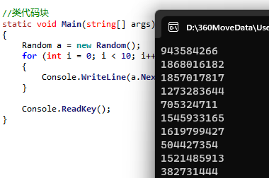
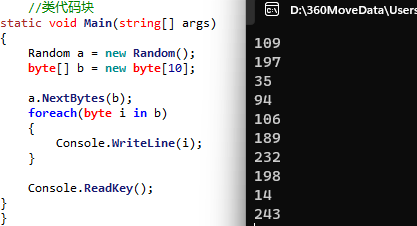
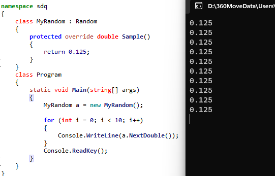
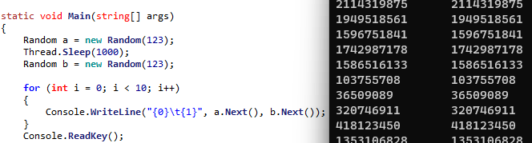
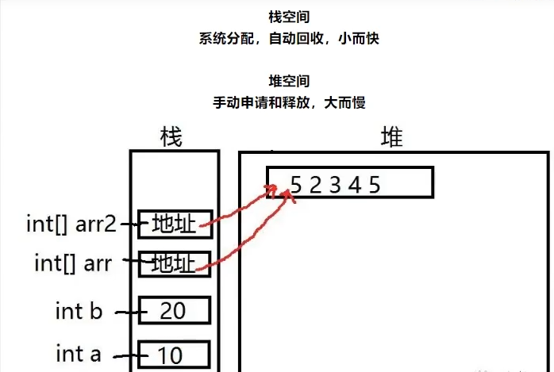
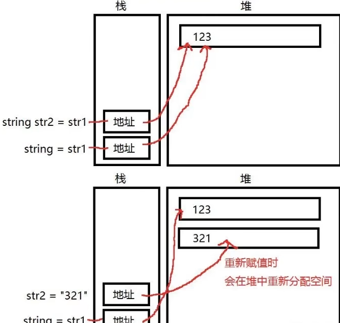
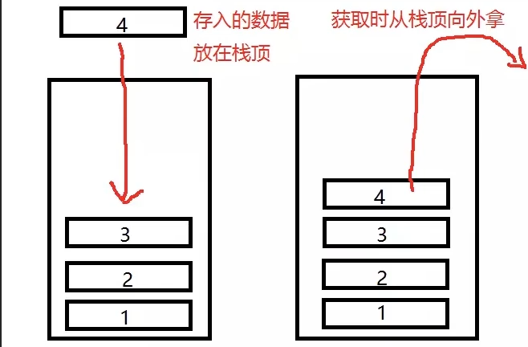
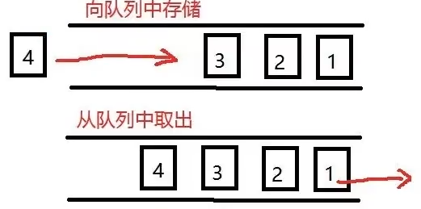
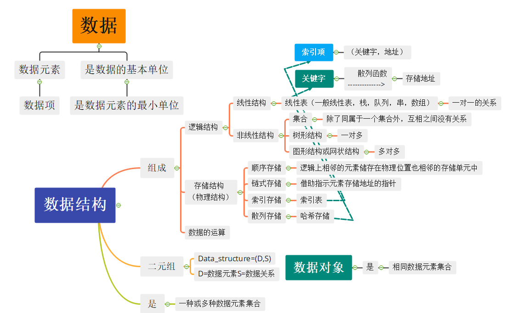

#  C#入门

### 1.程序语言是什么

用于人和计算机进行交流通过程序语言让计算机能够响应我们发出的指令。

- C：	嵌入式硬件开发

- C++:  游戏客户端，服务器，软件

- C#:	游戏客户端，服务器，软件，网站

- Java: 安卓，服务器，软件，网站

- JavaScript:H5游戏，网站，服务器

- PHP:  网站，服务器

- Python:网站，服务器，辅助开发

- SQL:  数据库

- Go:	服务器

- Objective-C: 苹果相关

- Swift: 苹果相关

### 2.开发环境搭建

搭建用于程序开发的环境，安装代码可以被电脑识别的软件

IDE 集成开发环境 一般包括了代码编辑，编译器，调试器。图形用户界面等等工具

常用的IDE软件

- Visual Studio:一般 Windows 操作系统使用的软件都由它来进行开发 ，可用于开发基于 C 、 C++ 、 C # 等等语言的软件
- Eclipse intelliJ IDEA:一般主要用于开发 Java 语言的相关软件
- Android Studio:谷歌推出 ，主要用于开发安卓应用
- Xcode:苹果推出 ，主要用于开发苹果应用

### 3.第一个应用程序

程序写在语句块中

被大括号包裹的部分称为语句块

不同语句块中书写的代码规则不同

```c#
using System;

namespace test
{
	//命名控件代码块
	class Program
	{
		//类代码块
		public static void Main(string[] args)
		{
			//函数代码块
			Console.WriteLine("Hello World!");
			
			// TODO: Implement Functionality Here
			Console.Write("Press any key to continue . . . ");
			Console.ReadKey(true);
		}
	}
}
输出：
    Hello World!
    Press any key to continue . . . 
```

### 4.变量

```
#region Myregion
折叠代码
#endregion
```

变量：存储各个类型数值的一个容器，可以通过‘+’来拼接，小数默认是double类型，需要float的话加f。

| 类型       | 举例                                                         |
| ---------- | ------------------------------------------------------------ |
| 整数类型   | sbyte（-128~127）、byte（0~255）、short（-32768~32767）、ushort（0~65535）、int（-21亿~21亿多）、uint（0~42亿）、long（-900万兆~900万兆）、ulong（0~1800万兆） 和 char（0~65535）,string (多个字符无上限) |
| 浮点型     | float（根据编译器不同存储7/8位有效数字） 和 double（存储15~17位有效数字，抛弃的数字会四舍五入） |
| 十进制类型 | decimal（存储27~28位有效数字，不建议使用）                   |
| 布尔类型   | true 或 false 值，指定的值                                   |
| 空类型     | 可为空值的数据类型                                           |

C# 允许定义其他值类型的变量，比如 **enum**，也允许定义引用类型变量，比如 **class**。

### 5.变量的本质

一个字节byte为8位bit

即1byte = 0000 0000

### 6.变量的命名规范

标识符是用来识别类、变量、函数或任何其它用户定义的项目。在 C# 中，类的命名必须遵循如下基本规则：

- 标识符必须以字母、下划线或 @ 开头，后面可以跟一系列的字母、数字（ 0 - 9 ）、下划线（ _ ）、@。
- 标识符中的第一个字符不能是数字。
- 标识符必须不包含任何嵌入的空格或符号，比如 ? - +! # % ^ & * ( ) [ ] { } . ; : " ' / \。
- 标识符不能是 C# 关键字。除非它们有一个 @ 前缀。 例如，@if 是有效的标识符，但 if 不是，因为 if 是关键字。
- 标识符必须区分大小写。大写字母和小写字母被认为是不同的字母。
- 不能与C#的类库名称相同。

### 7.常量

常量是固定值，程序执行期间不会改变。常量可以是任何基本数据类型，比如整数常量、浮点常量、字符常量或者字符串常量，还有枚举常量。

常量可以被当作常规的变量，只是它们的值在定义后不能被修改。

- 整数常量可以是十进制、八进制或十六进制的常量。前缀指定基数：0x 或 0X 表示十六进制，0 表示八进制，没有前缀则表示十进制。

  整数常量也可以有后缀，可以是 U 和 L 的组合，其中，U 和 L 分别表示 unsigned 和 long。后缀可以是大写或者小写，多个后缀以任意顺序进行组合。

  ```c#
  212         /* 合法 */
  215u        /* 合法 */
  0xFeeL      /* 合法 */
  078         /* 非法：8 不是一个八进制数字 */
  032UU       /* 非法：不能重复后缀 */
  ```

- 一个浮点常量是由整数部分、小数点、小数部分和指数部分组成。您可以使用小数形式或者指数形式来表示浮点常量。

  这里有一些浮点常量的实例：
  
  ```c#
  3.14159       /* 合法 */
  314159E-5L    /* 合法 */
  510E          /* 非法：不完全指数 */
  210f          /* 非法：没有小数或指数 */
  .e55          /* 非法：缺少整数或小数 */
  ```

- 字符串常量是括在双引号 "" 里，或者是括在 @"" 里。字符串常量包含的字符与字符常量相似，可以是：普通字符、转义序列和通用字符

  使用字符串常量时，可以把一个很长的行拆成多个行，可以使用空格分隔各个部分。

  这里是一些字符串常量的实例。下面所列的各种形式表示相同的字符串。

  ```c#
  string a = "hello, world";                  // hello, world
  string b = @"hello, world";               // hello, world
  string c = "hello \t world";               // hello     world
  string d = @"hello \t world";               // hello \t world
  string e = "Joe said \"Hello\" to me";      // Joe said "Hello" to me
  string f = @"Joe said ""Hello"" to me";   // Joe said "Hello" to me
  string g = "\\\\server\\share\\file.txt";   // \\server\share\file.txt
  string h = @"\\server\share\file.txt";      // \\server\share\file.txt
  string i = "one\r\ntwo\r\nthree";
  string j = @"one
  two
  three";
  ```

---

- 常量是使用 **const** 关键字来定义的 。定义一个常量的语法如下：

  ```c#
  const <data_type> <constant_name> = value;
  ```

### 8.转义字符

- 字符常量是括在单引号里，例如，'x'，且可存储在一个简单的字符类型变量中。一个字符常量可以是一个普通字符（例如 'x'）、一个转义序列（例如 '\t'）或者一个通用字符（例如 '\u02C0'）。

  在 C# 中有一些特定的字符，当它们的前面带有反斜杠时有特殊的意义，可用于表示换行符（\n）或制表符 tab（\t）。在这里，列出一些转义序列码：

  | 转义序列   | 含义                       |
  | ---------- | -------------------------- |
  | \\         | \ 字符                     |
  | \'         | ' 字符                     |
  | \"         | " 字符                     |
  | \?         | ? 字符                     |
  | \a         | Alert 或 bell              |
  | \b         | 退格键（Backspace）        |
  | \f         | 换页符（Form feed）        |
  | \n         | 换行符（Newline）          |
  | \r         | 回车                       |
  | \t         | 水平制表符 tab             |
  | \v         | 垂直制表符 tab             |
  | \ooo       | 一到三位的八进制数         |
  | \xhh . . . | 一个或多个数字的十六进制数 |

### 9.类型转换

类型转换从根本上说是类型铸造，或者说是把数据从一种类型转换为另一种类型。在 C# 中，类型铸造有两种形式：

- **隐式类型转换** - 这些转换是 C# 默认的以安全方式进行的转换, 不会导致数据丢失。例如，从小的整数类型转换为大的整数类型，从派生类转换为基类。

  ```c#
  long l = 1;
  int i = 1;
  l = i;//可以小范围的类型转换为大范围
  i = l;//报错，不能小范围的类型转换为大范围
  ```

  

- **显式类型转换** - 显式类型转换，即强制类型转换。显式转换需要强制转换运算符，而且强制转换会造成数据丢失。

  ```c#
  //强制转换 double 为 int
  i = (**int**)d;
  Console.WriteLine(i);
  Console.ReadKey();
  ```
  
    


C# 提供了下列内置的类型转换方法：

  | 序号 | 方法 & 描述                                                  |
  | ---- | ------------------------------------------------------------ |
  | 1    | **ToBoolean** 如果可能的话，把类型转换为布尔型。             |
  | 2    | **ToByte** 把类型转换为字节类型。                            |
  | 3    | **ToChar** 如果可能的话，把类型转换为单个 Unicode 字符类型。 |
  | 4    | **ToDateTime** 把类型（整数或字符串类型）转换为 日期-时间 结构。 |
  | 5    | **ToDecimal** 把浮点型或整数类型转换为十进制类型。           |
  | 6    | **ToDouble** 把类型转换为双精度浮点型。                      |
  | 7    | **ToInt16** 把类型转换为 16 位整数类型。                     |
  | 8    | **ToInt32** 把类型转换为 32 位整数类型。                     |
  | 9    | **ToInt64** 把类型转换为 64 位整数类型。                     |
  | 10   | **ToSbyte** 把类型转换为有符号字节类型。                     |
  | 11   | **ToSingle** 把类型转换为小浮点数类型。                      |
  | 12   | **ToString** 把类型转换为字符串类型。                        |
  | 13   | **ToType** 把类型转换为指定类型。                            |
  | 14   | **ToUInt16** 把类型转换为 16 位无符号整数类型。              |
  | 15   | **ToUInt32** 把类型转换为 32 位无符号整数类型。              |
  | 16   | **ToUInt64** 把类型转换为 64 位无符号整数类型。              |

 **实例**

```c#
**namespace** TypeConversionApplication
 {
   **class** StringConversion
   {
     **static** **void** Main(**string**[] args)
     {
       **int** i = 75;
       **float** f = 53.005f;
       **double** d = 2345.7652;
       **bool** b = **true**;
 
       Console.WriteLine(i.ToString());
       Console.WriteLine(f.ToString());
       Console.WriteLine(d.ToString());
       Console.WriteLine(b.ToString());
       Console.ReadKey();
       
     }
   }
 }
```


### 10.异常捕获

异常捕获可以避免代码报错造成程序卡死的情况

```c#
public static void Main(string[] args)

​    {

​      Console.WriteLine("异常捕获");

​      try

​      {

​        string str = Console.ReadLine();

​        int i = int.Parse(str);

​        Console.WriteLine(i);

​        Console.Read();

​        //希望进行异常捕获的代码块

​        //放到try中

​        //如果try中的代码报错了不会让程序卡死

​      } 

​      catch (Exception e)

​      {

​        Console.WriteLine(e);

​        Console.WriteLine("请输入合法数字");

​        Console.Read();

​        //e就是try里面的具体问题，可以使用e去打印问题

​        //如果出错了会执行catch中的代码来捕获异常

​        throw;

​      }

​      //可选部分

​      finally

​      {

​        Console.WriteLine("执行完毕");

​      }

​      //注意异常捕获代码基本结构不需要加分号，语句块需要加分号
```


### 11.运算符

- 赋值符号

  ​	“`=` ”将右侧的值赋给左侧

- 算术运算符

​		`+ - * / %`加减乘除取余

- 算数运算符的优先级

  ​	先算乘除取余，再算加减，有括号先括号

- 算术运算符的复合运算符

  ​	`+= -= *=  /=`	用于自己参加运算

- 算数运算符的自增减

  ​	`a++` 先用再加

  ​	`++a`  先加再用

- 字符串拼接

  1.使用加号 “`+`” 进行字符串拼接

  2.使用加号 “`+=`” 进行字符串拼接

  ```c#
  //字符串后面的都变成字符，加括号可以先运算
  str1 = 1+2+3+4 		//输出10
  
  str2 = ""+1+2+3+4	//输出1234
      
  str3 = 1+2+""+3+4	//输出334
  
  str4 = (1+2)+""+(3+4)	//输出37
  ```

  3.使用`string.Format("待拼接的内容",内容1,内容2,```)`，想要拼接的内容用占位符替代，数字：0~n 依次往后

  ```c#
  string str = string.Format("我是{0}，我今年{1}岁","大学生",12)	//输出 我是大学生，我今年12岁
  ```

  4.控制台打印（和string.Format类似）

  ```c#
  console.WriteLine("我是{0}，我今年{1}岁","大学生",12)	//输出 我是大学生，我今年12岁
  console.Write("我是{0}，我今年{1}岁","大学生",12)	//输出 我是大学生，我今年12岁 
  ```

- 条件运算符
	
	`> < = >= <= != ==`
	
	不同数值类型之间可以随意进行比较，特殊类型char string bool只能同类型进行==和!=比较
	
	（在隐式转换中char（ASCII）可以和数值进行比较,还可以和其他char进行><比较）
	
- 逻辑运算符

  `&&` 逻辑与

  `||` 逻辑或

  `!`  逻辑非

  逻辑非优先级>逻辑与优先级>逻辑或优先级

  逻辑运算符优先级<算术运算符优先级

  > 逻辑运算符短路规则 在||和&&中，若已经满足了左边的内容将不再执行右边的内容
  >
  
- 位运算符
  主要是用数值类型进行计算，先将数值转换为2进制，在进行位运算

  1.位与& 同1为1

  ```
  int a = 1;		//001
  int b = 5;		//101
  int c = a & b ;	//001
  ```

  多个数值进行计算时,从左到右，依次计算

  2.位或| 有1为1

  3.异或^ 相同为0不同为1

  4.取反~ 0变1 1变0

  5.左移 左移几位右侧加几个零

  6.右移 右移几位右侧去掉几个数

- 三目运算符
  空位1?空位2:空位3

  bool类型?bool为真时返回内容:bool为假时返回内容

### 12.条件分支语句

让顺序执行的代码产生逻辑分支

- if

  ~~~c#
  if("条件"){}
  if("条件"){}else{}
  if("条件"){}else if{"条件"}else
  ```
  ~~~

- switch

  ```
  switch()
  {
  	case 常量:
  	{
  	代码;
  	break;
  	}
  	case 常量:
  	{
  	代码;
  	break;
  	}
  	default://如果上方case条件都不满足，就会执行default中的代码。
  	{
  	代码;
  	break;
  	}
  }
  ```

### 13.循环语句

- while循环

  ```c#
  while(condition)
  {
     statement(s);
  }
  ```

  在这里，**statement(s)** 可以是一个单独的语句，也可以是几个语句组成的代码块。**condition** 可以是任意的表达式，当为任意非零值时都为真。当条件为真时执行循环。只要给定的条件为真，C# 中的 **while** 循环语句会重复执行一个目标语句。

- do while循环

  ```c#
  do
  {
     statement(s);
  
  }while( condition );
  ```

  - 不像 **for** 和 **while** 循环，它们是在循环头部测试循环条件。**do...while** 循环是在循环的尾部检查它的条件。

  - **do...while** 循环与 while 循环类似，但是 do...while 循环会确保至少执行一次循环。

- for循环

  ```c#
  for ( init; condition; increment )
  {
     statement(s);
  }
  ```

  1. **init** 会首先被执行，且只会执行一次。这一步允许您声明并初始化任何循环控制变量。您也可以不在这里写任何语句，只要有一个分号出现即可。

  2. 接下来，会判断 **condition**。如果为真，则执行循环主体。如果为假，则不执行循环主体，且控制流会跳转到紧接着 for 循环的下一条语句。

  3. 在执行完 for 循环主体后，控制流会跳回上面的 **increment** 语句。该语句允许您更新循环控制变量。该语句可以留空，只要在条件后有一个分号出现即可。

  4. 条件再次被判断。如果为真，则执行循环，这个过程会不断重复（循环主体，然后增加步值，再然后重新判断条件）。在条件变为假时，for 循环终止。

- foreach循环

  ```c#
  foreach (var item in collection)
  {
     statement(s);
  }
  ```

  collection 是要遍历的集合，item 是当前遍历到的元素。

  以下实例有三个部分：

  - 通过 foreach 循环输出整型数组中的元素。 
  - 通过 for 循环输出整型数组中的元素。 
  - foreach 循环设置数组元素的计算器。
  -  foreach 循环可以用来遍历集合类型，例如数组、列表、字典等

### 14.控制台相关方法

- Clear：清空屏幕上输出的全部内容

  ```cs
  Console.WriteLine("下面会进行清空");
  //1、清空上方全部内容
  Console.Clear();
  Console.WriteLine("上面进行了清空");
  ```

- SetWindowSize：设置窗口的大小

- SetBufferSize：设置缓冲区的大小

  > **注意：**
  >  控制台大小分为窗口大小和缓冲区大小
  >
  > ​    1、先设置窗口的大小，再设置缓冲区的大小
  > ​    2、窗口的大小和缓冲区的大小不能大于控制台的最大尺寸
  > ​    3、缓冲区的大小不能小于窗口的大小 

  ```c#
      //窗口大小（程序运行后能看到的控制面板的大小）
      Console.SetWindowSize(100, 50);//（x,y）
      //设置缓冲区的大小（缓冲区大小等于窗口大小加上滚动条后面的大小）
      Console.SetBufferSize(200, 100);//(x,y)
  ```

  

- SetCursorPosition：设置光标的位置

  > **注意：**
  >
  > - 控制台左上角是坐标的原点（0,0），右侧是x轴的正方向，下侧是y轴的正方向；是一个平面二位坐标系。
  > - 注意：边界问题（最好不要设置负数）、横纵距离单位不同1y=2x。 
  ```c#
          //设置光标位置为x=10，y=5；
    Console.SetCursorPosition(10, 5);
    Console.WriteLine("设置光标的位置在（10,5）");
  ```
  


- ForegroundColor：设置前景色

- BackgroundColor：设置背景色

  > **注意：**
  >
  > 设置前景色：从设置之后开始，改变输出内容的颜色；
  >
  > 设置背景色：改变背景颜色，这里需要重点注意的是，只是进行简单的设置不会改变全部的背景色，需要使用一次Clea[r方](https://so.csdn.net/so/search?q=r方&spm=1001.2101.3001.7020)法。（个人认为原因是：上面已经输出的内容调用了系统默认的背景色（黑色），只有在重新设置的背景色之后输出的内容才会改变背景的颜色；所以在没有内容输出的空白部分在设置背景色之前就已经调用了系统的默认黑色进行了空白输出，就会显示黑色。（设置背景色：只是设置输出内容的背景色，空白也是输出内容））

  ```c#
  Console.ForegroundColor = ConsoleColor.Red;
  Console.WriteLine("上面将前景色设置为红色");
  //设置背景色
  Console.BackgroundColor = ConsoleColor.Yellow;
  //Clear：将上面的内容清空后，背景色才能铺展开
  Console.Clear();
  Console.WriteLine("重置背景色需要将上面的内容Clear一次，才能把整个背景色改变");
  ```

- CursorVisible：设置光标的显隐

  ```c#
  //5、光标的显隐
  Console.CursorVisible = false;
  Console.WriteLine("将光标进行了隐藏");
  ```

  > 当为false时，就会隐藏光标；为true时就会显示光标跳动。

- Environment.Exit(0):关闭当前进程，关闭窗口

  ```c#
  //6、关闭控制台
  Environment.Exit(0);//参数为零，代表该进程完成
  ```
  
  > 参数为0（这里我不知道参数能不能为1），代表该进程全部执行完毕，会关闭当前窗口（在调试模式下不会关闭，发行版可以关闭）。

### 15.随机数

```c#
namespace System
{
    public class Random
    {
        public Random();
        public Random(int Seed);<br>
        public virtual int Next();
        public virtual int Next(int minValue, int maxValue);
        public virtual int Next(int maxValue);
        public virtual void NextBytes(byte[] buffer);
        public virtual double NextDouble();
        protected virtual double Sample();
    }
}
```

- Random();

  这是无参构造方法，比如在程序中这样写：

  ```c#
  Random a = new Random();
  ```

  得到的a就是一个随机数生成器，它可以用来生成随机数。

- int Next();

  这个方法返回值为int类型，调用它就能得到一个随机数，反复调用就能反复得到随机数。

  示例：

  ```c#
  static void Main(string[] args)
  {
      Random a = new Random();
      for (int i = 0; i < 10; i++)
      {
          Console.WriteLine(a.Next());
      }
   
      Console.ReadKey();
  }
  ```

  这样就可以获得10个随机数

  

  >  **注意**：虽然看上去Next方法返回值是int类型，但实际上它只返回非负整数，而且不包括int类型能表示的最大的那个整数（2^31 - 1）

- int Next(int minValue, int maxValue);

  这个方法能指定随机数的生成范围，左闭右开区间，即生成的数能包含minValue，不包含maxValue。可以包含负数。但是maxValue的值不能大于minValue的值，否则运行时会抛出异常。

- int Next(int maxValue);

  这个方法指定随机数的最大值（不包含maxValue），并且它也只能生成非负整数，与Next(0, maxValue)是一个道理，如果传入的maxValue为负数，那么运行时抛出异常，如果maxValue的值为0或1，那么生成的随机数只能是0。

- double NextDouble();

  这个方法能返回一个大于或等于 0.0 且小于 1.0 的随机浮点数。

- void NextBytes(byte[] buffer);

  这个方法传入指定长度的byte类型的数组，用byte类型的随机数填充数组，如：

  ```c#
  static void Main(string[] args)
  {
      Random a = new Random();
      byte[] b = new byte[10];
   
      a.NextBytes(b);
      foreach(byte i in b)
      {
          Console.WriteLine(i);
      }
   
      Console.ReadKey();
  }
  ```

  

- double Sample();

  这个方法比较特殊，从声明可以看出来，其他的方法权限都是public，这个方法是protected。从方法的描述上能看到，这个方法返回的也是大于或等于 0.0 且小于 1.0 的随机浮点数，它与NextDouble看上去似乎只是权限不一样，看了下面这段代码就知道了：

  ```c#
  namespace sdq
  {
      class MyRandom : Random
      {
          protected override double Sample()
          {
              return 0.125;
          }
      }
      class Program
      {
          static void Main(string[] args)
          {
              MyRandom a = new MyRandom();
   
              for (int i = 0; i < 10; i++)
              {
                  Console.WriteLine(a.NextDouble());
              }
              Console.ReadKey();
          }
      }
  }
  ```

  代码分析：

  　　首先定义了一个类MyRandom，继承至Random，由于Random中的Sample()是虚方法，因此可以在派生类中将Sample()重写，我在这里是将它固定返回0.125。在Main方法中构造了a这个对象，并且调用了a.NextDouble()去生成10个随机数，运行结果如下：

  

  从结果可以看出来，Random的Sample方法可以改变NextDouble()方法的行为，如果用户想自定义获取随机数的方法，则可以通过重写Sample来实现。

- Random(int Seed);

  最后再说一下这个带参构造函数，它用来在构造对象时指定随机数生成器的种子，而不带参的构造函数则是以时间作为种子。至于种子是个什么东西，我也不知道，通过下面这个例子也许能说明：

  ```c#
  using System;
  using System.Threading;
   
  namespace test
  {
      class Program
      {
          static void Main(string[] args)
          {
              Random a = new Random(123);
              Thread.Sleep(1000);
              Random b = new Random(123);
   
              for (int i = 0; i < 10; i++)
              {
                  Console.WriteLine("{0}\t{1}", a.Next(), b.Next());
              }
              Console.ReadKey();
          }
      }
  }
  ```

  运行结果如下：

  

  可见a对象和b对象是使用相同的种子123构造出来的，之后它们每次生成的随机数的值都是一样的。而如果使用默认的构造方法（以时间为种子）则不会有这种情况。

  注：之所以调用Thread.Sleep(1000);是为了错开两次构造随机数对象的时间，如果不这么做的话，使用默认构造方法，连续两次调用Random()得到的结果仍然可能会一样，因为两次调用Random()时的时间是一样的。

  我还没有去研究过windows系统时间的最小单位，按一般经验判断可能是us，想想1us内调用两次构造方法时间是够够的吧。

# C#基础

### 1.复杂数据类型

- 枚举

  枚举是一组命名整型常量。枚举类型是使用 **enum** 关键字声明的。

  C# 枚举是值类型。换句话说，枚举包含自己的值，且不能继承或传递继承。

  ```c#
  enum <enum_name>
  { 
      enumeration list 
  };
  ```

  其中，

  - *enum_name* 指定枚举的类型名称。
  - *enumeration list* 是一个用逗号分隔的标识符列表。

  枚举列表中的每个符号代表一个整数值，一个比它前面的符号大的整数值。默认情况下，第一个枚举符号的值是 0.例如：

  ```c#
  enum Days { Sun, Mon, tue, Wed, thu, Fri, Sat };
  ```

- 数组

  数组是一个存储相同类型元素的固定大小的顺序集合。数组是用来存储数据的集合，通常认为数组是一个同一类型变量的集合。

  声明数组变量并不是声明 number0、number1、...、number99 一个个单独的变量，而是声明一个就像 numbers  这样的变量，然后使用 numbers[0]、numbers[1]、...、numbers[99]  来表示一个个单独的变量。数组中某个指定的元素是通过索引来访问的。

  所有的数组都是由连续的内存位置组成的。最低的地址对应第一个元素，最高的地址对应最后一个元素。

  ```c#
  datatype[] arrayName;
  ```

  其中，

  - *datatype* 用于指定被存储在数组中的元素的类型。
  - *[ ]* 指定数组的秩（维度）。秩指定数组的大小。
  - *arrayName* 指定数组的名称。

  例如：

  ```c#
  double[] balance;
  ```

  初始化数组

  声明一个数组不会在内存中初始化数组。当初始化数组变量时，您可以赋值给数组。

  数组是一个引用类型，所以您需要使用 new 关键字来创建数组的实例。

  例如：

  ```c#
  double[] balance = new double[10];//声明数组
  balance[0] = 4500.0;//数组赋值
  double[] balance = { 2340.0, 4523.69, 3421.0};//声明数组的同时给数组赋值
  int [] marks = new int[5]  { 99,  98, 92, 97, 95};//创建并初始化一个数组
  int [] marks = new int[]  { 99,  98, 92, 97, 95};//也可以省略数组的大小
  //您也可以赋值一个数组变量到另一个目标数组变量中。在这种情况下，目标和源会指向相同的内存位置：
  int [] marks = new int[]  { 99,  98, 92, 97, 95};
  int[] score = marks;
  ```

  >  当您创建一个数组时，C# 编译器会根据数组类型隐式初始化每个数组元素为一个默认值。例如，int 数组的所有元素都会被初始化为 0。

  多维数组

  C# 支持多维数组。多维数组又称为矩形数组。

  例如

  ```c#
  string [,] names;//声明一个 string 变量的二维数组
  int [ , , ] m;//声明一个 int 变量的三维数组
  
  int [,] a = new int [3,4] {
   {0, 1, 2, 3} ,   /*  初始化索引号为 0 的行 */
   {4, 5, 6, 7} ,   /*  初始化索引号为 1 的行 */
   {8, 9, 10, 11}   /*  初始化索引号为 2 的行 */
  };
  ```

  交错数组

  交错数组是数组的数组，同时也是一维数组。

  例如

  ```c#
  int[][] scores = new int[5][];
  for (int i = 0; i < scores.Length; i++) //声明交错数组
  {
     scores[i] = new int[4];
  }
  int[][] scores = new int[2][]{new int[]{92,93,94},new int[]{85,66,87,88}};//初始化
  //其中，scores 是一个由两个整型数组组成的数组 -- scores[0] 是一个带有 3 个整数的数组，scores[1] 是一个带有 4 个整数的数组。
  ```

- 结构体

  在 C# 中，结构体是值类型数据结构。它使得一个单一变量可以存储各种数据类型的相关数据。**struct** 关键字用于创建结构体。

  结构体是用来代表一个记录。假设您想跟踪图书馆中书的动态。您可能想跟踪每本书的以下属性：

  - Title
  - Author
  - Subject
  - Book ID

定义结构体 

```c#
struct Books
{
   public string title;
   public string author;
   public string subject;
   public int book_id;
};  
```

用法

```c#
using System;
using System.Text;
     
struct Books
{
   public string title;
   public string author;
   public string subject;
   public int book_id;
};  

public class testStructure
{
   public static void Main(string[] args)
   {

      Books Book1;        /* 声明 Book1，类型为 Books */
      Books Book2;        /* 声明 Book2，类型为 Books */

      /* book 1 详述 */
      Book1.title = "C Programming";
      Book1.author = "Nuha Ali";
      Book1.subject = "C Programming Tutorial";
      Book1.book_id = 6495407;

      /* book 2 详述 */
      Book2.title = "Telecom Billing";
      Book2.author = "Zara Ali";
      Book2.subject =  "Telecom Billing Tutorial";
      Book2.book_id = 6495700;

      /* 打印 Book1 信息 */
      Console.WriteLine( "Book 1 title : {0}", Book1.title);
      Console.WriteLine("Book 1 author : {0}", Book1.author);
      Console.WriteLine("Book 1 subject : {0}", Book1.subject);
      Console.WriteLine("Book 1 book_id :{0}", Book1.book_id);

      /* 打印 Book2 信息 */
      Console.WriteLine("Book 2 title : {0}", Book2.title);
      Console.WriteLine("Book 2 author : {0}", Book2.author);
      Console.WriteLine("Book 2 subject : {0}", Book2.subject);
      Console.WriteLine("Book 2 book_id : {0}", Book2.book_id);      

      Console.ReadKey();

   }
}
```

特点

在 C# 中的结构与传统的 C 或 C++ 中的结构不同。C# 中的结构有以下特点：

- 结构可带有方法、字段、索引、属性、运算符方法和事件。

- 结构可定义构造函数，但不能定义析构函数。但是，您不能为结构定义无参构造函数。无参构造函数(默认)是自动定义的，且不能被改变。

- 与类不同，结构不能继承其他的结构或类。

- 结构不能作为其他结构或类的基础结构。

- 结构可实现一个或多个接口。

- 结构成员不能指定为 abstract、virtual 或 protected。

- 当您使用 **New** 操作符创建一个结构对象时，会调用适当的构造函数来创建结构。与类不同，结构可以不使用 New 操作符即可被实例化。

- 如果不使用 New 操作符，只有在所有的字段都被初始化之后，字段才被赋值，对象才被使用。


### 2.数值型和引用类型

引用类型：string，数组，类

值类型：其他

- 区别

  ```c#
  int a = 10;
  int b = a;
  int [] arr1 = new int[4]  {1,2,3,4};
  int [] arr2 = arr1;
  Console.WriteLine("a={0},b={1}",a,b);
  //输出a=10,b=10
  Console.WriteLine("arr1[0]={0},arr2[0]={1}",arr1[0],arr2[0]);
  //输出arr[0]=1,arr2[0]=1;
  b = 5;
  arr2[0] = 5;
  Console.WriteLine("a={0},b={1}",a,b);
  //输出a=10,b=5
  Console.WriteLine("arr1[0]={0},arr2[0]={1}",arr1[0],arr2[0]);
  //输出arr[0]=5,arr2[0]=5;
  ```

  不难发现，值类型在相互赋值时，把内容拷贝给了对方，而引用类型的相互赋值时，是让两者指向同一个值 

  原因为存储方式不同，值类型存储在栈（系统分配比较小但是快），引用类型存储在堆上（手动申请和释放，大而慢）

  

特殊的引用类型string

​	因为C#对字符串的特殊处理使它具有值类型的特点，当重新赋值时会在堆上重新分配空间

​	

> **注意：**string虽然方便，但频繁重新赋值时，会产生内存垃圾

### 3.函数

- 函数基础

  ```c#
  <Access Specifier> <Return Type> <Method Name>(Parameter List)
  {
     Method Body
  }
  ```

  下面是方法的各个元素：

  - **Access Specifier**：访问修饰符，这个决定了变量或方法对于另一个类的可见性。
  - **Return type**：返回类型，一个方法可以返回一个值。返回类型是方法返回的值的数据类型。如果方法不返回任何值，则返回类型为 **void**。
  - **Method name**：方法名称，是一个唯一的标识符，且是大小写敏感的。它不能与类中声明的其他标识符相同。
  - **Parameter list**：参数列表，使用圆括号括起来，该参数是用来传递和接收方法的数据。参数列表是指方法的参数类型、顺序和数量。参数是可选的，也就是说，一个方法可能不包含参数。
  - **Method body**：方法主体，包含了完成任务所需的指令集。

- ref和out

  在C#中通过使用方法来获取返回值时，通常只能得到一个返回值。因此，**当一个方法需要返回多个值的时候，就需要用到ref和out**，

  **同时也可以在函数内部，改变传入的参数的值**。

  若要使用 ref 和out参数，则方法定义和调用方法都必须显式使用 ref和out 关键字。在方法中对参数的设置和改变将会直接影响函数调用之处(参数的初始值）。

  > ref指定的参数在 **函数调用前必须初始化**，在内部可改可不改
  >
  > out指定的参数在不用初始化，**但在函数内部（即方法中）赋初值。**

  正确使用ref：

  ```c#
  class Program
      {
          static void Main(string[] args)
          {
              int x = 10;
              int y = 20;
              GetValue(ref x, ref  y);
              Console.WriteLine("x={0},y={1}", x, y);//输出x=333,y=444
              Console.ReadLine();
          }
          public void GetValue(ref int x, ref int y)
          {
              x = 333;
              y = 444;
          }
      }
  ```

  错误使用ref:

  ```
  class Program
      {
          static void Main(string[] args)
          {
              int x ;//未进行初始化，报错
              int y ;//未进行初始化，报错
              GetValue(ref x, ref  y);
              Console.WriteLine("x={0},y={1}", x, y);
              Console.ReadLine();
          }
          public void GetValue(ref int x, ref int y)
          {
              x = 333;
              y = 444;
          }
      }
  ```

  > 总结：使用ref 必须在 **调用方法前** 对其进行**初识化操作**

  正确使用out：

  ```
  class Program
  {
      static void Main(string[] args)
      {
          int x = 10;
          int y = 233;
          Swap(out x, out y);
          Console.WriteLine("x={0},y={1}", x, y);//输出x=333,y=444
          Console.ReadLine();
      }
  
      public static void Swap(out int a, out int b)
      {
          a = 333;   //对a,b 在方法内进行了初识化，不会报错
          b = 444;
      }
  }
  ```

  错误使用out:

  ```
  class Program
  {
      static void Main(string[] args)
      {
          int x = 10;
          int y = 233;
          Swap(out x, out y);
          Console.WriteLine("x={0},y={1}", x, y);
          Console.ReadLine();
      }
  
      public static void Swap(out int a, out int b)
      {
      	int tmp = a;
          a = b;   //a,b在函数内部没有赋初值，则出现错误。
          b = tmp;
      }
  }
  ```

  > 总结：out 的使用必须要在 **方法内** 进行 **初始化** ，才不会报错

- 变长参数和参数默认值

  比如要计算n个整数的和

  ```c#
  int SumInt(int a,int b, ......)//如果有n个参数就无法实现了
  ```

  变长参数关键字params

  ```c#
  int SumInt(params int[] arr)
  {
     	int sum;
  	foreach(int i in arr)
      {
          sum +=i;
      }
      return sum;
  }
  ```

  > params 关键字后面必为数组，数组的类型可以使任意类型，函数参数中最多出现一个params参数且在最后出现，前面可以有n个其他参数。

  参数默认值

  ​	如果在函数的参数处给形参赋值，则不输入实参时，默认为形参的值。

- 函数重载

  ​	和函数类型无关，名字相同，参数数量不同或者参数类型或顺序不同，命名一组功能相似的函数，减少函数名的数量，避免命名控件的污染，同时提升程序的可读性。

  > ref和out，params可以算作重载 ，ref和out不能同时重载，可选参数不算重载

- 递归函数

  让函数自己调用自己

  1.必须有结束调用的条件

  2.必须能够达到结束的目的

### 4. 初级排序

- 冒泡排序

  冒泡排序是比较基础的排序算法之一，其思想是相邻的元素两两比较，较大的数下沉，较小的数冒起来，这样一趟比较下来，最大(小)值就会排列在一端。整个过程如同气泡冒起，因此被称作冒泡排序。
   冒泡排序的步骤是比较固定的：
   1>比较相邻的元素。如果第一个比第二个大，就交换他们两个。
   2>每趟从第一对相邻元素开始，对每一对相邻元素作同样的工作，直到最后一对。
   3>针对所有的元素重复以上的步骤，除了已排序过的元素(每趟排序后的最后一个元素)，直到没有任何一对数字需要比较。

  ```c#
  using System;
  using System.Threading;
   
  namespace Sort
  {
      class Program
      {
          static void Main(string[] args)
          {
              
              int[] arr = {23, 44, 66, 76, 98, 11, 3, 9, 7};
              Console.WriteLine("排序前的数组：");
              foreach (int item in arr)
              {
                  Console.Write(item + ",");
              }
              Console.WriteLine();
              BubbleSort(arr);
              Console.WriteLine("排序后的数组：");
              foreach (int item in arr)
              {
                  Console.Write(item+",");
              }
              Console.WriteLine();
              Console.ReadKey();
          }
          static void BubbleSort(int[] arr)
          {
          	int temp = 0;
              for (int i = 0; i < arr.Length - 1; i++)
              {
                  for (int j = 0; j < arr.Length - 1 - i; j++)
                  {
                      if (arr[j] > arr[j + 1])
                      {
                          temp = arr[j + 1];
                          arr[j + 1] = arr[j];
                          arr[j] = temp;
                      }
                  }
              }
          }
      }
  }
  ```
  
  每一次循环产生一个最大数排到最后面，因此内循环中比较N-1-i次
  
  i为最大数的数量，外循环是N-1剩出来最右边的最大数
  
- 选择排序

  选择排序是寻找当前数组中的最小元素/最大元素，然后将他们放到最前边/最后边的位置上去，然后以此类推，在剩余的数组中再次寻找，直到全部待排序的数据元素的个数为零。

  ```c#
  using System;
  using System.Threading;
   
  namespace Sort
  {
      class Program
      {
          static void Main(string[] args)
          {
              
              int[] arr = {23, 44, 66, 76, 98, 11, 3, 9, 7};
              Console.WriteLine("排序前的数组：");
              foreach (int item in arr)
              {
                  Console.Write(item + ",");
              }
              Console.WriteLine();
              SelectionSort(arr);
              Console.WriteLine("排序后的数组：");
              foreach (int item in arr)
              {
                  Console.Write(item+",");
              }
              Console.WriteLine();
              Console.ReadKey();
          }
          static void SelectionSort(int[] arr)
          {
              for (int i = 0; i < arr.Length - 1; i++)
          	{
          		int minIndex = i;
          		int minValue = arr[i];
          		for(int j = i + 1 ;j < arr.Length ;j++)
          		{
          			if(arr[j]<minValue)
          			{
          				minIndex = j;
          				minValue = arr[j];
          			}
          		}
          		arr[minIndex] = arr[i];
          		arr[i] = minValue;
          	}
          }
      }
  }
  ```

  内循环从第二个数开始和第一个数比较，在遍历一遍后找到最小的数，放到最左边

# C#核心

### 1.面对对象的概念

- 面向过程编程
  是一种以过程为中心的编程思想，分析出解决问题所需要的步骤，然后用函数把步骤一步一步实现，使用的时候一个一个依次调用

- 面向对象编程

  面向对象是一种对现实世界理解和抽象的编程方法，把相关的数据和方法组织为一个整体来看待，从更高的层次来进行程序开发，更贴近事物的自然运行模式特点

- 特点

  提高代码复用率
  提高开发效率
  提高程序可拓展性
  清晰的逻辑关系

- 关键字class

  三大特性：封装、继承、多态

  七大原则：开闭原则 、 依赖倒转原则 、 里氏替换原则 、 单一职责原则、接口隔离原则 、 合成复用原则 、 迪米特法则
### 2. 面对对象-封装

用程序语言形容对象

- 类和对象

  类的定义:一般是声明在namespace中，是以关键字 **class** 开始，后跟类的名称。类的主体，包含在一对花括号内。下面是类定义的一般形式：

  ```
  <access specifier> class  class_name
  {
      // member variables //成员变量
      <access specifier> <data type> variable1;
      <access specifier> <data type> variable2;
      ...
      <access specifier> <data type> variableN;
      // member methods //成员方法
      <access specifier> <return type> method1(parameter_list)
      {
          // method body
      }
      <access specifier> <return type> method2(parameter_list)
      {
          // method body
      }
      ...
      <access specifier> <return type> methodN(parameter_list)
      {
          // method body
      }
  }
  ```

> 请注意：
>
> - 访问标识符 <access specifier> 指定了对类及其成员的访问规则。如果没有指定，则使用默认的访问标识符。类的默认访问标识符是 **internal**，成员的默认访问标识符是 **private**。
> - 帕斯卡命名法，即每个单词的首字母大写。同一个语句块中不能重名。
> - 数据类型 <data type> 指定了变量的类型，返回类型 <return type> 指定了返回的方法返回的数据类型。
> - 如果要访问类的成员，你要使用点（.）运算符。
> - 点运算符链接了对象的名称和成员的名称。

​	对象的定义：通过类创建出来的，相当于声明一个指定类的变量，创建的过程称为实例化对象，类对象都是引用类型

​	实例化对象的方法：

```c#
class Person
{

}
Person p1;					//已经在栈上分配空间，但地址指向空，即没有分配内存空间（一般指没有在堆上分配空间为没有分配内存空间）
Person p2 = null;			//已经在栈上分配空间，但地址指向空，即没有分配内存空间（一般指没有在堆上分配空间为没有分配内存空间）
Person p3 = new Person();	//分配空间，栈指向堆（引用类型）
```

- 成员变量和访问修饰符

  - 成员变量

    1.声明在类语句块中

    2.用来描述对象的特征

    3.可以使任意变量类型

    4.数量不做限制

    5.是否赋值根据需求来定

    ```c#
    enum E_SexType
    {
    	Man,
    	Woman
    }
    struct Position{}
    class Pet{}
    class Person
    {
    	public string name = "张三";//任意变量类型
    	int age;
    	E_SexType sex;//枚举
        //如果要在类中声明一个和自己相同类型的成员变量时不能对他进行实例化
    	Person gridFriend;//类 
    	Person[] boyFriend;//类
    	Position pos;//结构体
    	Pet pet;//类
    }
    //成员变量的使用 , 使用.来访问 可以访问的 成员变量和方法
    //值类型默认值都为0 , bool类型为false , 引用类型为null
    Person p = new Person();
    p.name = "名字";
    ```

  - 访问修饰符

    所有类型和类型成员都具有可访问性级别。 该级别可以控制是否可以从你的程序集或其他程序集中的其他代码中使用它们。 [程序集](https://learn.microsoft.com/zh-cn/dotnet/standard/glossary#assembly)是通过在单个编译中编译一个或多个 .cs 文件而创建的 .dll 或 .exe。 可以使用以下访问修饰符在进行声明时指定类型或成员的可访问性：

    - [public](https://learn.microsoft.com/zh-cn/dotnet/csharp/language-reference/keywords/public)：同一程序集中的任何其他代码或引用该程序集的其他程序集都可以访问该类型或成员。 某一类型的公共成员的可访问性水平由该类型本身的可访问性级别控制。

    - [private](https://learn.microsoft.com/zh-cn/dotnet/csharp/language-reference/keywords/private)：只有同一 `class` 或 `struct` 中的代码可以访问该类型或成员。

    - [protected](https://learn.microsoft.com/zh-cn/dotnet/csharp/language-reference/keywords/protected)：只有同一 `class` 或者从该 `class` 派生的 `class` 中的代码可以访问该类型或成员。

    - [internal](https://learn.microsoft.com/zh-cn/dotnet/csharp/language-reference/keywords/internal)：同一程序集中的任何代码都可以访问该类型或成员，但其他程序集中的代码不可以。 换句话说，`internal` 类型或成员可以从属于同一编译的代码中访问。

    - [protected internal](https://learn.microsoft.com/zh-cn/dotnet/csharp/language-reference/keywords/protected-internal)：该类型或成员可由对其进行声明的程序集或另一程序集中的派生 `class` 中的任何代码访问。

    - [private protected](https://learn.microsoft.com/zh-cn/dotnet/csharp/language-reference/keywords/private-protected)：该类型或成员可以通过从 `class` 派生的类型访问，这些类型在其包含程序集中进行声明。

      ## 摘要表

      | 调用方的位置           | `public` | `protected internal` | `protected` | `internal` | `private protected` | `private` |
      | ---------------------- | :------: | :------------------: | :---------: | :--------: | :-----------------: | :-------: |
      | 在类内                 |    ✔️️     |          ✔️           |      ✔️      |     ✔️      |          ✔️          |     ✔️     |
      | 派生类（相同程序集）   |    ✔️     |          ✔️           |      ✔️      |     ✔️      |          ✔️          |     ❌     |
      | 非派生类（相同程序集） |    ✔️     |          ✔️           |      ❌      |     ✔️      |          ❌          |     ❌     |
      | 派生类（不同程序集）   |    ✔️     |          ✔️           |      ✔️      |     ❌      |          ❌          |     ❌     |
      | 非派生类（不同程序集） |    ✔️     |          ❌           |      ❌      |     ❌      |          ❌          |     ❌     |

- 成员方法

  成员方法 （ 函数 ） 用来表现对象行为
  1 ． 申明在类语句块中
  2 ． 是用来描述对象的行为的
  3 ． 规则和函数申明规则相同
  4 ． 受到访问修饰符规则影响
  5 ． 返回值参数不做限制
  6 ． 方法数量不做限制

  > **注意** 成员方法不用加static关键字，必须实例化出对象，再通过对象来使用，相当于该对象执行了某个行为

- 构造函数和析构函数

  1.构造函数

  构造函数特点

  1.在实例化时会调用的用于初始化的函数

  2.如果不写会默认存在一个无参构造函数

  构造函数的写法

  1 ． 没有返回值

  2 ． 函数名和类名必须相同

  3 ． 没有特殊需求时一般都 是public 的

  ```c#
  class Person
  {
      string name;
      int age;
      public void Person()
      {
          name = "张三";
          age = 18;
      }
  	public void Person(string name,int _age) //重载
      {
          this.name = name;//this函数里面表示对象自己
          this.age = _age;
      }
  }
  ```

  > **注意：** 如果不自己实现无参构造函数，而实现了有参构造函数，会失去默认的无参构造

  构造函数的特殊写法

  ```c#
  class Person
  {
      string name;
      int age;
      public void Person()this("张三")//在无参构造函数时也可以添加常量进入含参构造函数
      {
          age = 18;
      }
      public void Person(string _name)
      {
          this.name = _name;
      }
  	public void Person(string _name,int _age) this(name)//this即该类的构造函数 先this再执行这个构造函数
      {
          this.age = _age;
      }
  }
  ```

  2.析构函数

  当引用类型的堆内存被**回收**时 ， 会调用该函数，对于需要手动管理内存的语言 （ 比如 c + + ） ，需要在析构函数中做一些内存回收处理。

  但是 c # 中存在自动垃圾回收机制 GC ， 所以我们几乎不会怎么使用析构函数 。 除非你想在某一个对象被垃圾回收时 ， 做一些特殊处理。

  > 注意：在Unity开发中析构函数几乎不会使用，所以该知识点只做了解即可。

  ```c#
  class Person
  {
      string name;
      int age;
      ~Person()// ~+类名即为析构函数，当引用类型的堆内存 被真正回收时 会调用该函数
      {
          name = "张三";
          age = 18;
      }
  }
  ```

  3.垃圾回收机制

  垃圾回收 ， 英文简写GC (Garbage collector)

  垃圾回收的过程是在遍历堆（Heap）上动态分配的所有对象

  通过识别它们是否被引用来确定哪些对象是垃圾 ， 哪些对象仍要被使用

  所渭的垃圾就是没有被任何变量 ， 对象引用的内容，垃圾就需要被回收释放

  垃圾回收有很多种算法 ， 比如

  引用计数 (Reference counting)

  标记清除 （ Mark sweep)

  标记整理 （ Mark compact)

  复制集合 （ copy collection)

  > 注意 ：
  >
  > GC 只负责堆 （ Heap ） 内存的垃圾回收
  >
  > 引用类型都是存在堆 （ Heap ） 中的 ， 所以它的分配和释放都通过垃圾回收机制来管理
  >
  > 栈 （ stack ） 上的内存是由系统自动管理的
  >
  > 值类型在栈 （ stack ） 中分配内存的 ， 他们有自己的申明周期 ， 不用对他们进行管理 ， 会自动分配和释放

  c # 中内存回收机制的大概原理

  0 代内存 1 代内存 2 代内存

  代的概念 ：

  代是垃圾回收机制使用的一种算法 （ 分代算法 ）

  新分配的对象都会被配置在第0代内存中

  每次分配都可能会进行垃圾回收以释放内存 （ 0代内存满时 ）

  > 在一次内存回收过程开始时 ， 垃圾回收器会认为堆中全是垃圾 ， 会进行以下两步
  >
  > 1 ． 标记对象从根 （ 静态字段 、 方法参数 ） 开始检查引用对象 ， 标记后为可达对象 ， 未标记为不可达对象
  >
  >  不可达对象就认为是垃圾
  >
  > 2 · 搬迁对象压缩堆 （ 挂起执行托管代码线程 ） 释放未标记的对象搬迁可达对象修改引用地址
  >
  > 大对象总被认为是第二代内存目的是减少性能损耗 ，提高性能，不会对大对象进行搬迁压缩 85000字节 (83kb) 以上的对象为大对象

  ```c#
  GC.collect()//主动去回收
  ```

  > 一般情况不会调用，在Loading条的时候使用。

- <span id="jump">成员属性</span>

  - 基本概念

    1.用于保护成员变量

    2.为成员属性的获取和赋值添加逻辑处理

    3.解决 3P 的局限性

    public一内外访问

    private— 内部访问

    protected— 内部和子类访问

    属性可以让成员变量在外部，只能获取不能修改或者只能修改不能获取

  - 示例

  ```c#
  class Person
  {
      private int age;
      public string Age //
      {
      	get
      	{
      		//加密处理
      		return age+5;
      	}
      	set
      	{
      		//加密处理
      		if(value<0)
      		{
      			value = 0;
      			Console.WriteLine("年龄不能小于0");
      		}
      		age = value-5;
      	}
      }
  }
  class main
  {
      Person p1 = new Person;
      Person p2 = new Person;
      p1.Age = 10; // 实际上为10
      p2.Age = -10;// 实际上为-10
  }
  ```

  > get和set可以加访问修饰符
  >
  > 注意
  > 1 ． 默认不加会使用属性申明时的访问权限
  >
  > 2 ． 加的访问修饰符要低于属性的访问权限
  >
  > 3 ． 不能让 get 和 set 的访问权限 **都低于** 属性的权限
  >
  > 3 ．  get 和 set 可以只有一个，此时不需要添加修饰符

  ```c#
  class Person
  {
      private int age;
      public string Age //
      {
      	get //默认public
      	{
      		//加密处理
      		return age+5;
      	}
      	private set //就只能在类里面设置该成员变量
      	{
      		//加密处理
      		if(value<0)
      		{
      			value = 0;
      			Console.WriteLine("年龄不能小于0");
      		}
      		age = value-5;
      	}
      }
  }
  ```

  - 自动属性

    作用 ： 外部能得不能改的特征,如果类中有一个特征是只希望外部能得不能改的又没什么特殊处理

    那么可以直接使用自动属性

  ```c#
    class Person
    {
        public int Height
        {
        	get;
        	private set;
        }
    }
  ```

  > 虽然成员属性可以替代成员变量，但会造成性能的消耗（代码变多了），只有[需要](#jump)的时候才引用。

- 索引器

  - 概念

    让对象可以像数组一样通过索引访问其中元素，使程序看起来更加直观，容易编写

  - 语法

   ```c#
    //访问修饰符 返回值 this[参数类型 参数名,参数类型,参数名]
    //{
    //	get
    //	{
    //		可以写逻辑
    //		return 返回值;
    //	};
    //	set
    //	{
    //		可以写逻辑
    //	};
    //}
     public class Person
     {
         private string name;
         private int age;
         private Person[] friends;
         public Person this[int index]
         {
             get
             {
                 if(index == 0 || index > friends.Length -1)
                 {
                     return null;
                 }
    			 else
                 {
                     return friends[index];
                 }
             }
             set
             {
                 if(friens == null)
                 {
                     friends = new People[]{value};
                 }
                 else if(index > friends.Length -1)
                 {
                     Person[friends.Length+1] newfriends = new Person;//新对象组长度加一
                     for(int i ;i<friends.Length;i++)//将旧的搬运过去
                     {
                         newfriends[i] = friends[i]; 
                     }
                     newfriends[friends.Length+1] = value;//添加新朋友
                     friends = newfriends;//转移引用到原来的friends
                 }else
                 {
                     friends[index] = value;//更改已有朋友
                 }
             }
         }
     }
   ```

    > 函数和属性的综合体，注意是[]中括号

    ```c#
    class main
    {
    	Person p = new Person;
        p[0] = new Person;//创建朋友0,让对象可以像数组一样通过索引访问其中元素
    }
    ```

  - 重载

   ```c#
     public class Person
     {
         private string name;
         private int age;
         private Person[] friends;
         private int[,] array;
         public int this[int i,int j]//索引器重载 this相当于变量名
         {
             get
             {
                 return array[i,j];
             }
             set
             {
                 array[i,j] = value;
             }
         }
         public Person this[int index]
         {
         //省略
         }
     }
   ```

    索引器主要作用可以让我们以中括号的形式，自定义类中的元素，规则自己定，访问时和数组一样,比较适用于 在类中有数组变量时使用，可以方便的访问和进行逻辑处理。

- 静态成员

  - 概念

    静态关键字 static，用 stat 让修饰的成员变量 、 方法 、 属性等称为静态成员

    直接使用类名点出来使用

    示例

    ```c#
    public class test
    {
    	private static float pi = 3.1415926f;
    }
    ```

  - 特点

    我们要使用的对象 ， 变量 ， 函数都是要在内存中分配内存空间的，之所以要实例化对象 ， 目的就是分配内存空间 ， 在程序中产生一个抽象的对象。
    
    程序开始运行时就会分配内存空间 。 所以我们就能直接使用 。
    
    静态成员和程序是一体的，只要使用了它 ， 直到程序结束时内存空间才会被释放，所以一个静态成员就会有自己唯一的一个 “ 内存小房间 ”，这让静态成员就有了唯一性。
    
    在任何地方使用都是用的小房间里的内容 ， 改变了它也是改变小房间里的内容 。
    
    > 注意：静态函数中不能使用非静态成员,成员变量只能将对象实例化出来后才能点出来使用不能直接使用非静态成语，否则会报错。
    >
    > ​			非静态函数可以使用静态成员
    
    静态变量常用唯一的变量，方便别人获取的对象声明，静态方法常用来唯一的方法声明。
    
  - const常量可以看做特殊的static

    相同点
    	他们都可以通过类名点出使用
    不同点

    1 .   const 必须初始化 ， 不能修改，static 没有这个规则

    2  .  const 只能修饰变量 、 static可以修饰很多

    3  .  const 一定是写在访问修饰符后面的 ， static没有这个要求

- 静态类和静态构造函数

  - 静态类

    用 static 修饰的类

    特点

    1 .  **只能包含静态成员**

    2 . **不能被实例化**

    作用

    1 ． 将常用的静态成员写在静态类中方便使用

    2 ． 静态类不能被实例化 ， 更能体现工具类的唯删国

  - 静态构造函数

    在构造函数上加上static修饰

    特点

    1 .  静态类和普通类都可以有

    2 .  不能使用访问修饰符

    3 .  不能有参数

    4 .  只会自动调用一次

    作用

    在静态构造函数中初始化静态变量

    ```c#
    class Test
    {
    	static Test()
    	{
    		Console.WriteLine("静态构造函数")
    	}
    	public Test()
    	{
    		Console.WriteLine("普通构造函数")
    	}
    }
    class Program
    {
        Static void main()
        {
        Test t = new Test();
        Test t2 = new Test(); 
        }
    }
    /*输出
    静态构造函数
    普通构造函数
    普通构造函数
    */
    ```

    

- 拓展方法

  **为现有 <u>非静态</u> 变量类型添加新方法**

  作用

  1 .  提升程序拓展性
  2 .  不需要再对象中重新写方法
  3 .  不需要继承来添加方法
  4 .  为别人封装的类型写额外的方法

  特点
  1 .  一定是写在静态类中
  2 .  一定是个静态函数
  3 .  第一个参数为拓展目标
  4 .  第一个参数用 this 修饰
  
  ```c#
  //访问修饰符 static 返回值 函数名(this 拓展类名 参数名,参数类型 参数名,......)
  //成员方法 是需要 实例化对象后 才能使用的
  //value 代表 使用该方法的 实例化对象
  static class tool
  {
      public static void SpeakValue(this int value)//here 第一个参数是规则，规定了为谁拓展的方法
      {
          Console.WriteLine("为Int拓展的方法"+value);
      }
  }
  class Program
  {
      static void Main(string[] Args)
      {
          Console.WriteLine("拓展方法");
          int i = 2;
          i.SpeakValue();
      }
  }
  //输出
  //拓展方法
  //为Int拓展的方法2
  ```
  
  >  注意：如果拓展的方法和原有的方法重名且参数相同，那么调用原有的方法
  
- 运算符重载

  概念

  让自定义类和结构体，能够使用运算符，使用关键字operator

  特点

  1 .  一定是一个公共的静态方法

  2 .  返回值写在operator前

  3 .  逻辑处理自定义

  作用

  1 .  让自定义类和结构体对象可以进行运算

  注意

  1 .  条件运算符需要成对实现

  2 .  一个符号可以多个重载

  3 .  不能使用 ref 和 out

  基本语法

  ```c#
  //public static 返回类型 operator 运算符(参数列表)
  class Point
  {
  	public int x;
  	public int y;
  	public static Point operator +(Point p1,Point p2)
  	{
  		Point p = new Point();
  		p.x = p1.x + p2.x;
  		p.y = p1.y + p2.y;
  		return p;
  	}
      public static Point operator +(Point p1,int value)
  	{
  		Point p = new Point();
  		p.x = p1.x + value;
  		p.y = p1.y + value;
  		return p;
  	}
  }
  class Program
  {
      static void Main(String[] Args)
      {
          Point p1 = new Point();
          Point p2 = new Point();
          p1.x = 3;
          p1.y = 4;
          p2.x = 5;
          p2.y = 6;
          Point p3 = p1 + p2;
          Point p4 = p2 + 3;//正确，重载参数中必须有一个为返回值的类型。
          Point p5 = 3 + p4;//错误，重载和参数顺序有关
      }
  }
  ```

  可重载的运算符：算数运算符（都可以），逻辑运算符（只有非!），位运算符（都可以），条件运算符（都可以，但是必须成对实现）

  不可重载的运算符：逻辑与&&，逻辑或||，索引符[]，强势运算符()，特殊运算符（点. 三目运算符?:赋值符号=）

- 内部类和分部类

  内部类

  概念

  ​	在一个类中，再声明一个类

  特点

  ​	在使用时要用包裹者点出自己

  作用

  ​	亲密关系的表现

  注意

  ​	访问修饰符作用很大

  ```c#
  calss Person
  {
  	public int age;
  	public string name;
  	public Body body;
  	public class Body
      {
          Arm leftArm;
          Arm rightArm;
          class Arm;
      }
  }
  class Program
  {
      static void Main(string[] Args)
      {
  		Person p = new Person();
          Person p.Body b = new Person.Body();
          Person p.Body.Arm a = new Person.Body.Arm();//错误，访问权限不足
      }
  }
  ```

  分部类

  概念

  ​	把一个类分成几部分，关键字 `partial`

  作用

  ​	分布描述一个类

  ​	增加程序拓展性

  注意

  ​	分布类可以写在多脚本文件中

  ​	分布类的访问修饰符要一致

  ​	分布类中不能有重复成员

  ```c#
  partial class Student
  {
  	public name;
      public num;
  }
  partial class Student
  {
  	public sex;
      public void Speak();
  }
  ```

  分部方法

  概念

  ​	将方法的声明和实现分离，用分部关键字去声明的方法

  特点

  1 .  不能加访问修饰符默认私有

  2 .  只能在分部类中申明

  3 .  返回值只能是void

  4 .  可以有参数，但不能用out关键字

  ```c#
  partial class Student
  {
  	public name;
      public num;
      partial void Speak();
  }
  partial class Student
  {
  	public sex;
      partial void Speak()
      {
          //实现逻辑
      }
  }
  ```

  

### 3. 面对对象-继承

概念

​	若类A继承类B，那么类A继承类B的所有成员，拥有类B的所有特征以及行为

​	被继承的类称为 父类，基类，超类

​	继承的类称为 子类，派生类

​	子类可以有自己的特征和行为

特点

​	单根性 子类只能有一个父类

​	传递性 子类可以间接继承父类的父类

语法

```c#
//class 类名:被继承的类
class Teacher
{
    public string name;
    public int number;
    public void SpeakNumber();
}
class TeachingTeacher : Teacher
{
    public string subject;
    public void SpeakSubject();
}
class Program
{
    static void Main(string[] Args)
    {
		TeachingTeacher t = new TeachingTeacher();
        t.name = "张三";
    }
}
```

访问修饰符的影响

```c#
//public private protect internal
```

子类和父类的同名成员

​	c#允许子类父类出现相同的成员，但不推荐使用

```c#
class Teacher
{
    public string name;
}
class TeachingTeacher : Teacher
{
    public string name;
}
class Program
{
    static void Main(string[] Args)
    {
		TeachingTeacher t = new TeachingTeacher();
        t.name = "张三";//默认为TeachingTeacher类中的name
    }
}
```

- 里式替换原则

  概念

  ​	任何父类出现的地方，子类都可以替代

  ​	也就是 父类容器装子类对象，因为子类对象包含了父类的所有内容

  ​	方便了对象的存储和管理

  实现

  ```c#
  class GameObject{}
  class Player:GameObject{}
  class Monster:GameObject{}
  class Program
  {
      static void Main(string[] Args)
      {
  		GameObject player = new Player();//用父类容器装子类对象
          GameObject monster = new Monster();//用父类容器装子类对象
          GameObject[] object = new Gameobject[] {new Player(),new Monster()};
      } 
  }
  ```

  is和as

  ```c#
  //is 一个对象是否指定类对象
  //返回值 bool
  //as 将一个对象转换为指定类对象
  //返回值 指定类对象 失败返回Null
  //语法
  //类对象 is 类名 该语句块有bool返回值true或false
  //类对象 as 类名 返回值对象或Null
  if (player is  Player)
  {
  	Player p = player as Player;//p = player
  	Player p1 = monster as Player;//p1==null
  }
  ```

- 继承中的构造函数

  概念

  当申明一个子类对象时，先执行父类的构造函数，再执行子类的构造函数

  注意：父类无参构造很重要，子类可以通过base关键字代表父类调用父类构造

  ```c#
  class Teacher
  {
      public Teacher()
      {
      	Console.WriteLine("父类构造函数");
      }
  }
  class TeachingTeacher : Teacher
  {
      public TeachingTeacher()
      {
      	Console.WriteLine("子类构造函数");
      }
  }
  class Program
  {
      static void Main(string[] Args)
      {
  		TeachingTeacher t = new TeachingTeacher();
      }
  }
  //输出
  //父类构造函数
  //子类构造函数
  ```

  ```c#
  class Teacher
  {
      public Teacher(int i)
      {
      	Console.WriteLine("父类构造函数");
      }
  }
  class TeachingTeacher : Teacher //报错，因为父类的无参构造函数被有参构造函数顶掉了，详细查看类的构造函数
  {
      //父类无参构造很重要
  }
  ```

  通过base关键字调用指定父类构造

  ```c#
  class Teacher
  {
      public Teacher(int i)
      {
      	Console.WriteLine("父类构造函数");
      }
  }
  class TeachingTeacher : Teacher 
  {
      public TeachingTeacher(int i):base(i)
      {
          //不管是默认无参构造还是通过base进行有参构造
          Console.WriteLine("一个参数构造函数");
          //父类构造必须执行
      }
      public TeachingTeacher(int i ,string str)this(i)
      {
          //父类构造必须执行
          Console.WriteLine("两个参数构造函数");
      }
  }	
  //输出
  //父类构造函数
  //一个参数构造函数
  //两个参数构造函数
  ```

  > 先执行父类构造函数，在执行子类构造函数

- 万物之父和装箱拆箱

  - 万物之父object

    ​	object是所有类型的基类，他是一个引用类型的类

    作用

    ​	可以利用里氏替换原则，用object容器装所有对象，可以用来表示不确定类型


  ```c#
  Father f = new son;
  if(f is son)
  {
  	(f as son).speak();
  }
  //object之引用类型
  object o = new son();
  if(o is son)
  {
  	(o as son).speak();
  }
  //object之值类型
  object o2 = 1;//int类
  object o3 = 1f;//flout类
  //强转
  int fl = (float)o2;
  //object之string
  object o4 = "123456";
  string str1 = o4.ToString();
  string str2 = o4 as string;
  //object之数组
  object o5 = new int[10];
  int[] arr = o5 as int[];//或者int[] arr = (int[])o5;
  
  ```


装箱拆箱

​	用object存值类型（装箱）

​	再把object转为值类型(拆箱)

装箱

​	把值类型用引用类型存储

​	栈内存会迁移到堆内存中

拆箱

​	把引用类型的值类型取出来

​	堆内存会迁移到栈内存中

好处

​	不确定类型时可以方便参数的存储和传递

坏处

​	存在内存迁移 ， 增加性能消耗

```c#
class Program
{
    static void Main(string[] Args)
    {
		TestFunc(1,2,"nihao",new son());
    }
    static void TestFunc(params object[] array)
    {
        
    }
}
```

- 密封类

  概念

  使用sealed关键字，让类无法再被继承

  ```c#
  sealed class father
  {}
  class son:father
  {}//报错 无法被继承
  ```

  在面向对象程序的设计中 ， 密封类的主要作用就是不允许最底层子类被继承
  可以保证程序的规范性 、 安全性

### 4.面对对象-多态

同样行为的不同表现

- 多态Vob（virtual 虚函数 override 重写 base 父类）

  让继承同一父类的子类们，在执行相同方法时有不同表现

  ```c#
  class GameObject
  {
  	public virtual void Atk1()
      {
          Console.WriteLine("GameObjectAtk1");
      }
      public void Atk2()
      {
          Console.WriteLine("GameObjectAtk2");
      }
  }
  class Player:GameObject
  {
      public override void Akt1()
      {
          base.Atk1;//可以用base来执行父类中的方法
          Console.WriteLine("Player")
      }
  }
  class Monster:GameObject
  {
      public new void Akt2()
      {
          Console.WriteLine("Monster")
      }
  }
  class Program
  {
      static void Main(string[] Args)
      {
  		GameObject p = new Player();
          GameObject m = new Monster();
          m.atk(); //执行了父类输出GameObjectAtk2 						不是期望的输出
          (m as Monster).atk; //执行了子类输出Monster
          p.atk(); //使用virtual和override：输出GameObjectAtk1 Player 	 是期望的输出
      }
  }
  ```

  > 让一个对象有唯一性为的特征

- 抽象类和抽象方法aob 

  - 抽象类

    被抽象关键字abstract修饰的类，恰当的使用让基类更加安全

    特点

    1 .  不能被实例化的类

    2 .  可以包含抽象方法

    3 .  继承抽象类必须重写抽象方法

    ```c#
    abstract class Thing
    {
        public string name;
        
    }
    class Water：Thing
    {
        
    }
    class Program
    {
        static void Main(string[] Args)
        {
    		Thing w = new Water();//可以里式替换原则
            Thing t = new Thing();//错误，抽象类不能实例化
        }
    }
    ```

  - 抽象方法

    被抽象关键字abstract修饰的方法

    特点

    1 .  只能在抽象类中声明

    2 .  没有方法体

    3 .  不是私有的

    4 .  继承后必须实现 用override重写

    ```c#
    abstract class Fruit
    {
        public string name;
        public abstract void Bad();
    }
    class Banana
    {
        public override void Bad()
        {
            int baddata;
        }
    }
    ```

    > 虚方法和抽象方法的区别
    >
    > ```c#
    > abstract class Fruit
    > {
    >     public string name;
    >     public abstract void Bad();//抽象方法只有方法体 且只能写在抽象类中
    >     public virtual void Size()
    >     {
    >         //虚方法可以选择是否写逻辑
    >     }
    > }
    > class Banana
    > {
    >     public override void Bad()//必须实现抽象方法
    >     {
    >         int badData;
    >     }
    >     //可以不实现虚方法 都可以用override重写
    > }
    > ```
    >
    > 

- 接口

  关键字interface 接口是 **行为的抽象规范** ，是一种自定义的类型

  - 接口声明的规范

    1 .  只包含方法 、 属性 、 索引器 、 事件

    2 .  成员不能被实现

    3 .  成员可以不用与访问修饰符 ， 不能是私有的

    4 .  接口不能继承类 ， 但是可以继承另一个接口

  - 接口的使用规范

    1 .  类可以继承多个接口

    2 .  类继承接口后 ， 必须实现接口中所有成员

  - 特点

    1 .  它和类的申明类似

    2 .  接口是用来继承的

    3 .  接口不能被实例化 ， 但是可以作为容器存储对象

​		接口的声明

​		类可以继承一个类和多个接口，继承了接口后必须实现其中的内容并且必须是 public 的

```c#
//interface 接口名
//{
//}
//接口命名规范 I+帕斯卡命名法
inrerface IFly
{
    //方法
    void Fly();//成员不能被实现 不能为私有 默认public
    //成员属性
    string Name
    {
        get;//成员不能被实现
        set;//成员不能被实现
    }
    //索引
    int this[int index]
    {
        get;//成员不能被实现
        set;//成员不能被实现
    }
    //事件
    event Action doSomething;//成员不能被实现
}
class Animal
{
}
class Person:Animal,IFly//一个类可以继承一个类和多个接口
{
    //方法
    public virtual void Fly() //可以加virtual关键字在子类继承重写
    {
        
    }
    //成员属性
    public string Name
    {
        get;
        set;
    }
    //索引
    public int this[int index]
    {
        get
        {
            return 0;
        }
        set
        {
            
        }
    }
    //事件
    public event Action doSomething;
}
class Program
{
    static void Main(string[] Args)
    {
		IFly f = new Person();//可以里式替换原则
        IFly fly = new IFly();//错误，接口不能实例化
    }
}
```

>  通过相同的行为，可以储存具有同样行为的类
>
> 比如 会飞的动物，会坐飞机的人，会飞的飞机

接口继承接口时，不需要实现，类继承接口需要实现所有内容

```c#
interface IWalk
{
    void Walk();
}
interface IFly
{
    void Fly();
}
interface IMove:IWalk,IFly
{
}
class Test()
{
    public void Walk()
    {
    }
    public void Fly()
    {
    }
}
class Program
{
    static void Main(string[] Args)
    {
		IWalk t1 = new Test();//可以里式替换原则
		IFly  t2 = new Test();//可以里式替换原则
        IMove t3 = new Test();//可以里式替换原则
    }
}
```

当继承的两个接口存在同名方法时，显式实现接口 不能写访问修饰符

```c#
interface IAtk
{
	void Atk()
}
interface ISuperAtk
{
    void Atk()
}
class Player:IAtk,ISuperAtk
{
    //用接口名.行为名来显式实现接口
    void IAtk.Atk()
    {}
    void ISuperAtk.Atk()
    {}
}
class Program
{
    static void Main(string[] Args)
    {
		Player p = new Player;//需要转换成对应接口去使用
        (p as IAtk).Atk();
        (p as ISuperAtk).Atk();
    }
}
```

>  继承类：是对象间的继承 ， 包括特征行为等等
>
>  继承接口：是行为间的继承，继承接口的行为规范 ，按照规范去实现内容

- 密封方法

  用密封关键字 sealed 修饰的重写函数

  作用 ： 让虚方法或者抽象方法之后不能再被重写

  特点 ： 和 override— 起出现

  ```c#
  abstract class Animal
  {
      public string name;
      public abstract void Eat();
  	public virtual Speak()
      {
          Console.WriteLine("哼哼");
      }
  }
  class Person:Animal
  {
      public override void Eat()
      {
          Console.WriteLine("吧唧");
      }
      public sealed override void Speak() //密封了该重写的方法
      {
      }
  }
  class SuperPerson:Person
  {
      public override void Eat()
      {
          base.Eat();
      }
      public override void Speak() //报错该重写的方法密封了
      {
          base.Speak();
      }
  }
  ```

  

### 5.面对对象相关知识点补充

#### （1）.命名空间

命名空间是用来组织和重用代码的

作用

就像是一个工具包 ， 类就像是一件一件的工具 ， 都是申明在命名空间中的

- 命名空间的使用

  ```c#
  //namespace 命名空间名
  //{
  //	类名
  //}
  namespace MyNameSpace
  {
      class Test1
      {}
  }
  namespace MyNameSpace
  {
      class Test2:Test1 //可以分成两块，两个文件来写，同属于一个命名空间
      {}
  }
  ```

  在不同名命名空间中，需要使用`using`去引用或者指明出处

  ```c#
  using MyNameSpace;
  using System;
  
  namespace Test
  {
  	class Program
  	{
  		public static void Main(string[] args)
  		{
  			Test1 t = new Test2();//使用using
              MyNameSpace.Test1 t = new MyNameSpace.Test2();//不使用using的话必须指明出处
  		}
  	}
  }
  ```

- 不同命名空间中允许有同名类

  ```c#
  namespace MyNameSpace1
  {
      class Test1
      {}
  }
  namespace MyNameSpace2
  {
      class Test1
      {}
  }
  ```

  如果要使用不同命名空间的同名类，则必须指明出处

  ```c#
  using System;
  
  namespace Test
  {
  	class Program
  	{
  		public static void Main(string[] args)
  		{
              MyNameSpace1.Test1 t = new MyNameSpace2.Test1();//不同命名空间的同名类必须指明出处
  		}
  	}
  }
  ```

- 命名空间可以包裹命名空间

  ```c#
  namespace MyGame
  {
      namespace UI
      {
          class Image;
      }
      namespace Scene
      {
          class Image;
      }
      namespace Battle
      {}
  }
  ```

  ```c#
  using System;
  namespace Test
  {
  	class Program
  	{
  		public static void Main(string[] args)
  		{
              Image i = new Image();
  		}
  	}
  }
  ```

#### （2）.关于修饰类的访问修饰符

  命名空间中的类默认为internal

  public 公共类

  internal 该程序集

  abstract 抽象类

  sealed 密封类

  partial 分部类

#### （3）.万物之父中的方法

- object中的静态方法

  Equals

  ​	判断两个对象是否相等

  ​	最终的判断权 ， 交给左侧对象的Equals 方法 ，

  ​	不管值类型引用类型都会按照左侧对象Equals 方法的规则来进行比较

  ```c#
  namespace Test
  {
  	class Test1
      {}
  	class Program
  	{
  		public static void Main(string[] args)
  		{
              Console.WriteLine(object.Equals(1,1));//True
              Test1 t1 = new Test1();
              Test1 t2 = new Test1();
              Console.WriteLine(object.Equals(t1,t2));//False 地址不同
              t2 = t1;
              Console.WriteLine(object.Equals(t1,t2));//True
  		}
  	}
  }
  ```

  ReferenceEquals 

  ​	比较两个对象是否是相同的引用，主要是用来比较引用类型的对象，值类型对象返回值始终是 false 。

  ```c#
  namespace Test
  {
  	class Test1
      {}
  	class Program
  	{
  		public static void Main(string[] args)
  		{
              Console.WriteLine(ReferenceEquals(1,1));//False object是基类不写也行
              Test1 t1 = new Test1();
              Test1 t2 = new Test1();
              Console.WriteLine(ReferenceEquals(t1,t2));//False 地址不同
              t2 = t1;
              Console.WriteLine(ReferenceEquals(t1,t2));//True 地址相同
  		}
  	}
  }
  ```

- object中的成员方法

  普通方法 GetType

  该方法在反射相关知识点中是非常重要的方法 ， 之后我们会具体的讲解这里返回的 T y p e 类型 。

  该方法的主要作用就是获取对象运行时的类型 Type ，

  通过 Type 结合反射相关知识点可以做很多关于对象的操作 。

  ```c#
  namespace Test
  {
  	class Test1
      {}
  	class Program
  	{
  		public static void Main(string[] args)
  		{
  			Test1 t = new Test1();
              Type type =t.GerType();
  		}
  	}
  }
  ```

  普通方法MemberwiseClone

  该方法用于获取对象的浅拷贝对象 ， 口语化的意思就是会返回一个新的对象 ，

  但是新对象中的引用变量会和老对象中一致 。

  ```c#
  namespace Test
  {
  	class Test1
      {
      	public int i =1;
      	public Test2 t= new Test2();
      	public Test1 Clone()
      	{
  			return MemberwiseClone() as Test1;//MemberwiseClone()是protect的，因此要用public包裹起来
      	}
      }
      class Test2
      {
      	public int i = 2;
      }
  	class Program
  	{
  		public static void Main(string[] args)
  		{
  			Test1 t1 = new Test1();
              Test2 t2 = t1.Clone();
              Console.WriteLine(t1.i); 	//1
              Console.WriteLine(t1.t.i); 	//2
              Console.WriteLine(t2.i); 	//1
              Console.WriteLine(t2.t.i);  //2
              //改变Test1和Test2中i的值
              t2.i = 20;
              t2.t.i = 21;
              Console.WriteLine(t1.i);	//1
              Console.WriteLine(t1.t.i);	//21	新对象中的引用变量会和老对象中一致
              Console.WriteLine(t2.i);	//20
              Console.WriteLine(t2.t.i);	//21
  		}
  	}
  }
  ```

- object中的虚方法

  虚方法 `Equals`

  默认实现还是比较两者是否为同一个引用 ， 即相当于 ReferenceEquals

  但是微软在所有值类型的基类 system.valueType 中重写了该方法 ， 用来比较值相等 。

  我们也可以重写该方法 ， 定义自己的比较相等的规则

  虚方法 `GetHashCode`

  该方法是获取对象的哈希码

  （ 一种通过算法算出的 ， 表示对象的唯一编码 ， 不同对象哈希码有可能一样 ， 具体值根据哈希算法决定 ） ，

  我们可以通过重写该函数来自己定义对象的哈希码算法 ， 正常情况下 ， 我们使用的极少 ， 基本不用 。

  虚方法`ToString`

  该方法用于返回当前对象代表的字符串 ， 我们可以重写它定义我们自己的对象转字符串规则，

  该方法非常常用 。 当我们调用打印方法时 ， 默认使用的就是对象的 Tostring 方法后打印出来的内容 。

#### （4）.字符串String

- 字符串指定位置获取

  ```c#
  string name = "张三";
  //字符串本质是char数组
  Console.WriteLine(name[0]);
  //转为char数组
  char[] chars = name.ToCharArray();
  //获取每个hcar
  for(int i = 0 ;i < name.Length ; i++)
  {
      Console.WriteLine(name[i]);
  }
  ```

- 字符串拼接

  ```c#
  string str = "张三";
  string str1;
  str1 = str + "你好";//张三你好
  str1 = str.Format("{0}{1}",1,"333");//张三你好1333
  ```

- 正向查找字符串位置

  ```c#
  string str = "张三在哪里";
  int index = str.IndexOf = "在";//2 默认返回-1
  ```

- 反向查找字符串位置

  ```c#
  string str = "张三在哪里在哪里";
  int index = str.LastIndexOf = "在";//5 默认返回-1
  ```

- 移除指定位置后的字符

  ```c#
  string str = "张三在哪里在哪里";
  string str1 = str.Remove(4);//张三在哪在哪里
  string str2 = str.Remove(4,4);//张三在哪  开始位置 字符个数
  ```

- 替换指定字符串

  ```c#
  string str = "张三在哪里在哪里";
  string str1 = str.Replace("张三","李四");//李四在哪里在哪里
  ```

- 大小写转换

  ```c#
  string str = "abcdefg";
  string str1 = str.ToUpper();//ABCDEFG
  string str2 = str1.ToLower();//abcd
  ```

- 字符串截取

  截取指定位置之后的字符串

  ```c#
  string str = "张三在哪里在哪里";
  string str1 = str.Substring(2);//在哪里在哪里
  string str2 = str.Substring(2,3);//在哪里 开始位置，截取个数
  ```

- 字符串切割

  ```c#
  string str = "1,2,3,4,5,6,7,8"
  string str1 = str.Split(',');//单引号
  for(int i ; i < str1.Length ; i++)
  {
      Console.WriteLine(str1[i]);//12345678
  }
  ```

#### （5）.Stringbuilder

string是特殊的引用类型，每次赋值或者拼接都会分配新的内存空间，如果一个字符串经常改变那么非常浪费空间

Stringbuilder是C#提供的用于处理字符串的公共类，修改字符串而不创建新的对象 ， 需要频繁修改和拼接的字符串可以使用它 ， 可以提升性能，使用前需要引用命名空间

```c#
using System;
using System.Text; //引用命名空间
namespace Test
{
	class Program
	{
		public static void Main(string[] args)
		{
            StringBuilder str = new StringBuilder("张三在哪里");
            Console.WriteLine(str);
		}
	}
}
```

StringBuilder在每次往里面添加时，会自动扩容

```c#
using System;
using System.Text; //引用命名空间
namespace Test
{
	class Program
	{
		public static void Main(string[] args)
		{
            StringBuilder str = new StringBuilder("张三在哪里");//只有9个字符 
            Console.WriteLine(str.Capacity);//16 也就是说通过提前预留一些内存达到避免频繁每次赋值或者拼接时造成的内存浪费
            //当超过16时，会获得32的容量（倍增）（每个编译器可能有差异），以此类推达到减少垃圾的作用
            StringBuilder str1 = new StringBuilder("张三在哪里",100);//后一个参数是当前的最大容量
            //实际长度
            Console.WriteLine(str1.Length);
		}
	}
}
```

增删改查替换

```c#
using System;
using System.Text; //引用命名空间
namespace Test
{
	class Program
	{
		public static void Main(string[] args)
		{
            StringBuilder str = new StringBuilder("张三在哪里");
            //增
            str.Append("在哪里");// 张三在哪里在哪里
            str.AppendFormat("{0}{1}",1,"123");//张三在哪里在哪里1123
            str.Insert(0,"你好，");//你好，张三在哪里在哪里1123  参数1开始位置
            //删
            str.Remove(0,8);//在哪里1123 参数1开始位置，参数2结束位置
            str.Clear();//清空 容量会变化
            //查
            str.Append("张三在哪里");
            Console.WriteLine(str[1]);//三
            //改
            str[1] = '四';//三->四
            //替换
            str.Replace("张","李");//李四在哪里
            //重新赋值 先Clear再Append
            //判断是否相等
            //if(str == "123123")//错误
            if(str.Equals("123123"))//正确 使用万物之父obj来判断
            {
                ConSole.WriteLine("相等");
            }
		}
	}
}
```


#### （6）.结构体和类的区别

存储上：结构体和类最大的区别是在存储空间上的 ， 因为结构体是值 ， 类是引用 ，

因此他们的存储位置一个在栈上 ， 一个在堆上 ，

使用上：结构体和类在使用上很类似 ， 结构体甚至可以用面向对象的思想来形容一类对象 。

结构体具备着面向对象思想中封装的特性 ， 但是它**不具备继承和多态的特性** ， 因此大大减少了它的使用频率 。

由于结构体不具备继承的特性 ， 所以它**不能够使用protect**访问修饰符 。

> tip:
>
> 类和结构有以下几个基本的不同点：
>
> - 结构体是值类型，类是引用类型。
> - 结构体存在栈上，类存在堆中，栈中保存的只是引用。
> - 结构体成员不能使用protect访问修饰符，而类可以。
> - 结构体成员变量声明无法赋予初值，而类可以。
> - 结构不能声明无参的构造函数，而类可以。
> - 结构体声明了有参构造函数后，默认的无参构造函数不会被顶掉。
>
> - 结构体不能声明析构函数，而类可以。
>
> - 结构不支持继承，而类可以。
> - 结构体的构造函数中，必须为结构体所有字段赋值，类的构造函数无此限制。
> - 结构体不能被静态static修饰（不存在静态结构体），而类可以。
> - 结构体不能再自己内部声明和自己一样的结构体变量，而类可以。

结构体可以继承接口，因为接口是行为的抽象。

> 如何选择类和结构体
>
> 想要用继承和多态时 ， 直接淘汰结构体 ， 比如玩家 、 怪物等
>
> 对象时数据集合时 ， 优先考虑结构体 ， 比如位置 、 坐标等等
>
> 从值类型和引用类型赋值时的区别上去考虑 ， 比如经常被赋值传递的对象 ， 并且改变赋值对象 ， 原对象不想跟着变化时 ， 就用结构体 。 比如坐标 、 向量 、 旋转等等

#### （7）.抽象类和接口的区别

相同点

> 都可以被继承
>
> 都不能直接实例化
>
> 都可以包含方法申明
>
> 子类必须实现未实现的方法
>
> 都遵循里氏替换原则

区别

> 抽象类中可以有构造函数 ； 接口中不能
>
> 抽象类只能被单一继承 ； 接口可以被继承多个
>
> 抽象类中可以有成员变量 ； 接口中不能
>
> 抽象类中可以申明成员方法 ， 虚方法 ， 抽象方法 ， 静态方法 ； 接口中只能申明没有实现的抽象方法
>
> 抽象类方法可以使用访问修饰符 ； 接口中建议不写 ， 默认 publ 让

如何选择

> 表示对象的用抽象类 ， 表示行为拓展的用接口
>
> 不同对象拥有的共同行为 ， 我们往往可以使用接口来实现
>
> 举个例子 ：
>
> 动物是一类对象 ， 我们自然会选择抽象类 ； 而飞翔是一个行为 ， 我们自然会选择接口 。

### 6.多个脚本文件

### 7.Uml类图

### 8.七大原则

# C#进阶

## 一、语法知识

### 1.简单数据结构类

#### （1）.动态数组Arraylist

Arraylist是C#封装好的类，本质是一个**object类型的数组**，可以使用该类提供的方法进行增删改查。

```c#
using System.Collections;//需要引用命名空间
using System;
namespace Test
{
	class Program
	{
		public static void Main(string[] args)
		{
            ArrayList array = new ArrayList();
            //增  存储任意对象
            array.Add(1);
            array.Add("nihao");
            array.Add(true);
            array.Add(new object());
            ArrayList array2 = new ArrayList(); //拼接array2
            array2.Add(123);
            array.AddRange(array2);//从后面依次累加
            array.Insert(1,"1234567");//将元素插到指定位置
            //删
            array.Remove(1);//从前往后删除指定元素
            array.RemoveAt(2);//移除第二个位置的元素
            array.Clear();//清空
            //
            array.Add(1);
            array.Add("nihao");
            array.Add(true);
            //改
            array[1] = 999;
            //查
            Console.WriteLine(array[0]);//得到第0个位置的元素
            bool position = array.Contains("nihao");//查看ArrayList是否有该元素
            int index = array.IndexOf(true);//正向查找元素，返回的是索引位置，找不到为-1
            index = array.LastIndexOf(true);//反向查找元素，返回的是索引位置，找不到为-1
            //遍历
            int count = array.Count;//元素长度
            int capacity = array.Capacity;//容量 避免产生大量垃圾
            for(int i = 0 ; i< array.Count ; i++)//for循环遍历
            {
                Console.WriteLine(array[i]);
            }
            foreach(var item in array)//迭代器遍历
            {
                Console.WriteLine(item);
            }
            //装箱拆箱
            int num = 0;
            array[0] = 1;//装箱 栈内存到堆内存
            num = (int)array[0];//拆箱 堆内存到栈内存
		}
	}
}
```

#### （2）.栈Stack

Stack是C#封装好的类，它的本质也是object [ ] 数组 ， 只是封装了特殊的存储规则，stack 是栈存储容器 ， 栈是一种先进后出的数据结构

先存入的数据后获取 ， 后存入的数据先获取



```c#
using System.Collections;//需要引用命名空间
using System;
namespace Test
{
	class Program
	{
		public static void Main(string[] args)
		{
        	Stack stack = new Stack();
            //增
            stack.Push(1);
            stack.Push("123");
            stack.Push(true);
            stack.Push(new object());
            //取 栈中没有删的概念
            Console.WriteLine(stack.Pop());//System.Object
            Console.WriteLine(stack.Pop());//True
            //查 只能查看栈顶的元素
            Console.WriteLine(stack.Peek());//123
            Console.WriteLine(stack.Peek());//123
            bool have = stack.Contains(1);//true
            //改 无法改变其中的元素，只可以压和弹
            stack.Clear();//清空
            stack.Push(1);
            stack.Push(1.2f);
            stack.Push("哈哈哈");
            //遍历
            Console.WriteLine(stack.Count);//3 
            foreach(var item in stack)//foreach遍历 是查看不是弹出 从栈顶到栈底
            {
                Console.WriteLine(item);
            }
            object[] o = stack.ToArray();//转换为object数组后遍历 从栈顶到栈底
            for (int i = 0; i < o.Length; i++)
            {
            	Console.WriteLine(o[i]);
            }
            while( stack.Count > 0 )//循环弹栈
            {
                object p = stack.Pop();
            }
            //装箱拆箱
            int num = 0;
            stack.Push(num);//装箱 栈内存到堆内存
            stack.Pop();//拆箱 堆内存到栈内存
        }
	}
}
```

#### （3）.队列Queue

Stack是C#封装好的类,它的本质也是object[]数组 ， 只是封装了特殊的存储规则，Queue 是队列存储容器，队列是一种先进先出的数据结构

先存入的数据先获取 ， 后存入的数据后获取



```c#
using System.Collections;//需要引用命名空间
using System;
namespace Test
{
	class Program
	{
		public static void Main(string[] args)
		{
            Queue queue = new Queue();
            //增
            queue.Enqueue(1);
            queue.Enqueue("123");
            queue.Enqueue(true);
            queue.Enqueue(new object());
            //取
            Console.WriteLine(queue.Dequeue());//1
            Console.WriteLine(queue.Dequeue());//123
            //查
            Console.WriteLine(queue.Peek());//true
            Console.WriteLine(queue.Peek());//true
            bool have = queue.Contains(true);//true
            //改 只能清空后改变
            queue.Clear();
            queue.Enqueue(1);
            queue.Enqueue(2);
            queue.Enqueue(3);
            //遍历
            Console.WriteLine(queue.Count);//3
            foreach(object item in queue)//foreach遍历 是查看不是取出 从队首到队尾
            {
                Console.WriteLine(item);
            }
            object[] o = queue.ToArray();//转换为object数组后遍历 从队首到队尾
            for (int i = 0; i < o.Length; i++)
            {
            	Console.WriteLine(o[i]);
            }
            while( queue.Count > 0 )//循环出列
            {
                object p = queue.Dequeue();
            }
            //装箱拆箱
            int num = 0;
            queue.Enqueue(num);//装箱 栈内存到堆内存
            queue.Dequeue();//拆箱 堆内存到栈内存
        }
	}
}
```

#### （4）.哈希表Hashtable

Hashtable （ 又称散列表 ） 是基于键的哈希代码组织起来的 键 / 值 对，它的主要作用是高数据查询的效率

使用键来访问集合中的元素

```c#
using System.Collections;//需要引用命名空间
using System;
namespace Test
{
	class Program
	{
		public static void Main(string[] args)
		{
        	Hashtable hashtable = new Hashtable();
            //增 键是唯一的
            hashtable.Add(1,1);//键 1 ,值 1
            hashtable.Add(true,"123");//键true ,值 123 
            hashtable.Add(false,false);//键false ,值 false
            //删 只能通过键去删除
            hashtable.Remove(1);//通过删除键 来删除值 如果没有键则无反应
            hashtable.Clear();//清空
            
            hashtable.Add(1,1);
            hashtable.Add(2,2);
            hashtable.Add("year",3);
            hashtable.Add(true,3);
            //查
            Console.WriteLine(hashtable[true]);//3 通过键查值找不到返回空
            bool have = hashtable.Contains("year");//true 键查找
            bool havekey = hashtable.ContainsKey("year");//true 键查找
            bool havevalue = hashtable.ContainsValue("123");//true 值查找
            //改 只能改键对应的值 无法修改键
            hashtable[true] = 100.9f; 
            //遍历
            Console.WriteLine(hashtable.Count);//对数
            //遍历所有键
            foreach(object item in hashtable.Keys)//注意要加Keys
            {
                Console.WriteLine("键："item);
                Console.WriteLine("值："hashtable[item]);
            }
            //遍历所有值
            foreach(object item in hashtable.Values)//注意要加Values
            {
                Console.WriteLine("值："item);
            }
            //键值对一起遍历
            foreach(DictionaryEntry item in hashtable)//注意DictionaryEntry
            {
                Console.WriteLine("键："item.Key"+值："item.Value);
            }
            //迭代器遍历
            IDictionaryEnumerator myEnumerator = hashtable.GetEnumerator();
            bool flag = myEnumerator.MoveNext();
            while(flag) // 判断之后有没有
            {
                Console.WriteLine("键：{0} 值：{1}",myEnumerator.Key,myEnumerator.Value);
                flag = myEnumerator.MoveNext();
            }
            //装箱拆箱
            int i = 0;
            hashtable.Add(index,i);////装箱 栈内存到堆内存
            i = hashtable[index];//拆箱 堆内存到栈内存
        }
	}
}
```

### 2.泛型

泛型实现了类型参数化 ， 达到代码重用目的，通过类型参数化来实现同一份代码上操作多种类型，泛型相当于类型占位符，定义类或方法时使用替代符代表变量类型，当真正使用类或者方法时再具体指定类型

泛型分类

泛型类和泛型接口

基本语法：

class 类名 < 泛型占位字母 >

interface 接口名 〈 泛型占位字母 >

泛型函数

基本语法 ： 函数名 < 泛型占位字母 > （ 参数列表 ）

注意 ： 泛型占位字母可以有多个 ， 用逗号分开

```c#
using System;
namespace Test
{
    class TestClass<T>//泛型类（单参）
	{
    	public T value;
	}
    class TestClass2<A,B>//泛型类（多参）
	{
    	public A aValue;
        public B bValue;
	}
    class Test2
    {
        public void TestFun<T>(T value)//泛型方法(单参)
        {
            Console.WriteLine(value);
        }
        public void TestFun<T,U,V>(T t,U u,V v)//泛型方法(多参)
        {
        }
        public void TestFun1<T>()//泛型方法(逻辑处理)
        {
        	T t = default(T);
        }
        public T TestFun1<T>()//泛型方法(返回值)
        {
        	return default(T);
        }
    }
    class Test2<T>//泛型类中的泛型方法 与Test2算作两个类，泛型也看做名字的一部分
    {
    	public void Test<U>(U u)//泛型类中的泛型方法
    	{
    		
    	}
    }
    interface TestInterface<T>//泛型接口
    {
        T value
        {
            get;
            set;
        }
    }
    class Test:TestInterface<int>//继承泛型接口
    {
        public int num;
        public int value
        {
            get
            {
                return 0;
            }
            set
            {
            	num = value;
            }
        }
    }
    class Program
	{
    	public static void Main(string[] args)
		{
            //泛型类（单参）
            TestClass<int> t = new TestClass<int>();
            t.value = 10;//int类型
            TestClass<float> f = new TestClass<float>();
            f.value = 10.0f;//float类型
            //泛型类（多参）
            TestClass2<int,string> intstring = new TestClass2<int,string>();
            intstring.aValue = 10;
            intstring.bValue = "123";
            //泛型方法
            Test2 tt = new Test2();
            tt.TestFun<string>("nihao");
            //不同类型对象的相同逻辑处理就可以选择泛型
        }
    }
}
```

泛型约束

让泛型的类型有一定限制，关键字where，泛型约束一共有六种

```c#
using System;
namespace Test
{
    //值类型 where 泛型字母:struct
	class Test1<T> where T:struct
	{
		public T value;
		public void TestFun<K>(K k) where K:struct
    	{
        
    	}
	}
    //引用类型 where 泛型字母:class 
    class Test2<T> where T:class
	{
		public T value;
		public void TestFun<K>(K k) where K:class
    	{
        
    	}
	}
    //存在无参公共构造函数 where 泛型字母:new()
    class Test3<T> where T:new() //必须是具有公共构造函数的非抽象函数类型
	{
		public T value;
	}
    //类约束 where 泛型字母:类名
    class Test4<T> where T:Test1//某个类本身或者其派生类
	{
		public T value;
	}
    //接口约束 where 泛型字母:接口名
    class Test5<T> where T:IFly
	{
		public T value;
	}
    //另一个泛型约束  where 泛型字母:另一个泛型字母
    class Test6<T,U> where T:U//另一个泛型类型本身或者派生类型 T要么和U相同要么是U的派生
	{
		public T value;
        public void TestFun<K,V>(K k) where K:V
    	{
        
    	}
	}
    //------------测试类------------
    class Test1//用于Test3 Test4测试 
    {
        public Test1()
        {
        }
    }
    class Test2:Test1//用于Test4测试 
    {
    }
    class Test3//用于Test4测试 
    {
    }
    interface IFly//用于Test5测试 
    {
    }
    class Test4:IFly//用于Test5测试 
    {
    }
    //------------测试类------------
	class Program
		{
    		public static void Main(string[] args)
			{
                //值类型
                Test1<int> t1 = new Test1<int>();
                t1.TestFun<float>(1.3f);
                //引用类型
                Test2<Random> t2 = new Test2<Random>();
                t2.value = new Random(); 
                //存在无参公共构造函数
                Test3<Test1> t3 = new Test3<Test1>();
                //某个类本身或者其派生类
                Test4<Test1> t4 = new Test4<Test1>();
                Test4<Test2> t4 = new Test4<Test2>();
                //Test4<Test3> t4 = new Test4<Test3>();错误，必须是Test1类本身或者其派生类
                //某个接口的派生类型
                Test5<IFly> t5 = new Test5<IFly>();//接口本身或者派生接口
                t5.value = Test4;//派生类
                //另一个泛型类型本身或者派生类型
                Test6<Test4,IFly> t6 = new Test6<Test4,IFly>();
        	}
		}
}
```

约束的组合使用

```c#
class Test7<T> where T:class,new() //T必须是引用类型且具有无参的构造函数
{
}
```

多个泛型有约束

```c#
class Test7<T,K> where T:class,new() where K:struct //关键字where
{
}
```


### 3.常用泛型数据结构类

#### （1）列表List

- List是C#封装好的类，本质是一个**可变类型的泛型数组**。

  ```c#
  using System.Collections.Generic;//需要引用命名空间
  using System;
  namespace Test
  {
  	class Program
  	{
  		public static void Main(string[] args)
  		{
              //声明
  			List<int> list1 = new List<int>();
              List<int> list2 = new List<int>();
              //增
              list1.Add(1);
              list1.Add(2);
              list2.Add(3);
              list1.AddRange(list2);
              list1.Insert(0,999);
              //删
              list1.Remove(1);//删除元素1
              list1.RemoveAt(0);//删除第一个元素
              list1.Clear();//清空
              //
              list1.Add(1);
              list1.Add(2);
              //查
              //Console.WriteLine(list1[0]);//得到指定位置的元素
              bool have = list1.Contains(1);//查看元素是否存在
              int index = list1.IndexOf(2);//正向返回查找值的下标
              int lastIndex = list1.LastIndexOf(2);//反向返回查找值的下标
              //改
              list1[0] = 99;
              //遍历
              int length = list1.Count;//长度
              int capacity = list1.Capacity;//容量
              for (int i = 0 ; i < list1.Count; i++)
              {
                  Console.WriteLine(list1[i]);
              }
              foreach (var item in list1)
              {
                  Console.WriteLine(item);
              }
          }
      }
  }
  ```

  

#### （2）字典Dictionary

- 可以将Dictionary理解为拥有泛型的Hashtable，只不过键值对类型从object变成了可以自己制定的泛型

```c#
using System.Collections.Generic;//需要引用命名空间
using System;
namespace Test
{
	class Program
	{
		public static void Main(string[] args)
		{
            //声明
            Dictionary<int,string> dictionary = new Dictionary<int,string>();//键int 值string
            //增
            dictionary.Add(1,"123");
            dictionary.Add(2,"456");
            dictionary.Add(3,"789");
            //删
            dictionary.Remove(1);
            dictionary.Remove(4);//删除没有的键没有反应
            dictionary.Clear();//清空
            //
            dictionary.Add(1,"123");
            dictionary.Add(2,"456");
            dictionary.Add(3,"789");
            //查
            Console.WriteLine(dictionary[1]);//123 通过键查看值
            //Console.WriteLine(dictionary[4]);//返回不存在的键会报错
            bool haveKey = dictionary.ContainsKey(1);//true 是否存在键为1的
            bool haveValue = dictionary.ContainsValue("123");//true 是否存在值为123的
            //改
            dictionary[1] = "555";
            //遍历
            int index = dictionary.Count;//长度
            foreach(var item in dictionary.Keys)//foreach遍历键值
            {
                Console.WriteLine(item);
                Console.WriteLine(dictionary[item]);
            }
            foreach(var item in dictionary.Values)//遍历值
            {
                Console.WriteLine(item);
            }
            foreach (KeyValuePair<int,string> item in dictionary)//KeyValuePair遍历键值
            {
            	Console.WriteLine("键{0},值{1}",item.Key,item.Value);
            }
        }
    }
}
```


#### （3）顺序存储和链式存储

数据结构， 就是人定义的    **存储数据**    和    **表示数据之间关系**    的规则，常见的数据结构有数组 、 栈 、 队列 、 链表 、 树 、 图 、 堆 、 散列表等



顺序存储 ：

用一组地址连续的存储单元依次存储线性表的各个数据元素

数组 、 stack 、 Queue 、 List 、 ArrayList是顺序存储

只是数组 、 Stack 、 Queue 的组织规则不同而已

链式存储 〈 链接存储 ） ：

用一组任意的存储单元存储线性表中的各个数据元素

单向链表 、 双向链表 、 循环链表是链式存储

```c#
using System;
namespace Test
{
	class LinkNode<T>//节点
	{
		public T value;
   	 	public LinkNode<T> nextNode;
        public LinkNode(T value)
        {
            this.value = value;
            this.nextNode = null;
        }
	}
	class LinderList<T>//单链表
	{
		public LinkNode<T> head;//头结点
		public LinkNode<T> tail;//尾节点
		public void AddTail(T value)//尾插法
		{
			LinkNode<T> newNode = new LinkNode<T>(value);
			if(head == null)//如果当前链表为空
			{
				head = newNode;
				tail = newNode;
			}
			else
			{
				tail.nextNode = newNode;//让尾的下一个指向新节点
				tail = newNode;//新节点变成新的尾巴
			}
		}
		public void RemoveNode(T value)
		{
			if(head == null)
			{
				return;
			}
			if(head.value.Equals(value))
			{
				head = head.nextNode;//头结点变为下一个节点
				if(head == null)//如果删除后头结点为空
				{
					tail = null;
				}
				return;
			}
			LinkNode<T> node = head;
			while(node != null)
			{
				if(node.nextNode.value.Equals(value))//如果下一个节点的值与要删除的值相同
				{
					node.nextNode = node.nextNode.nextNode;//那么指向下下个节点
					break;
				}
				node = node.nextNode;
			}
		}
	}
	class Program
	{
		public static void Main(string[] args)
		{
		LinderList<int> linderList1 = new LinderList<int>();
		linderList1.AddTail(1);
		linderList1.AddTail(2);
		linderList1.AddTail(3);
		linderList1.AddTail(4);
		linderList1.AddTail(5);
		linderList1.RemoveNode(1);//删除头结点
		linderList1.RemoveNode(3);//删除中间节点
		linderList1.RemoveNode(5);//删除尾节点
		LinkNode<int> node = linderList1.head;
		while(node!= null)
		{
			Console.WriteLine(node.value);
			node = node.nextNode;
		}
		}
	}
}
```


#### （4）泛型双向链表Linkedlist

Linkedlist是C#封装好的类，他的本质是一个可变类型的泛型双向链表

```c#
using System.Collections.Generic;//需要引用命名空间
using System;
namespace Test
{
	class Program
	{
		public static void Main(string[] args)
		{
            //声明
            LinkedList<int> linkedList = new LinkedList<int>();
            //链表对象需要掌握两个类，一个是链表本身LinkedList，一个是链表节点类LinkedListNode
            //增
            linkedList.AddFirst(10);//在链表头部添加元素
            linkedList.AddLast(20);//在链表尾部添加元素
            linkedList.AddLast(3);//在链表尾部添加元素
            linkedList.AddAfter(linkedList.Find(3),20);//在从头开始查找第一个节点值3后添加元素20
            linkedList.AddBefore(linkedList.Find(10),1);//在从头开始查找第一个节点值10后添加元素1
            linkedList.AddLast(3);//在链表尾部添加元素
            Console.WriteLine("-------初始值------");
            LinkedListNode<int> node = linkedList.First;
            while (node != null) 
            {
            	Console.WriteLine(node.Value);
            	node = node.Next;
            }
            Console.WriteLine("-------------------");
            //删
            linkedList.RemoveFirst();//移除头结点
            linkedList.RemoveLast();//移除尾结点
            linkedList.Remove(20);//移除从头开始第一个等于该值节点
            Console.WriteLine("---移除头尾和一个20--");
            node = linkedList.First;
            while (node != null) 
            {
            	Console.WriteLine(node.Value);
            	node = node.Next;
            }
            Console.WriteLine("-------------------");
            linkedList.Clear();//清空链表
            //
            linkedList.AddLast(1);//在链表尾部添加元素
            linkedList.AddLast(2);//在链表尾部添加元素
            linkedList.AddLast(3);//在链表尾部添加元素
			linkedList.AddLast(4);//在链表尾部添加元素
			linkedList.AddLast(5);//在链表尾部添加元素
			Console.WriteLine("-------新值------");
            node = linkedList.First;
            while (node != null) 
            {
            	Console.WriteLine(node.Value);
            	node = node.Next;
            }
            Console.WriteLine("-------------------");
            //查
            LinkedListNode<int> first = linkedList.First;
            LinkedListNode<int> last = linkedList.Last;
            Console.WriteLine("first:{0} , last:{1}",first.Value,last.Value);
            Console.WriteLine("链表中存在2：{0}",linkedList.Contains(2));
            node = linkedList.Find(2);//存在后可以返回该节点
			Console.WriteLine("链表中存在6：{0}",linkedList.Contains(6));
			//node = linkedList.Find(6);//若不存在则会报错
            //改
            linkedList.Find(2).Value = 4;//先得到节点，再修改值
            //遍历
            Console.WriteLine("-----foreach遍历---");
            foreach (var item in linkedList) //通过迭代器处理可以直接得到里面的值
            {
            	Console.WriteLine(item);
            }
            Console.WriteLine("-------------------");
            Console.WriteLine("---从头节点遍历-----");
            LinkedListNode<int> head = linkedList.First;
            while (head != null) 
            {
            	Console.WriteLine(head.Value);
            	head = head.Next;
            }
            Console.WriteLine("-------------------");
            Console.WriteLine("---从尾节点遍历-----");
            LinkedListNode<int> tail = linkedList.Last;
            while (tail != null) 
            {
            	Console.WriteLine(tail.Value);
            	tail = tail.Previous;
            }
            Console.WriteLine("-------------------");
        }
    }
}
```

#### （5）泛型栈和队列

```c#
using System.Collections.Generic;//需要引用命名空间
using System;
namespace Test
{
	class Program
	{
		public static void Main(string[] args)
		{
            //声明 命名空间using System.Collections.Generic;
            //使用上和Stack与Queue相同
            Stack<int> stack = new Stack<int>;
            Queue<int> queue = new Queue<int>;
		}
	}
}
```


### 4.委托和事件

#### （1）委托

委托是函数方法的容器，可以理解为函数方法的变量类型，用来存储传递函数方法

委托的本质是一个类，是用来定义函数方法的类型（返回值和参数的类型）

关键字delegate

```c#
using System;
namespace Test
{
	//委托
    //访问修饰符 delegate 返回值 委托名(参数列表);
    //更多的写到namespace中，也可以写到类里面
    delegate void MyFun();//无参无返回值的函数容器
    //当访问修饰符不写时为public
    public delegate int MyFun1(int a);//不能重名无法重载
	class Program
	{
		public static void Main(string[] args)
		{
			//无参
			//方式一
            MyFun f1 = new MyFun(Fun);//参数为符合条件的函数方法名 
            Console.WriteLine("-方法一-");
            f1.Invoke();//调用委托中的函数
            //方式二
            Console.WriteLine("-方法二-");
            MyFun f2 = Fun;//不加括号
            f2();
            //含参
            Console.WriteLine("-方法一-");
            MyFun1 f3 = new MyFun1(Fun2);
            Console.WriteLine(f3.Invoke(1));
            Console.WriteLine("-方法二-");
            MyFun1 f4 = Fun2;
            Console.WriteLine(f4(1));
            //多播
            Console.WriteLine("--多播委托--");
            MyFun ff = new MyFun(Fun);
            ff += Fun1;//委托变量存储多个函数 并按添加的顺序执行
            ff.Invoke();
            //移除指定函数
            ff -= Fun1;
            //清空函数
            ff = null;
            //使用系统自带的委托,使用时必须引用using System命名空间
            Console.WriteLine("--系统委托Action--");//Action无返回值的委托
            Action action = null;//Action委托无参数委托
            action += Fun1;
            action.Invoke();
            Action<string,int> action2 = null;//Action泛型n个参数委托（n<=16）
            action2 += Fun4;
            action2.Invoke("nihao",123);
            Console.WriteLine("--系统委托Func--");//Func泛型有返回值委托
            Func<string> func = null;//Func泛型无参数sting返回值委托
            func += Fun3;
            Console.WriteLine(func.Invoke());
            Func<int,int> func2 = null;//Func泛型前面参数，后面返回值
            func2 += Fun2;
            func2.Invoke(16);
		}
		static public void Fun()
		{
			Console.WriteLine("void Fun");
		}
		static public void Fun1()
		{
			Console.WriteLine("void Fun1");
		}
		static public int Fun2(int value)
		{
			Console.Write("int Fun2：{0}",value);
			return value;
		}
		static public string Fun3()
		{
			return "string Fun3";
		}
		static public void Fun4(string s,int i)
		{
			Console.WriteLine("void Fun4 string:{0},int:{1}",s,i);
		}
	}
	class Test //可以在类中委托
	{
		public MyFun fun1;
		public MyFun1 fun2;
		public void AddMyFun(MyFun fun1,MyFun1 fun2)
		{
			this.fun1 += fun1;
			this.fun2 += fun2;
		}
		public void RemoveMyFun(MyFun fun1,MyFun1 fun2)
		{
			this.fun1 -= fun1;
			this.fun2 -= fun2;                        	
		}                        
	}
}
```

#### （2）事件

事件是一种特殊的委托，事件是委托的安全包裹，让委托的使用更具有安全性

```c#
using System;
namespace Test
{
	//访问修饰符 event 委托类型 事件名；
	//只能作为成员变量存在类，接口和结构体中 和委托用法相同
	//相比于委托 事件不能在类的外部赋值与调用
	class Test
	{
		//委托成员变量 用于存储函数
		public Action myFun;
		//事件成员变量 用于存储函数
		public event Action myEvent;
		public Test()
		{
			myFun = TestFun;
			myFun += TestFun;
			myFun -= TestFun;
			myFun();
			myFun.Invoke();
			myFun = null;
			myEvent = TestFun;
			myEvent += TestFun;
			myEvent -= TestFun;
			myEvent();
			myEvent.Invoke();
			myEvent = null;
		}
		public void TestFun()
		{
			Console.WriteLine("NoProblem");
		}
	}
	class Program
	{
		public static void Main(string[] args)
		{
			Test test = new Test();
			//委托可以在外部赋值
			test.myFun = null;
			test.myFun = TestFun;
			//事件不能再外部赋值
			//test.myEvent =null;//报错
			//test.myEvent =TestFun;//报错
			//不能赋值但可以通过加减添加或者移除记录的函数
			test.myEvent += TestFun;
			//委托可以在外部调用
			test.myFun();
			test.myFun.Invoke();
			//事件不可以;
			//test.myEvent();//报错
			//test.myEvent.Invoke();//报错
		}
		static public void TestFun()
		{
			Console.WriteLine("MainFunNoProblem");
		}
	}
}
```

> - 为什么有事件
>
> 防止外部随意置空委托
>
> 防止外部随意调用委托
>
> - 区别
>
> 事件不能再外部使用赋值 `=` 符号 ， 只能使用 `+` `-` 委托哪里都能用。
>
> 事件不能再外部执行，委托哪里都能执行。
>
> 事件不能作为函数中的临时变量 委托可以。

#### （3）匿名函数

没有名字的函数，主要是配合事件与委托进行使用

```c#
using System;
namespace Test
{
	class Program
	{
		public static void Main(string[] args)
		{
			//声明匿名函数 
			//无参无返回
			Action a1 = delegate()
			{
				Console.WriteLine("无参无返回匿名函数");
			};
			//只有函数容器调用时才会执行函数代码
			a1.Invoke();
			//有参无返回
			Action<int,string> a2 = delegate(int i,string s)
			{
				Console.WriteLine("有参有返回匿名函数{0}{1}",i,s);
			};
			a2(520,"你好");
			//有返回值无参
			Func<string> f1 = delegate()
			{
				return "有返回值无参匿名函数";
			};
			Console.WriteLine(f1.Invoke());
			//有返回值有参
			Func<string,string> f2 = delegate(string s)
			{
				return s;
			};
			Console.WriteLine("有返回值有参匿名函数"+f2.Invoke("我好"));
			//经常用在随参数传入时
			Test t = new Test();
			t.doSomething("你好",delegate(){Console.WriteLine("随参数传入的匿名函数");});
			t.doSomething("随参数传入的匿名函数是a1",a1);
			//也可以分部写匿名函数
			Action ac = t.GetFun();
			ac();
			
			t.GetFun()();//等于上面的代码 一步调用
			//匿名函数的缺点
			//不记录无法单独移除
			Action a3 = delegate()
			{
				Console.WriteLine("匿名函数1");
			};
			a3 += delegate()
			{
				Console.WriteLine("匿名函数2");
			};
			a3();
			//因为匿名函数没有名字，所以没办法指定移除某个匿名函数
			a3 -= delegate()//新函数，并非上方的1
			{
				Console.WriteLine("匿名函数1");
			};
			a3();
		 }
	}
	class Test
	{
		public void doSomething(string s, Action fun)
		{
			Console.WriteLine("执行了一段代码{0}",s);
			fun();
		}
		public Action GetFun()
		{
			return delegate()
			{
				Console.WriteLine("我只是想返回一个函数？");//返回匿名函数
			};
		}
	}
}
```

#### （4）Lamada表达式

### 5.List排序

### 8.协变逆变

### 9.多线程

### 10.预处理器指令

###  11.反射和特性

### 12.迭代器

### 13. 特殊语法

### 14.排序进阶

## 二、实践项目

### 1.需求分析

### 2.复用修改贪吃蛇部分代码

### 3.绘制对象基类和类型枚举

### 4.地图类不变墙壁和动态墙壁相关

### 5.方块变形信息类

### 6.方块管理者类初始化方块

### 7.方块变形

### 8.方块左右移动

### 9.方块自动向下移动

### 10.输入线程

### 11.消方块

### 12.结束流程

### 13.优化线程

---

参考文献

 [ 微软 | Microft docs.访问修饰符(C# 编程指南)](https://learn.microsoft.com/zh-cn/dotnet/csharp/language-reference/keywords/public) 

