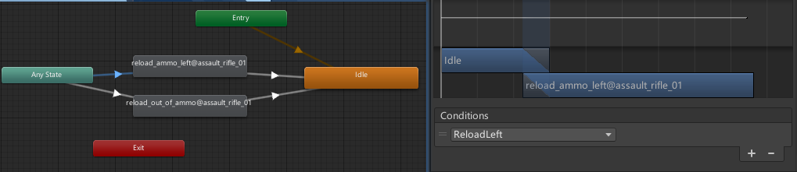
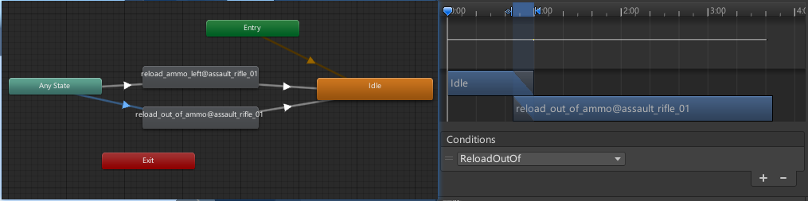
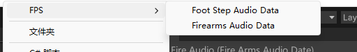
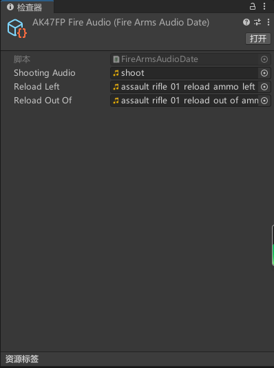
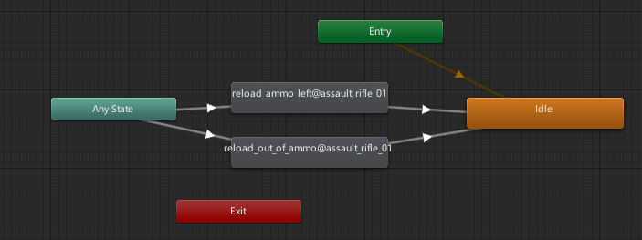
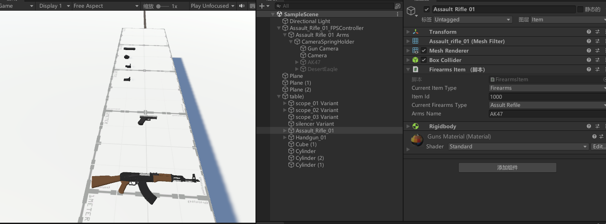

# 创建FPS游戏

- Unity编辑器版本2021.3.21f1c1
- 3D核心模板

## 一、[FPController] - 使用Rigidbody&Capsule Collider制作FPS角色控制器

#### 1.创建胶囊并把摄像机一起放到FPcontroller中


#### 2.FPcontroller添加CapsuleCollider 、RigiBody


#### 3.需要让鼠标移动改变摄像机的值，创建脚本FPMouseLoook

FPMouseLoook.cs

```c#
using System.Collections;

using System.Collections.Generic;

using UnityEngine;

//视角控制

public class FPMouseLoook : MonoBehaviour

{

  //获得自身的组件，一般写在开头,获得的组件一般在Awake里初始化

  private Transform cameraTransform;

  [SerializeField] private Transform characterTransform;

  private Vector3 cameraRotation;

  public float mouseSensitivity = 5f;

  public Vector2 maxInAngle = new Vector2(-65,65);

  private void Awake() 

  {

​    cameraTransform = GetComponent<Transform>();

​    //cameraTransform = transform;

  }

  private void Update() {

​    var tmp_MouseX = Input.GetAxis("Mouse X");

​    var tmp_MouseY = Input.GetAxis("Mouse Y");

​    //摄像机Rotation

​    //y值增加向右旋转

​    cameraRotation.y += tmp_MouseX * mouseSensitivity;

​    //x轴增加向下旋转

​    cameraRotation.x -= tmp_MouseY * mouseSensitivity;

​    //限制向上向下看的角度

​    cameraRotation.x =  Mathf.Clamp(cameraRotation.x,maxInAngle.x,maxInAngle.y);

​    //Quaternion.Euler返回一个旋转，它围绕 z 轴旋转 z 度、围绕 x 轴旋转 x 度、围绕 y 轴旋转 y 度（按该顺序应用）

​    cameraTransform.rotation = Quaternion.Euler(x:cameraRotation.x,y:cameraRotation.y,z:0);
​      
//使用键盘控制移动，同时前进方向应为注视的方向
​      
​    characterTransform.rotation = Quaternion.Euler(x:0,y:cameraRotation.y,z:0);

  }

}
```


#### 4.使用键盘控制移动，同时前进方向应为注视的方向

FPMove.cs

```c#
using System.Collections;

using System.Collections.Generic;

using UnityEngine;

//根据视角方向进行移动

public class FPMove : MonoBehaviour

{

  private Transform characterTransform;

  private Rigidbody characterRigibody;

  public float speed;

  private void Awake() {

​    characterTransform = GetComponent<Transform>();

​    characterRigibody = GetComponent<Rigidbody>();

  }

  private void FixedUpdate() {

​    //Horizontal 这个水平轴其实就是X轴，也就是键盘上的AD键或方向箭头，当静止时为0

​    //当按下A键时这个数值减小，返回一个小于0的数值，同理，D键为大于0的数值；物体就在X轴方向水平移动

​    var tmp_Horizontal = Input.GetAxis("Horizontal");

​    //Vertical 这个垂直轴是Y轴，当我们按下键盘上的WS键也就是前进后退键，当静止时为0

​    //当按下S键时这个数值减小，返回一个小于0的数值，同理，W键为大于0的数值；物体就在Y轴方向垂直移动

​    var tmp_Vertical = Input.GetAxis("Vertical");

​    //当前方向

​    var tmp_CurrentDirection = new Vector3(tmp_Horizontal,0,tmp_Vertical);

​    tmp_CurrentDirection = characterTransform.TransformDirection(tmp_CurrentDirection);

​    tmp_CurrentDirection *= speed;

​    //当前速度

​    var tmp_CurrentVelocity = characterRigibody.velocity;

​    var tmp_VelocityChange = tmp_CurrentDirection - tmp_CurrentVelocity;

​    //速度的改变量

​    tmp_VelocityChange.y = 0;

​    //public void AddForce (Vector3 force（力矢量世界坐标）, ForceMode mode= ForceMode.Force（要施加力的类型）)

​    //沿 force 矢量的方向连续施加力。可以指定 ForceMode /mode/，以将力的类型更改为 Acceleration、Impulse 或 Velocity Change。

​    characterRigibody.AddForce(tmp_VelocityChange,ForceMode.VelocityChange);

​    

  }

}
```

#### 5.编写脚本

FPMove.cs

添加一个平面,同时使角色只有在地面上才移动，添加跳跃

```c#
using System;

using System.Collections;

using System.Collections.Generic;

using UnityEngine;

//根据视角方向进行移动

public class FPMove : MonoBehaviour

{

  private Transform characterTransform;

  private Rigidbody characterRigibody;

  private bool isGrounded;

  public float speed;

  public float gravity;

  public float jumpHeight;

  private void Awake() {

​    characterTransform = GetComponent<Transform>();

​    characterRigibody = GetComponent<Rigidbody>();

  }

  private void FixedUpdate() {

​    if(isGrounded)

​    {

​      //Horizontal 这个水平轴其实就是X轴，也就是键盘上的AD键或方向箭头，当静止时为0

​      //当按下A键时这个数值减小，返回一个小于0的数值，同理，D键为大于0的数值；物体就在X轴方向水平移动

​      var tmp_Horizontal = Input.GetAxis("Horizontal");

​      //Vertical 这个垂直轴是Y轴，当我们按下键盘上的WS键也就是前进后退键，当静止时为0

​      //当按下S键时这个数值减小，返回一个小于0的数值，同理，W键为大于0的数值；物体就在Y轴方向垂直移动

​      var tmp_Vertical = Input.GetAxis("Vertical");

​      //当前方向

​      var tmp_CurrentDirection = new Vector3(tmp_Horizontal,0,tmp_Vertical);

​      tmp_CurrentDirection = characterTransform.TransformDirection(tmp_CurrentDirection);

​      tmp_CurrentDirection *= speed;

​      //当前速度

​      var tmp_CurrentVelocity = characterRigibody.velocity;

​      var tmp_VelocityChange = tmp_CurrentDirection - tmp_CurrentVelocity;

​      //速度的改变量

​      tmp_VelocityChange.y = 0;

​      //public void AddForce (Vector3 force（力矢量世界坐标）, ForceMode mode= ForceMode.Force（要施加力的类型）)

​      //沿 force 矢量的方向连续施加力。可以指定 ForceMode /mode/，以将力的类型更改为 Acceleration、Impulse 或 Velocity Change。

​      characterRigibody.AddForce(tmp_VelocityChange,ForceMode.VelocityChange);

​      if(Input.GetButtonDown("Jump"))

​      {

​        characterRigibody.velocity = new Vector3(tmp_CurrentVelocity.x,CalculateJumpHeightSpeed(),tmp_CurrentVelocity.z);

​      }

​    }

​    

​    characterRigibody.AddForce(new Vector3(0,-gravity * characterRigibody.mass,0));

  }


  private float CalculateJumpHeightSpeed()

  {

​    return Mathf.Sqrt(2*gravity*jumpHeight);

  }


  //碰撞时一直检测


  private void OnCollisionStay(Collision other) {

​    isGrounded = true;   

  }

  //离开时检测

  private void OnCollisionExit(Collision other) {

​    isGrounded = false;

  }

}
```

缺点：会吞掉一些指令

## 二、[FPController] - 使用CharacterController制作FPS角色控制器

####  1.添加CharacterController组件


#### 2.编辑FPControler脚本

FPControler.cs

```c#
using System.Collections;
using System.Collections.Generic;
using UnityEngine;

public class FPControler : MonoBehaviour
{
    private Transform characterTransform;
    private Vector3 movementDirection;
    public float speed = 3.0f;
    public float gravity  = 9.8f;
    public float jumpHeight = 3.0f;
    private CharacterController characterController;
    //获取组件
    private void Awake() {
        characterTransform = GetComponent<Transform>();
        characterController = GetComponent<CharacterController>();
        
    }
    private void Update() {
    if(characterController.isGrounded)
    {
        var tmp_Horizontal = Input.GetAxis("Horizontal");
        var tmp_Vertical = Input.GetAxis("Vertical");
        //当前要移动的方向
        movementDirection = characterTransform.TransformDirection(new Vector3(tmp_Horizontal,0,tmp_Vertical));
        if(Input.GetButtonDown("Jump"))
        {
            movementDirection.y = jumpHeight;
        }
    }
    movementDirection.y -= gravity*Time.deltaTime;
    //Move不实现重力
    characterController.Move(speed*Time.deltaTime*movementDirection);  
    //SimpleMove实现重力
    //characterController.SimpleMove(speed*Time.deltaTime*tmp_MovementDirection);
    }
}

```

## 三、完善FP控制器实现下蹲&静步&行走

#### 1.编辑FPControler.cs脚本

FPControler.cs

```c#
using System.Collections;

using System.Collections.Generic;

using UnityEngine;


public class FPControler : MonoBehaviour

{

  private Transform characterTransform;

  private Vector3 movementDirection;

  public float speed = 3.0f;

  public float walkSpeed = 1.7f;

  public float gravity  = 9.8f;

  public float jumpHeight = 3.0f;

  public float crouchHeight = 1.0f;

  public float smoothTime = 5;

  private float originHeight;

  private bool isCrouched = false;

  private CharacterController characterController;


  //获取组件

  private void Awake() {

​    characterTransform = GetComponent<Transform>();

​    characterController = GetComponent<CharacterController>();

​    originHeight = characterController.height;

  }

  private float tmp_CurrentSpeed = 1.7f;

  private void Update() {

  

  if(characterController.isGrounded)

  {

​    

​    //在地上时可以跳跃与静步

​    var tmp_Horizontal = Input.GetAxis("Horizontal");

​    var tmp_Vertical = Input.GetAxis("Vertical");

​    //当前要移动的方向

​    movementDirection = characterTransform.TransformDirection(new Vector3(tmp_Horizontal,0,tmp_Vertical));

​    //跳跃

​    if(Input.GetButtonDown("Jump"))

​    {

​      movementDirection.y = jumpHeight;

​    }

​    //静步 蹲下时速度都会变化

​    // if(Input.GetKey(KeyCode.LeftShift))

​    // {

​    //   tmp_CurrentSpeed = walkSpeed;

​    // }

​    // else

​    // {

​    //   tmp_CurrentSpeed = speed;

​    // }

​    tmp_CurrentSpeed =  Input.GetKey(KeyCode.LeftShift)||isCrouched?walkSpeed:speed;

  }

  //蹲下与站起

  Crouch_tip();

  movementDirection.y -= gravity*Time.deltaTime;

  //Move不实现重力

  characterController.Move(tmp_CurrentSpeed * Time.deltaTime*movementDirection);  

  //SimpleMove实现重力

  //characterController.SimpleMove(speed*Time.deltaTime*tmp_MovementDirection);

  }

  private void Crouch_tip(){

​    if(Input.GetKeyDown(KeyCode.LeftControl))

​    {

​    //协程函数，用于从2过渡到到1

​    float tmp_TargetHeight = isCrouched?originHeight:crouchHeight;

​    StartCoroutine(DoCrouch(tmp_TargetHeight));

​    isCrouched = !isCrouched;

​    }

  }

  private IEnumerator DoCrouch(float targetHeight){

  float tmp_CurrentHeight= 0;

​    while(Mathf.Abs(characterController.height - targetHeight)>0.1f)

​    {

​      yield return null;

​      characterController.height = 

​        Mathf.SmoothDamp(characterController.height,targetHeight,

​          ref tmp_CurrentHeight,Time.deltaTime*smoothTime);

​    }

  }

}
```


## 四、[FPController] - 手臂资源导入实现行走奔跑

#### 1.导入素材包，应用之前的脚本

POLYGON - FPS SAMPLE

LowPolyFPS Pack - Free(Sample)


#### 2.构建动画，使用混合树来创建不同速度下创建的动画


#### 3.用脚本传入动画控制器中变量Velocity的值来实现控制动画

FPControler.cs

```c#
using System.Collections;

using System.Collections.Generic;

using UnityEngine;


public class FPControler : MonoBehaviour

{
  private Animator animator;
  private Transform characterTransform;
  private Vector3 movementDirection;
  private CharacterController characterController;

  public float speed = 3.0f;

  public float walkSpeed = 1.7f;

  public float gravity  = 9.8f;

  public float jumpHeight = 3.0f;

  public float crouchHeight = 1.0f;

  public float smoothTime = 5;

  private float originHeight;

  private bool isCrouched = false;
  private float velocity;


  //获取组件

  private void Awake() {

	characterTransform = GetComponent<Transform>();

	characterController = GetComponent<CharacterController>();

	animator = GetComponentInChildren<Animator>();

  }
  private void Start() {
    

	originHeight = characterController.height;

  }

  private float tmp_CurrentSpeed = 1.7f;

  private void Update() {

  Vector3 tmp_SubXVelocity ;

  if(characterController.isGrounded)

  {

​    

	//在地上时可以跳跃与静步

	var tmp_Horizontal = Input.GetAxis("Horizontal");

	var tmp_Vertical = Input.GetAxis("Vertical");

	//当前要移动的方向

	movementDirection = characterTransform.TransformDirection(new Vector3(tmp_Horizontal,0,tmp_Vertical));

	//跳跃

	if(Input.GetButtonDown("Jump"))

	{

 	 movementDirection.y = jumpHeight;

	}

	//静步 蹲下时速度都会变化

	// if(Input.GetKey(KeyCode.LeftShift))

	// {

	//   tmp_CurrentSpeed = walkSpeed;

	// }

	// else

	// {

	//   tmp_CurrentSpeed = speed;

	// }

	tmp_CurrentSpeed =  Input.GetKey(KeyCode.LeftShift)||isCrouched?walkSpeed:speed;

  }

  //蹲下与站起

  	Crouch_tip();

 	 movementDirection.y -= gravity*Time.deltaTime;

  	//Move不实现重力

 	 characterController.Move(tmp_CurrentSpeed * Time.deltaTime*movementDirection);  
 	 tmp_SubXVelocity = characterController.velocity;
 	 tmp_SubXVelocity.y = 0;
  	velocity = tmp_SubXVelocity.magnitude;
  	animator.SetFloat("Velocity",velocity);

  	//SimpleMove实现重力

 	 //characterController.SimpleMove(speed*Time.deltaTime*tmp_MovementDirection);

  }

  private void Crouch_tip(){

	if(Input.GetKeyDown(KeyCode.LeftControl))

{

//协程函数，用于从2过渡到到1

	float tmp_TargetHeight = isCrouched?originHeight:crouchHeight;

	StartCoroutine(DoCrouch(tmp_TargetHeight));

	isCrouched = !isCrouched;

}

  }

  private IEnumerator DoCrouch(float targetHeight){

  	float tmp_CurrentHeight= 0;

	while(Mathf.Abs(characterController.height - targetHeight)>0.1f)

	{

 	 yield return null;

 	 characterController.height = 

​   	 Mathf.SmoothDamp(characterController.height,targetHeight,

​      	ref tmp_CurrentHeight,Time.deltaTime*smoothTime);

	}

  }

}
```

使用变量Velocity控制三种动画


## 五、[FPController] - 移动脚步声

#### 1.创建FootStepAudioData.cs

```c#
using System.Collections;

using System.Collections.Generic;

using UnityEngine;

[CreateAssetMenu(menuName ="FPS/FootStepAudioData")]

public class FootStepAudioData : ScriptableObject

{

  public List<FootStepAudio> FootStepAudios = new List<FootStepAudio>();

}


[System.Serializable]//序列化存储

public class FootStepAudio

{

  public string tag;

  public List<AudioClip> AudioClips = new List<AudioClip>();

  public float Delay;

}
```


#### 2.创建FP Foot Step Audio Data


#### 3.插入素材Footstep


#### 4.创建FootStepListener.cs

FootStepListener.cs

```c#
using System.Collections;

using System.Collections.Generic;

using UnityEngine;


public class FootStepListener : MonoBehaviour

{

  public FootStepAudioData footStepAudioData;

  private AudioSource footStepAudioSource;

  private CharacterController characterController;

  private Transform characterTransform;

  private float nextPlayTime;

  public LayerMask playerLayerMask;//用来过滤一些物体(玩家)

  private float audioDelay;

  public enum State

  {

​    idle,

​    walk,

​    run,

​    other


  }

  public State characterState;

private void Awake() {

  characterController = GetComponent<CharacterController>();

  characterTransform = GetComponent<Transform>();

  footStepAudioSource = GetComponent<AudioSource>();

}

private void Update() {

 var tmp_SubXVelocity = characterController.velocity;

 tmp_SubXVelocity.y = 0;

 var velocity = tmp_SubXVelocity.magnitude;

 if(velocity>2)

 {

  characterState = State.run;

 }else if(velocity>1.5&&velocity<2)

 {

  characterState = State.walk;

 }else

 {

  characterState = State.idle;

 }


}

private void FixedUpdate() {

  if(characterController.isGrounded)

  {

​    //normalized单位向量magnityde向量长度

​    if(characterController.velocity.normalized.magnitude>0.1f)

​    {

​      //播放移动声音

​      nextPlayTime+=Time.fixedDeltaTime;

​      //Linecast是以投射的起始位置和终止位置为参数 Raycast则是以投射的起始位置和投射方向为参数来判断这个投射有没有和某个Collider发生了碰撞

​      //~表示求补

​      bool tmp_IsHit = Physics.Raycast(characterTransform.position,Vector3.down,out RaycastHit tmp_HitInfo,2,~playerLayerMask);

​      

​      //bool tmp_IsHit = Physics.Raycast(characterTransform.position,Vector3.down ,out RaycastHit tmp_HitInfo);

//射线检测

// #if UNITY_EDITOR

//   Debug.DrawRay(characterTransform.position,Vector3.down * (characterController.height /2 + characterController.skinWidth*2 - characterController.center.y ),Color.red,0.25f);

// #endif

​      // Debug.Log("hit="+tmp_HitInfo.collider.tag);

​      if(tmp_IsHit)

​      {

​        foreach (var tmp_AudioElement in footStepAudioData.FootStepAudios)

​        {

​          //如果tmp_HitInfo的标签为循环中音源的标签

​          if(tmp_HitInfo.collider.CompareTag(tmp_AudioElement.tag))

​          {

​            switch (characterState)

​            {

​              case(State.run):

​              audioDelay = tmp_AudioElement.Delay;

​              break;

​              case(State.walk):

​              audioDelay = tmp_AudioElement.walkDelay;

​              break;

​              case(State.other):

​              break;

​              default:

​              break;

​            }

​            //如果已经播放的时间大于设置中延迟的时间（延迟的作用是使一个音效可以完整播放完）

​            if(nextPlayTime >=audioDelay)

​            {

​              int tmp_AudioCount = tmp_AudioElement.AudioClips.Count;

​              int tmp_AudioIndex = UnityEngine.Random.Range(0,tmp_AudioCount);

​              //随机播放相应标签中的音效

​              AudioClip tmp_FootStepAudioClip = tmp_AudioElement.AudioClips[tmp_AudioIndex];

​              footStepAudioSource.clip = tmp_FootStepAudioClip;

​              footStepAudioSource.Play();

​              nextPlayTime = 0;

​              break;

​            }

​          }

​        }

​      }

​    }

  }

}

}
```

## 六、实现枪械的射击 - 动画与脚本


#### 1.导入素材包

StylizedProjectilePack1

Series-5

将

Series-5\Artwork\Prefabs\Particle System.prefab

StylizedProjectilePack1\prefabs\Bullet\Bullet_GoldFire\Bullet_Small_Goldfire\Bullet_GoldFire_Small_MuzzleFlare.prefab

放到Components下，调整Transform属性，图层为GUN


#### 2.编写脚本


IWeapon.cs **<u>(武器)</u>**

```c#
using System.Collections;

using System.Collections.Generic;

using UnityEngine;

/*接口是功能的集合，同样可看做是一种数据类型，是比抽象类更为抽象的”类”。

接口只描述所应该具备的方法，并没有具体实现，具体的实现由接口的实现类(相当于接口的子类)来完成。这样将功能的定义与实现分离，优化了程序设计。

请记住：一切事物均有功能，即一切事物均有接口。*/

namespace Script.Weapon

{

  public interface IWeapon

  {

​    void DoAttack();

  }

}
```

Firearms.cs **<u>(枪)</u>**

```c#
using System.Collections;
using System.Collections.Generic;
using UnityEngine;
namespace Script.Weapon
{
    //枪类
    public abstract class Firearms : MonoBehaviour,IWeapon
    {
        public Transform muzzlePonit;//枪口位置
        public Transform casingPoint;//蛋壳抛出位置

        public AudioSource FirearmsReloadAudioSource;//装弹音效
        public AudioSource FirearmsShootingAudioSource;//射击音效
        public FireArmsAudioDate fireArmsAudioDate;//音源数据

        public ParticleSystem muzzleParticle;//枪口火焰粒子
        public ParticleSystem casingParticle;//蛋壳抛出粒子
        
        public int ammoInMag = 30;//弹夹
        public float fireRate;//射速 一秒射出的子弹
        public int maxAmmoCarried = 120;//总弹夹
        public GameObject bulletPrefab;//子弹


        protected int currentAmmo;
        protected int currentMaxCarried;
        protected float lastFireTime;
        protected Animator gunAnimator;//射击动画
        protected AnimatorStateInfo gunStateInfo;//动画的播放状态
        protected virtual void Start()
        {
            currentAmmo = ammoInMag;
            currentMaxCarried = maxAmmoCarried;
            gunAnimator = GetComponent<Animator>();
        }
        public void DoAttack()
        {
            Shooting();//射击
        }
        protected abstract void Shooting();
        protected abstract void Reload();
        protected bool IsAllowShooting()
        {
            return Time.time  - lastFireTime > 1/fireRate;
        }

    }
}
```

AssualtRifle.cs **<u>(突击步枪)</u>**

```c#


using UnityEngine;
using System.Collections;
using System.Collections.Generic;
namespace Script.Weapon
{
    public class AssualtRifle : Firearms
    {
        private IEnumerator reloadAmmoCheckerCoroutine;
        protected override void Start()
        {
            base.Start();
            reloadAmmoCheckerCoroutine = CheckReloadAmmoAnimationEnd();
        }
        protected override void Reload()
        {   
            //图层中顺序由上至下0>1>2，设置第2图层的优先级为1
            gunAnimator.SetLayerWeight(2,1);
            gunAnimator.SetTrigger(currentAmmo>0?"ReloadLeft":"ReloadOutOf");
            //当动画播放完
            //如果直接使用一直按R时会一直进行协程
            //StartCoroutine(CheckReloadAmmoAnimationEnd());
            if(reloadAmmoCheckerCoroutine == null )
            {
            reloadAmmoCheckerCoroutine = CheckReloadAmmoAnimationEnd();
            StartCoroutine(reloadAmmoCheckerCoroutine);
            }
            else
            {
                StopCoroutine(reloadAmmoCheckerCoroutine);//停止协程
                reloadAmmoCheckerCoroutine = null ;
                reloadAmmoCheckerCoroutine = CheckReloadAmmoAnimationEnd();
                StartCoroutine(reloadAmmoCheckerCoroutine);
            }
        }

        protected override void Shooting()
        {
            if(currentAmmo <= 0)return;
            if(!IsAllowShooting())return;
            currentAmmo -= 1;//弹夹减一
            gunAnimator.Play("Fire",0,0);
            CreatBullet();
            muzzleParticle.Play();
            casingParticle.Play();
            lastFireTime = Time.time;//记录最后一次开枪的时间
        }
        private void Update() {
            if(Input.GetMouseButton(0))
            {
                DoAttack();
            }  
            if(Input.GetKeyDown(KeyCode.R))
            {
                Reload();
            }
        }
        /**
         * @description: 创建子弹的飞行速度
         * @return {*}
         */        
        protected void  CreatBullet()
        {
            GameObject tmp_Bullet =  Instantiate(bulletPrefab,muzzlePonit.position,muzzlePonit.rotation);
            var tmp_BulletRigibody = tmp_Bullet.AddComponent<Rigidbody>();
            tmp_BulletRigibody.velocity = tmp_Bullet.transform.forward *190f;
        }
        /**
         * @description: 装弹动画播放完毕后进行弹夹的替换
         * @return {*}
         */        
        private IEnumerator CheckReloadAmmoAnimationEnd()
        {
            while(true)
            {
                yield return null;
                gunStateInfo = gunAnimator.GetCurrentAnimatorStateInfo(2);
                if(gunStateInfo.IsTag("ReloadTag"))
                {
                    //和动画里的过度时间对应
                    if(gunStateInfo.normalizedTime>=0.89f)
                    {
                        int tmp_NeedAmmoCount = ammoInMag - currentAmmo;
                        int tmp_RemainingAmmo = currentMaxCarried - tmp_NeedAmmoCount;
                        if(tmp_RemainingAmmo <= 0)
                        {
                            currentAmmo += currentMaxCarried;
                            currentMaxCarried = 0;
                        }
                        else
                        {
                            currentAmmo = ammoInMag;
                            currentMaxCarried = tmp_RemainingAmmo;
                        }
                        yield break;
                    }
                }
            }
        }
    }
}
```

#### 3.开火动画

在Firearms.cs 中调用gunAnimator.Play("Fire",0,0);


#### 4.装弹动画





## 七、实现枪械的射击 - 音效与脚本

#### 1.编写FootStepAudioData脚本

FootStepAudioData.cs

```c#
using System.Collections;

using System.Collections.Generic;

using UnityEngine;

namespace Script.Weapon

{

  //继承ScriptableObject类，如果你想创建不需要附加到游戏对象上的对象，你可以从中派生出一个类。

  [CreateAssetMenu(menuName = "FPS/Firearms Audio Data")]

  public class FireArmsAudioDate : ScriptableObject

  {

​    public AudioClip shootingAudio;

​    //TODO消音器

​    public AudioClip reloadLeft;

​    public AudioClip reloadOutOf;

  }

}
```


#### 2.创建AK47 Firearms Audio Data序列化对象





#### 3. 编辑AssualtRifle脚本

AssualtRifle.cs

```c#
using UnityEngine;

using System.Collections;

using System.Collections.Generic;

namespace Script.Weapon

{

  public class AssualtRifle : Firearms

  {

​    private IEnumerator reloadAmmoCheckerCoroutine;

​    protected override void Start()

​    {

​      base.Start();

​      reloadAmmoCheckerCoroutine = CheckReloadAmmoAnimationEnd();

​    }

​    protected override void Reload()

​    {  

​      //图层中顺序由上至下0>1>2，设置第2图层的优先级为1

​      gunAnimator.SetLayerWeight(2,1);

​      gunAnimator.SetTrigger(currentAmmo>0?"ReloadLeft":"ReloadOutOf");

​      //当动画播放完

​      //如果直接使用一直按R时会一直进行协程

​      //StartCoroutine(CheckReloadAmmoAnimationEnd());

​      FirearmsReloadAudioSource.clip = currentAmmo>0?fireArmsAudioDate.reloadLeft:fireArmsAudioDate.reloadOutOf;

​      FirearmsReloadAudioSource.Play();

​      if(reloadAmmoCheckerCoroutine == null )

​      {

​      reloadAmmoCheckerCoroutine = CheckReloadAmmoAnimationEnd();

​      StartCoroutine(reloadAmmoCheckerCoroutine);

​      }

​      else

​      {

​        StopCoroutine(reloadAmmoCheckerCoroutine);//停止协程

​        reloadAmmoCheckerCoroutine = null ;

​        reloadAmmoCheckerCoroutine = CheckReloadAmmoAnimationEnd();

​        StartCoroutine(reloadAmmoCheckerCoroutine);

​      }

​    }


​    protected override void Shooting()

​    {

​      if(currentAmmo <= 0)return;

​      if(!IsAllowShooting())return;

​      currentAmmo -= 1;//弹夹减一

​      gunAnimator.Play("Fire",0,0);

​      CreatBullet();

​      //开枪音效

​      FirearmsShootingAudioSource.clip = fireArmsAudioDate.shootingAudio;

​      FirearmsShootingAudioSource.Play();

​      //开枪特效

​      muzzleParticle.Play();

​      casingParticle.Play();

​      lastFireTime = Time.time;//记录最后一次开枪的时间

​    }

​    private void Update() {

​      if(Input.GetMouseButton(0))

​      {

​        DoAttack();

​      }  

​      if(Input.GetKeyDown(KeyCode.R))

​      {

​        Reload();

​      }

​    }

​    /**

​     \* @description: 创建子弹的飞行速度

​     \* @return {*}

​     */     

​    protected void  CreatBullet()

​    {

​      GameObject tmp_Bullet =  Instantiate(bulletPrefab,muzzlePonit.position,muzzlePonit.rotation);

​      var tmp_BulletRigibody = tmp_Bullet.AddComponent<Rigidbody>();

​      tmp_BulletRigibody.velocity = tmp_Bullet.transform.forward *190f;

​    }

​    /**

​     \* @description: 装弹动画播放完毕后进行弹夹的替换

​     \* @return {*}

​     */     

​    private IEnumerator CheckReloadAmmoAnimationEnd()

​    {

​      while(true)

​      {

​        yield return null;

​        gunStateInfo = gunAnimator.GetCurrentAnimatorStateInfo(2);

​        if(gunStateInfo.IsTag("ReloadTag"))

​        {

​          

​          //和动画里的过度时间对应

​          if(gunStateInfo.normalizedTime>=0.89f)

​          {

​            int tmp_NeedAmmoCount = ammoInMag - currentAmmo;

​            int tmp_RemainingAmmo = currentMaxCarried - tmp_NeedAmmoCount;

​            if(tmp_RemainingAmmo <= 0)

​            {

​              currentAmmo += currentMaxCarried;

​              currentMaxCarried = 0;

​            }

​            else

​            {

​              currentAmmo = ammoInMag;

​              currentMaxCarried = tmp_RemainingAmmo;

​            }

​            yield break;

​          }

​        }

​      }

​    }

  }

}
```

## 八、实现枪械的射击 - 瞄准与脚本

#### 1.瞄准动画



#### 2.编写脚本

```c#
using UnityEngine;

using System.Collections;

using System.Collections.Generic;

namespace Script.Weapon

{

  public class AssualtRifle : Firearms

  {

​    private IEnumerator reloadAmmoCheckerCoroutine;

​    private IEnumerator doAimCoroutine;

​    protected override void Start()

​    {

​      base.Start();

​      reloadAmmoCheckerCoroutine = CheckReloadAmmoAnimationEnd();

​      doAimCoroutine = DoAim();

​    }

​    protected override void Reload()

​    {  

​      //图层中顺序由上至下0>1>2，设置第2图层的优先级为1

​      gunAnimator.SetLayerWeight(2,1);

​      gunAnimator.SetTrigger(currentAmmo>0?"ReloadLeft":"ReloadOutOf");

​      //当动画播放完

​      //如果直接使用一直按R时会一直进行协程

​      //StartCoroutine(CheckReloadAmmoAnimationEnd());

​      FirearmsReloadAudioSource.clip = currentAmmo>0?fireArmsAudioDate.reloadLeft:fireArmsAudioDate.reloadOutOf;

​      FirearmsReloadAudioSource.Play();

​      if(reloadAmmoCheckerCoroutine == null )

​      {

​      reloadAmmoCheckerCoroutine = CheckReloadAmmoAnimationEnd();

​      StartCoroutine(reloadAmmoCheckerCoroutine);

​      }

​      else

​      {

​        StopCoroutine(reloadAmmoCheckerCoroutine);//停止协程

​        reloadAmmoCheckerCoroutine = null ;

​        reloadAmmoCheckerCoroutine = CheckReloadAmmoAnimationEnd();

​        StartCoroutine(reloadAmmoCheckerCoroutine);

​      }

​    }


​    protected override void Shooting()

​    {

​      if(currentAmmo <= 0)return;

​      if(!IsAllowShooting())return;

​      currentAmmo -= 1;//弹夹减一

​      gunAnimator.Play("Fire",isAim?1:0,0);

​      CreatBullet();

​      //开枪音效

​      FirearmsShootingAudioSource.clip = fireArmsAudioDate.shootingAudio;

​      FirearmsShootingAudioSource.Play();

​      //开枪特效

​      muzzleParticle.Play();

​      casingParticle.Play();

​      lastFireTime = Time.time;//记录最后一次开枪的时间

​    }

​    protected override void Aim()

​    {

​      gunAnimator.SetBool("Aim",isAim);

​      if(doAimCoroutine == null)

​      {

​        doAimCoroutine = DoAim();

​        StartCoroutine(doAimCoroutine);

​      }

​      else

​      {

​        StopCoroutine(doAimCoroutine);

​        doAimCoroutine = null;

​        doAimCoroutine = DoAim();

​        StartCoroutine(doAimCoroutine);

​      }

​      

​      

​    }

​    private void Update() {

​      if(Input.GetMouseButton(0))

​      {

​        DoAttack();

​      }  

​      if(Input.GetKeyDown(KeyCode.R))

​      {

​        Reload();

​      }

​      if(Input.GetMouseButtonDown(1))

​      {

​        isAim=true;

​        Aim();

​      }

​      if(Input.GetMouseButtonUp(1))

​      {

​        isAim=false;

​        Aim();

​      }

​    }

​    /**

​     \* @description: 创建子弹的飞行速度

​     \* @return {*}

​     */     

​    protected void  CreatBullet()

​    {

​      GameObject tmp_Bullet =  Instantiate(bulletPrefab,muzzlePonit.position,muzzlePonit.rotation);

​      var tmp_BulletRigibody = tmp_Bullet.AddComponent<Rigidbody>();

​      tmp_BulletRigibody.velocity = tmp_Bullet.transform.forward *190f;

​    }

​    \#region 换弹检测

​    /**

​     \* @description: 装弹动画播放完毕后进行弹夹的替换

​     \* @return {*}

​     */     

​    private IEnumerator CheckReloadAmmoAnimationEnd()

​    {

​      while(true)

​      {

​        yield return null;

​        gunStateInfo = gunAnimator.GetCurrentAnimatorStateInfo(2);

​        if(gunStateInfo.IsTag("ReloadTag"))

​        {

​          

​          //和动画里的过度时间对应

​          if(gunStateInfo.normalizedTime>=0.89f)

​          {

​            int tmp_NeedAmmoCount = ammoInMag - currentAmmo;

​            int tmp_RemainingAmmo = currentMaxCarried - tmp_NeedAmmoCount;

​            if(tmp_RemainingAmmo <= 0)

​            {

​              currentAmmo += currentMaxCarried;

​              currentMaxCarried = 0;

​            }

​            else

​            {

​              currentAmmo = ammoInMag;

​              currentMaxCarried = tmp_RemainingAmmo;

​            }

​            yield break;

​          }

​        }

​      }

​    }

​    \#endregion

​    private IEnumerator DoAim()

​    {

​      while(true)

​      {

​        yield return null;


​        float tmp_CurrentFov = 0;

​        eyeCamera.fieldOfView = Mathf.SmoothDamp(eyeCamera.fieldOfView,isAim?45:originCameraFOV,ref tmp_CurrentFov,Time.deltaTime*2);

​      }

​    }

  }

}
```

## 九、实现枪械的射击 - 补充

#### 1.弹孔与音效

AssualtRifle.cs

```c#
using UnityEngine;
using System.Collections;
using System.Collections.Generic;
namespace Script.Weapon
{
    public class AssualtRifle : Firearms
    {
        private IEnumerator reloadAmmoCheckerCoroutine;
        private IEnumerator doAimCoroutine;
        protected override void Start()
        {
            base.Start();
            reloadAmmoCheckerCoroutine = CheckReloadAmmoAnimationEnd();
            doAimCoroutine = DoAim();
        }
        protected override void Reload()
        {   
            //图层中顺序由上至下0>1>2，设置第2图层的优先级为1
            gunAnimator.SetLayerWeight(2,1);
            gunAnimator.SetTrigger(currentAmmo>0?"ReloadLeft":"ReloadOutOf");
            //当动画播放完
            //如果直接使用一直按R时会一直进行协程
            //StartCoroutine(CheckReloadAmmoAnimationEnd());
            FirearmsReloadAudioSource.clip = currentAmmo>0?fireArmsAudioDate.reloadLeft:fireArmsAudioDate.reloadOutOf;
            FirearmsReloadAudioSource.Play();
            if(reloadAmmoCheckerCoroutine == null )
            {
            reloadAmmoCheckerCoroutine = CheckReloadAmmoAnimationEnd();
            StartCoroutine(reloadAmmoCheckerCoroutine);
            }
            else
            {
                StopCoroutine(reloadAmmoCheckerCoroutine);//停止协程
                reloadAmmoCheckerCoroutine = null ;
                reloadAmmoCheckerCoroutine = CheckReloadAmmoAnimationEnd();
                StartCoroutine(reloadAmmoCheckerCoroutine);
            }
        }

        protected override void Shooting()
        {
            if(currentAmmo <= 0)return;
            if(!IsAllowShooting())return;
            currentAmmo -= 1;//弹夹减一
            gunAnimator.Play("Fire",isAim?1:0,0);
            CreatBullet();
            //开枪音效
            FirearmsShootingAudioSource.clip = fireArmsAudioDate.shootingAudio;
            FirearmsShootingAudioSource.Play();
            //开枪特效
            muzzleParticle.Play();
            casingParticle.Play();
            lastFireTime = Time.time;//记录最后一次开枪的时间
        }
        protected override void Aim()
        {
            gunAnimator.SetBool("Aim",isAim);
            if(doAimCoroutine == null)
            {
                doAimCoroutine = DoAim();
                StartCoroutine(doAimCoroutine);
            }
            else
            {
                StopCoroutine(doAimCoroutine);
                doAimCoroutine = null;
                doAimCoroutine = DoAim();
                StartCoroutine(doAimCoroutine);
            }
            
            
        }
        private void Update() {
            if(Input.GetMouseButton(0))
            {
                DoAttack();
            }  
            if(Input.GetKeyDown(KeyCode.R))
            {
                Reload();
            }
            if(Input.GetMouseButtonDown(1))
            {
                isAim=true;
                Aim();
            }
            if(Input.GetMouseButtonUp(1))
            {
                isAim=false;
                Aim();
            }
        }
        /**
         * @description: 创建子弹的飞行速度
         * @return {*}
         */        
        protected void  CreatBullet()
        {
            GameObject tmp_Bullet =  Instantiate(bulletPrefab,muzzlePonit.position,muzzlePonit.rotation);
            var tmp_BulletScript = tmp_Bullet.AddComponent<Bullet>();
            tmp_BulletScript.tmp_DestroyBullet = tmp_Bullet;
            tmp_BulletScript.shootImpactAudioData = shootImpactAudioData;
            tmp_BulletScript.impactPrefab = bulletImpactPrefabe;//该枪射击弹坑
            tmp_BulletScript.bulletSpeed = 19f;//该枪子弹速度 
        }
        #region 换弹检测
        /**
         * @description: 装弹动画播放完毕后进行弹夹的替换
         * @return {*}
         */        
        private IEnumerator CheckReloadAmmoAnimationEnd()
        {
            while(true)
            {
                yield return null;
                gunStateInfo = gunAnimator.GetCurrentAnimatorStateInfo(2);
                if(gunStateInfo.IsTag("ReloadTag"))
                {
                    
                    //和动画里的过度时间对应
                    if(gunStateInfo.normalizedTime>=0.89f)
                    {
                        int tmp_NeedAmmoCount = ammoInMag - currentAmmo;
                        int tmp_RemainingAmmo = currentMaxCarried - tmp_NeedAmmoCount;
                        if(tmp_RemainingAmmo <= 0)
                        {
                            currentAmmo += currentMaxCarried;
                            currentMaxCarried = 0;
                        }
                        else
                        {
                            currentAmmo = ammoInMag;
                            currentMaxCarried = tmp_RemainingAmmo;
                        }
                        yield break;
                    }
                }
            }
        }
        #endregion
        private IEnumerator DoAim()
        {
            while(true)
            {
                yield return null;
                float tmp_CurrentFov = 0;
                eyeCamera.fieldOfView = Mathf.SmoothDamp(eyeCamera.fieldOfView,isAim?45:originCameraFOV,ref tmp_CurrentFov,Time.deltaTime*2);
            }
        }
    }
}
```

Bullet.cs

```c#
using System.Collections;
using System.Collections.Generic;
using UnityEngine;
namespace Script.Weapon
{
    public class Bullet : MonoBehaviour
    {
        public float bulletSpeed = 19f;//子弹速度
        public GameObject impactPrefab;//碰撞弹印
        public GameObject tmp_DestroyBullet;//子弹(用于销毁)
        public ShootImpactAudioData shootImpactAudioData;//音效
        private Vector3 prevPosition;
        private Transform bulletTransform;
        private void Awake() 
        {
            bulletTransform = GetComponent<Transform>();
            prevPosition = bulletTransform.position;
        }
        private void FixedUpdate() {
            prevPosition = bulletTransform.position;
            bulletTransform.Translate(0,0,bulletSpeed*Time.deltaTime);
            if(!Physics.Raycast(prevPosition,(bulletTransform.position - prevPosition).normalized,out RaycastHit tmp_Hit,(bulletTransform.position-prevPosition).magnitude))
            {
                return;
            }
            else
            {
                //特效
                var tmp_BulletEffect = Instantiate(impactPrefab,tmp_Hit.point,Quaternion.LookRotation(tmp_Hit.normal,Vector3.up));
                Destroy(tmp_DestroyBullet,0);
                Destroy(tmp_BulletEffect,3f);

                //音频
                var tmp_TagWithAudio = shootImpactAudioData.impactTagsWithAuidos.Find((tmp_AudioData) =>tmp_AudioData.tag.Equals(tmp_Hit.collider.tag));
                if(tmp_TagWithAudio == null)return;
                int tmp_Length = tmp_TagWithAudio.impactAduioClips.Count;
                AudioClip tmp_AudioClip =  tmp_TagWithAudio.impactAduioClips[Random.Range(0,tmp_Length)];
                AudioSource.PlayClipAtPoint(tmp_AudioClip,tmp_Hit.point,1f);
            }
        }
    }
}

```

ShootImpactAudioData.cs

```c#
using System.Collections;
using System.Collections.Generic;
using UnityEngine;
namespace Script.Weapon

{
    [CreateAssetMenu(menuName ="FPS/Shoot Impact Audio Data")]
    public class ShootImpactAudioData : ScriptableObject
    {
        public List<impactTagsWithAuido> impactTagsWithAuidos;
    }
    [System.Serializable]
    public class impactTagsWithAuido
    {
        public string tag;
        public List<AudioClip> impactAduioClips;
    }
}

```

#### 2.后坐力

Firearms.cs

```c#
using System.Collections;
using System.Collections.Generic;
using UnityEngine;
namespace Script.Weapon
{
    //枪类
    public abstract class Firearms : MonoBehaviour,IWeapon
    {
        public Transform muzzlePonit;//枪口位置
        public Transform casingPoint;//蛋壳抛出位置
        public Camera eyeCamera;//倍镜

        public AudioSource FirearmsReloadAudioSource;//装弹音效
        public AudioSource FirearmsShootingAudioSource;//射击音效
        public FireArmsAudioDate fireArmsAudioDate;//音源数据

        public ParticleSystem muzzleParticle;//枪口火焰粒子
        public ParticleSystem casingParticle;//蛋壳抛出粒子
        public ShootImpactAudioData shootImpactAudioData;//子弹碰撞音效
        
        public int ammoInMag = 30;//弹夹
        public float fireRate;//射速 一秒射出的子弹
        public int maxAmmoCarried = 120;//总弹夹
        public GameObject bulletPrefab;//子弹
        public GameObject bulletImpactPrefabe;//子弹碰撞

        protected float originCameraFOV;//初始的视野
        protected int currentAmmo;
        protected int currentMaxCarried;
        protected float lastFireTime;
        protected bool isAim = false;
        protected Animator gunAnimator;//射击动画
        protected AnimatorStateInfo gunStateInfo;//动画的播放状态
        
        protected FPMouseLoook mouseLook;
        protected virtual void Start()
        {
            currentAmmo = ammoInMag;
            currentMaxCarried = maxAmmoCarried;
            gunAnimator = GetComponent<Animator>();
            originCameraFOV = eyeCamera.fieldOfView;
            mouseLook = FindObjectOfType<FPMouseLoook>();
        }
        public void DoAttack()
        {
            Shooting();//射击
        }
        protected abstract void Shooting();
        protected abstract void Reload();
        protected abstract void Aim();
        protected bool IsAllowShooting()
        {
            return Time.time  - lastFireTime > 1/fireRate;
        }

    }
}
```

```c#
using UnityEngine;
using System.Collections;
using System.Collections.Generic;
namespace Script.Weapon
{
    public class AssualtRifle : Firearms
    {
        private IEnumerator reloadAmmoCheckerCoroutine;
        private IEnumerator doAimCoroutine;
        
        protected override void Start()
        {
            base.Start();
            reloadAmmoCheckerCoroutine = CheckReloadAmmoAnimationEnd();
            doAimCoroutine = DoAim();
        }
        protected override void Reload()
        {   
            //图层中顺序由上至下0>1>2，设置第2图层的优先级为1
            gunAnimator.SetLayerWeight(2,1);
            gunAnimator.SetTrigger(currentAmmo>0?"ReloadLeft":"ReloadOutOf");
            //当动画播放完
            //如果直接使用一直按R时会一直进行协程
            //StartCoroutine(CheckReloadAmmoAnimationEnd());
            FirearmsReloadAudioSource.clip = currentAmmo>0?fireArmsAudioDate.reloadLeft:fireArmsAudioDate.reloadOutOf;
            FirearmsReloadAudioSource.Play();
            if(reloadAmmoCheckerCoroutine == null )
            {
            reloadAmmoCheckerCoroutine = CheckReloadAmmoAnimationEnd();
            StartCoroutine(reloadAmmoCheckerCoroutine);
            }
            else
            {
                StopCoroutine(reloadAmmoCheckerCoroutine);//停止协程
                reloadAmmoCheckerCoroutine = null ;
                reloadAmmoCheckerCoroutine = CheckReloadAmmoAnimationEnd();
                StartCoroutine(reloadAmmoCheckerCoroutine);
            }
        }

        protected override void Shooting()
        {
            if(currentAmmo <= 0)return;
            if(!IsAllowShooting())return;
            currentAmmo -= 1;//弹夹减一
            gunAnimator.Play("Fire",isAim?1:0,0);
            CreatBullet();
            //开枪音效
            FirearmsShootingAudioSource.clip = fireArmsAudioDate.shootingAudio;
            FirearmsShootingAudioSource.Play();
            //开枪特效
            muzzleParticle.Play();
            casingParticle.Play();
            mouseLook.FiringForTest();
            lastFireTime = Time.time;//记录最后一次开枪的时间
        }
        protected override void Aim()
        {
            gunAnimator.SetBool("Aim",isAim);
            if(doAimCoroutine == null)
            {
                doAimCoroutine = DoAim();
                StartCoroutine(doAimCoroutine);
            }
            else
            {
                StopCoroutine(doAimCoroutine);
                doAimCoroutine = null;
                doAimCoroutine = DoAim();
                StartCoroutine(doAimCoroutine);
            }
            
            
        }
        private void Update() {
            if(Input.GetMouseButton(0))
            {
                DoAttack();
            }  
            if(Input.GetKeyDown(KeyCode.R))
            {
                Reload();
            }
            if(Input.GetMouseButtonDown(1))
            {
                isAim=true;
                Aim();
            }
            if(Input.GetMouseButtonUp(1))
            {
                isAim=false;
                Aim();
            }
        }
        /**
         * @description: 创建子弹的飞行速度
         * @return {*}
         */        
        protected void  CreatBullet()
        {
            GameObject tmp_Bullet =  Instantiate(bulletPrefab,muzzlePonit.position,muzzlePonit.rotation);
            var tmp_BulletScript = tmp_Bullet.AddComponent<Bullet>();
            tmp_BulletScript.tmp_DestroyBullet = tmp_Bullet;
            tmp_BulletScript.shootImpactAudioData = shootImpactAudioData;
            tmp_BulletScript.impactPrefab = bulletImpactPrefabe;//该枪射击弹坑
            tmp_BulletScript.bulletSpeed = 19f;//该枪子弹速度 
        }
        #region 换弹检测
        /**
         * @description: 装弹动画播放完毕后进行弹夹的替换
         * @return {*}
         */        
        private IEnumerator CheckReloadAmmoAnimationEnd()
        {
            while(true)
            {
                yield return null;
                gunStateInfo = gunAnimator.GetCurrentAnimatorStateInfo(2);
                if(gunStateInfo.IsTag("ReloadTag"))
                {
                    
                    //和动画里的过度时间对应
                    if(gunStateInfo.normalizedTime>=0.89f)
                    {
                        int tmp_NeedAmmoCount = ammoInMag - currentAmmo;
                        int tmp_RemainingAmmo = currentMaxCarried - tmp_NeedAmmoCount;
                        if(tmp_RemainingAmmo <= 0)
                        {
                            currentAmmo += currentMaxCarried;
                            currentMaxCarried = 0;
                        }
                        else
                        {
                            currentAmmo = ammoInMag;
                            currentMaxCarried = tmp_RemainingAmmo;
                        }
                        yield break;
                    }
                }
            }
        }
        #endregion
        private IEnumerator DoAim()
        {
            while(true)
            {
                yield return null;
                float tmp_CurrentFov = 0;
                eyeCamera.fieldOfView = Mathf.SmoothDamp(eyeCamera.fieldOfView,isAim?45:originCameraFOV,ref tmp_CurrentFov,Time.deltaTime*2);
            }
        }
    }
}
```

```c#
using System.Collections;

using System.Collections.Generic;

using UnityEngine;

//视角控制

public class FPMouseLoook : MonoBehaviour

{

  //获得自身的组件，一般写在开头,获得的组件一般在Awake里初始化

  private Transform cameraTransform;

  [SerializeField] private Transform characterTransform;

  

  public float mouseSensitivity = 5.0f;//鼠标灵敏度
  public Vector2 maxInAngle = new Vector2(-65,65);//向上向下看最大角度
  public AnimationCurve recoilAnimationCurve;//后坐力曲线
  public Vector2 recoilRange = new Vector2(0.5f,0.2f);//后坐力范围
  public float recoilFadeOutTime = 0.3f;//后坐力缓冲系数
  private Transform cameraTransForm;
  private Vector3 cameraRotation;
  private float currentRecoilTime;
  private Vector2 currentRecoil;

  private void Awake() 

  {

    cameraTransform = GetComponent<Transform>();

    //cameraTransform = transform;
    currentRecoil = recoilRange;

  }

  private void Update() {

    var tmp_MouseX = Input.GetAxis("Mouse X");

    var tmp_MouseY = Input.GetAxis("Mouse Y");

    //摄像机Rotation

    //y值增加向右旋转

    cameraRotation.y += tmp_MouseX * mouseSensitivity;

    //x轴增加向下旋转

    cameraRotation.x -= tmp_MouseY * mouseSensitivity;

    //限制向上向下看的角度
    //后坐力影响
    CalculateRecoilOffset();
    cameraRotation.y += currentRecoil.y;
    cameraRotation.x -= currentRecoil.x;
    

    cameraRotation.x =  Mathf.Clamp(cameraRotation.x,maxInAngle.x,maxInAngle.y);

    //Quaternion.Euler返回一个旋转，它围绕 z 轴旋转 z 度、围绕 x 轴旋转 x 度、围绕 y 轴旋转 y 度（按该顺序应用）

    cameraTransform.rotation = Quaternion.Euler(x:cameraRotation.x,y:cameraRotation.y,z:0);
      
//使用键盘控制移动，同时前进方向应为注视的方向
      
    characterTransform.rotation = Quaternion.Euler(x:0,y:cameraRotation.y,z:0);

  }
  /**
   * @description: 计算后坐力偏移
   * @return {*}
   */  
  private void CalculateRecoilOffset()
  {
    currentRecoilTime+= Time.deltaTime;
    float tmp_RecoilFraction = currentRecoilTime / recoilFadeOutTime;
    float tmp_RecoilValue = recoilAnimationCurve.Evaluate(tmp_RecoilFraction);
    currentRecoil = Vector2.Lerp(Vector2.zero,currentRecoil,tmp_RecoilValue);
  }
  public void FiringForTest()
  {
    currentRecoil += recoilRange;
    //每次射击时，使曲线开始时间为零
    currentRecoilTime = 0;
  }
}
```

#### 3.散射

Firearms.cs

```c#
using System.Collections;
using System.Collections.Generic;
using UnityEngine;
namespace Script.Weapon
{
    //枪类
    public abstract class Firearms : MonoBehaviour,IWeapon
    {
        public Transform muzzlePonit;//枪口位置
        public Transform casingPoint;//蛋壳抛出位置
        public Camera eyeCamera;//倍镜

        public AudioSource FirearmsReloadAudioSource;//装弹音效
        public AudioSource FirearmsShootingAudioSource;//射击音效
        public FireArmsAudioDate fireArmsAudioDate;//音源数据

        public ParticleSystem muzzleParticle;//枪口火焰粒子
        public ParticleSystem casingParticle;//蛋壳抛出粒子
        public ShootImpactAudioData shootImpactAudioData;//子弹碰撞音效
        
        public int ammoInMag = 30;//弹夹
        public float fireRate;//射速 一秒射出的子弹
        public int maxAmmoCarried = 120;//总弹夹
        public GameObject bulletPrefab;//子弹
        public GameObject bulletImpactPrefabe;//子弹碰撞
        public float spreadAngle = 70;//子弹散射
        public AnimationCurve horizontalRecoilAnimationCurve;//水平后坐力曲线
        public AnimationCurve verticalRecoilAnimationCurve;//垂直后坐力曲线

        protected float originCameraFOV;//初始的视野
        protected int currentAmmo;
        protected int currentMaxCarried;
        protected float lastFireTime;
        protected bool isAim = false;
        protected Animator gunAnimator;//射击动画
        protected AnimatorStateInfo gunStateInfo;//动画的播放状态
        protected bool isshooting;
        
        protected FPMouseLoook mouseLook;
        protected virtual void Start()
        {
            currentAmmo = ammoInMag;
            currentMaxCarried = maxAmmoCarried;
            gunAnimator = GetComponent<Animator>();
            originCameraFOV = eyeCamera.fieldOfView;
            mouseLook = FindObjectOfType<FPMouseLoook>();
        }
        public void DoAttack()
        {
            Shooting();//射击
        }
        protected abstract void Shooting();
        protected abstract void Reload();
        protected abstract void Aim();
        protected abstract void RecoilValue();//后坐力
        protected bool IsAllowShooting()
        {
            return Time.time  - lastFireTime > 1f/fireRate;
        }
        protected bool IsStopShooting()
        {
            return Time.time - lastFireTime > 3f/(fireRate);//设置停止射击 连续发射三发子弹的时间为停止开火
        }
    }
}
```

FPMouseLoook.cs

```c#
using System.Collections;

using System.Collections.Generic;

using UnityEngine;

//视角控制

public class FPMouseLoook : MonoBehaviour

{

  //获得自身的组件，一般写在开头,获得的组件一般在Awake里初始化

  private Transform cameraTransform;

  [SerializeField] private Transform characterTransform;


  public float mouseSensitivity = 5.0f;//鼠标灵敏度
  public Vector2 maxInAngle = new Vector2(-65,65);//向上向下看最大角度

  private Transform cameraTransForm;
  private Vector3 cameraRotation;


  private void Awake() 

  {
    cameraTransform = GetComponent<Transform>();
  }

  private void Update() {

    var tmp_MouseX = Input.GetAxis("Mouse X");

    var tmp_MouseY = Input.GetAxis("Mouse Y");
    
    
    //摄像机Rotation

    //y值增加向右旋转

    cameraRotation.y += tmp_MouseX * mouseSensitivity;

    //x轴增加向下旋转

    cameraRotation.x -= tmp_MouseY * mouseSensitivity;

    //限制向上向下看的角度

    

    cameraRotation.x =  Mathf.Clamp(cameraRotation.x,maxInAngle.x,maxInAngle.y);

    //Quaternion.Euler返回一个旋转，它围绕 z 轴旋转 z 度、围绕 x 轴旋转 x 度、围绕 y 轴旋转 y 度（按该顺序应用）

    cameraTransform.rotation = Quaternion.Euler(x:cameraRotation.x,y:cameraRotation.y,z:0);
      
//使用键盘控制移动，同时前进方向应为注视的方向
      
    characterTransform.rotation = Quaternion.Euler(x:0,y:cameraRotation.y,z:0);

  }
  //todo 后坐力应该考虑上下角度范围
  public void SetRecoilCamera(float tmp_HorizontalRecoilValue,float tmp_VerticalRecoilValue)
  {
    cameraRotation.y += tmp_HorizontalRecoilValue;
    cameraRotation.x -= tmp_VerticalRecoilValue;
  }
}
```

AssualtRifle.cs

```c#
using UnityEngine;
using System.Collections;
using System.Collections.Generic;
namespace Script.Weapon
{
    public class AssualtRifle : Firearms
    {
        
        private float currentRecoilTime;
        private IEnumerator reloadAmmoCheckerCoroutine;
        private IEnumerator doAimCoroutine;
        
        protected override void Start()
        {
            base.Start();
            reloadAmmoCheckerCoroutine = CheckReloadAmmoAnimationEnd();
            doAimCoroutine = DoAim();
        }
        protected override void Reload()
        {   
            //图层中顺序由上至下0>1>2，设置第2图层的优先级为1
            gunAnimator.SetLayerWeight(2,1);
            gunAnimator.SetTrigger(currentAmmo>0?"ReloadLeft":"ReloadOutOf");
            //当动画播放完
            //如果直接使用一直按R时会一直进行协程
            //StartCoroutine(CheckReloadAmmoAnimationEnd());
            FirearmsReloadAudioSource.clip = currentAmmo>0?fireArmsAudioDate.reloadLeft:fireArmsAudioDate.reloadOutOf;
            FirearmsReloadAudioSource.Play();
            if(reloadAmmoCheckerCoroutine == null )
            {
            reloadAmmoCheckerCoroutine = CheckReloadAmmoAnimationEnd();
            StartCoroutine(reloadAmmoCheckerCoroutine);
            }
            else
            {
                StopCoroutine(reloadAmmoCheckerCoroutine);//停止协程
                reloadAmmoCheckerCoroutine = null ;
                reloadAmmoCheckerCoroutine = CheckReloadAmmoAnimationEnd();
                StartCoroutine(reloadAmmoCheckerCoroutine);
            }
        }

        protected override void Shooting()
        {
            if(currentAmmo <= 0)return;
            if(!IsAllowShooting())return;
            currentAmmo -= 1;//弹夹减一
            gunAnimator.Play("Fire",isAim?1:0,0);
            CreatBullet();//创建子弹时实现子弹偏移
            //开枪音效
            FirearmsShootingAudioSource.clip = fireArmsAudioDate.shootingAudio;
            FirearmsShootingAudioSource.Play();
            //开枪特效
            muzzleParticle.Play();
            casingParticle.Play();
            if(IsStopShooting()){currentRecoilTime = 0;}//停止射击后currentRecoilTime应该归0 
            RecoilValue();//后坐力
            lastFireTime = Time.time;//记录最后一次开枪的时间
        }
        /**
         * @description: 后坐力
         * @return {*}
         */   
        protected override void RecoilValue()
        {
            currentRecoilTime += (1f/ammoInMag);
            Debug.Log(currentRecoilTime);
            float tmp_HorizontalRecoilValue = horizontalRecoilAnimationCurve.Evaluate(currentRecoilTime);
            float tmp_VerticalRecoilValue = verticalRecoilAnimationCurve.Evaluate(currentRecoilTime);
            mouseLook.SetRecoilCamera(tmp_HorizontalRecoilValue,tmp_VerticalRecoilValue);//后坐力
        }
        protected override void Aim()
        {
            gunAnimator.SetBool("Aim",isAim);
            if(doAimCoroutine == null)
            {
                doAimCoroutine = DoAim();
                StartCoroutine(doAimCoroutine);
            }
            else
            {
                StopCoroutine(doAimCoroutine);
                doAimCoroutine = null;
                doAimCoroutine = DoAim();
                StartCoroutine(doAimCoroutine);
            }
            
            
        }
        private void Update() {
            if(Input.GetMouseButton(0))
            {
                DoAttack();
            }  
            if(Input.GetKeyDown(KeyCode.R))
            {
                Reload();
            }
            if(Input.GetMouseButtonDown(1))
            {
                isAim=true;
                Aim();
            }
            if(Input.GetMouseButtonUp(1))
            {
                isAim=false;
                Aim();
            }
        }

        /**
         * @description: 创建子弹的飞行速度
         * @return {*}
         */        
        protected void  CreatBullet()
        {
            GameObject tmp_Bullet =  Instantiate(bulletPrefab,muzzlePonit.position,muzzlePonit.rotation);
            tmp_Bullet.transform.eulerAngles += CalculateSpreadOffset();
            var tmp_BulletScript = tmp_Bullet.AddComponent<Bullet>();
            tmp_BulletScript.tmp_DestroyBullet = tmp_Bullet;
            tmp_BulletScript.shootImpactAudioData = shootImpactAudioData;
            tmp_BulletScript.impactPrefab = bulletImpactPrefabe;//该枪射击弹坑
            tmp_BulletScript.bulletSpeed = 19f;//该枪子弹速度 
        }
        #region 换弹检测
        /**
         * @description: 装弹动画播放完毕后进行弹夹的替换
         * @return {*}
         */        
        private IEnumerator CheckReloadAmmoAnimationEnd()
        {
            while(true)
            {
                yield return null;
                gunStateInfo = gunAnimator.GetCurrentAnimatorStateInfo(2);
                if(gunStateInfo.IsTag("ReloadTag"))
                {
                    
                    //和动画里的过度时间对应
                    if(gunStateInfo.normalizedTime>=0.89f)
                    {
                        int tmp_NeedAmmoCount = ammoInMag - currentAmmo;
                        int tmp_RemainingAmmo = currentMaxCarried - tmp_NeedAmmoCount;
                        if(tmp_RemainingAmmo <= 0)
                        {
                            currentAmmo += currentMaxCarried;
                            currentMaxCarried = 0;
                        }
                        else
                        {
                            currentAmmo = ammoInMag;
                            currentMaxCarried = tmp_RemainingAmmo;
                        }
                        yield break;
                    }
                }
            }
        }
        #endregion
        private IEnumerator DoAim()
        {
            while(true)
            {
                yield return null;
                float tmp_CurrentFov = 0;
                eyeCamera.fieldOfView = Mathf.SmoothDamp(eyeCamera.fieldOfView,isAim?45:originCameraFOV,ref tmp_CurrentFov,Time.deltaTime*2);
            }
        }
        /**
         * @description: 子弹散射
         * @return {*}
         */        
        protected Vector3 CalculateSpreadOffset()
        {
           float tmp_SpreadAngle = spreadAngle/eyeCamera.fieldOfView;
           return tmp_SpreadAngle*UnityEngine.Random.insideUnitCircle;
        }
    }
}
```

#### 4.射击反馈-震屏

CameraSpringUtillity.cs

```
using System.Collections;
using System.Collections.Generic;
using UnityEngine;

public class CameraSpringUtillity
{
    public Vector3 values;
    private Vector3 dampVaules;
    private float frequence;
    private float damp;
    public CameraSpringUtillity(float _frequence,float _damp)
    {
        frequence = _frequence;
        damp = _damp;
    }
    public void UpdateSpring(float _deltaTime,Vector3 _target)
    {
        values -= _deltaTime * frequence * dampVaules;
        dampVaules = Vector3.Lerp(dampVaules,values - _target,damp*_deltaTime);
    }
}

```

CameraSpring.cs

```
using System.Collections;
using System.Collections.Generic;
using UnityEngine;

public class CameraSpring : MonoBehaviour
{
    public Vector2 minRecoilRange;
    public Vector2 maxRecoilRange;
    public float frequence = 25;
    public float damp = 15;
    private Transform cameraSpringTransform;
    private CameraSpringUtillity cameraSpringUtillity;
    private void Start() {
        cameraSpringUtillity = new CameraSpringUtillity(frequence,damp);
        cameraSpringTransform = transform;
    }
    private void Update() {
        cameraSpringUtillity.UpdateSpring(Time.deltaTime,Vector3.zero);
        cameraSpringTransform.localRotation = Quaternion.Slerp(cameraSpringTransform.localRotation,
        Quaternion.Euler(cameraSpringUtillity.values),Time.deltaTime * 10);
    }
    /**
     * @description: 屏幕左右震动
     * @return {*}
     */    
    public void StartCameraSpring()
    {
        cameraSpringUtillity.values = new Vector3(0,
        UnityEngine.Random.Range(minRecoilRange.x,maxRecoilRange.x),
        UnityEngine.Random.Range(minRecoilRange.y,maxRecoilRange.y));
    }
}

```

只需要在FPMouseLook中调用cameraSpring.StartCameraSpring()函数即可实现屏幕抖动。

## 十、武器控制-切换枪支

#### 1.编写脚本

Firearms.cs

```
using System.Collections;
using System.Collections.Generic;
using UnityEngine;
namespace Script.Weapon
{
    //枪类
    public abstract class Firearms : MonoBehaviour,IWeapon
    {
        public Transform muzzlePonit;//枪口位置
        public Transform casingPoint;//蛋壳抛出位置
        public Camera eyeCamera;//倍镜

        public AudioSource FirearmsReloadAudioSource;//装弹音效
        public AudioSource FirearmsShootingAudioSource;//射击音效
        public FireArmsAudioDate fireArmsAudioDate;//音源数据

        public ParticleSystem muzzleParticle;//枪口火焰粒子
        public ParticleSystem casingParticle;//蛋壳抛出粒子
        public ShootImpactAudioData shootImpactAudioData;//子弹碰撞音效
        
        public int ammoInMag = 30;//弹夹
        public float fireRate;//射速 一秒射出的子弹
        public int maxAmmoCarried = 120;//总弹夹
        public GameObject bulletPrefab;//子弹
        public GameObject bulletImpactPrefabe;//子弹碰撞
        public float spreadAngle = 70;//子弹散射
        public AnimationCurve horizontalRecoilAnimationCurve;//水平后坐力曲线
        public AnimationCurve verticalRecoilAnimationCurve;//垂直后坐力曲线
        internal Animator gunAnimator;//射击动画


        protected float originCameraFOV;//初始的视野
        protected int currentAmmo;
        protected int currentMaxCarried;
        protected float lastFireTime;
        protected bool isAim = false;
        protected AnimatorStateInfo gunStateInfo;//动画的播放状态
        protected bool isshooting;
        protected FPMouseLook mouseLook;
        private IEnumerator doAimCoroutine;
        private bool isHoldingTrrigger;
        protected virtual void Awake() {
            //先获得animator然后由WeaponManger给FPcontroler
            gunAnimator = GetComponent<Animator>();
        }
        protected virtual void Start()
        {
            currentAmmo = ammoInMag;
            currentMaxCarried = maxAmmoCarried;
            originCameraFOV = eyeCamera.fieldOfView;
            mouseLook = FindObjectOfType<FPMouseLook>();
            doAimCoroutine = DoAim();
            if(isHoldingTrrigger)return;
        }

        internal void HoldTrigger()
        {
            DoAttack();
            isHoldingTrrigger = true;
        }
        internal void ReleseTrigger()
        {
            isHoldingTrrigger = false;
        }
        internal void ReloadAmmo()
        {
            Reload();
        }
        /**
         * @description: 瞄准
         * @return {*}
         */        
        internal void Aiming(bool _isAim)
        {
            isAim = _isAim;
            gunAnimator.SetBool("Aim",isAim);
            if(doAimCoroutine == null)
            {
                doAimCoroutine = DoAim();
                StartCoroutine(doAimCoroutine);
            }
            else
            {
                StopCoroutine(doAimCoroutine);
                doAimCoroutine = null;
                doAimCoroutine = DoAim();
                StartCoroutine(doAimCoroutine);
            } 
        }
        public void DoAttack()
        {
            Shooting();//射击
        }
        
        protected abstract void Shooting();
        protected abstract void Reload();
        protected abstract void RecoilValue();//后坐力
        /**
         * @description: 检测允许射击
         * @return {*}
         */        
        protected bool IsAllowShooting()
        {
            return Time.time  - lastFireTime > 1f/fireRate;
        }
        /**
         * @description: 检测停止射击
         * @return {*}
         */        
        protected bool IsStopShooting()
        {
            return Time.time - lastFireTime > 3f/(fireRate);//设置停止射击 连续发射三发子弹的时间为停止开火
        }
        /**
         * @description: 瞄准协程
         * @return {*}
         */        
        protected IEnumerator DoAim()
        {
            while(true)
            {
                yield return null;
                float tmp_CurrentFov = 0;
                eyeCamera.fieldOfView = Mathf.SmoothDamp(eyeCamera.fieldOfView,isAim?45:originCameraFOV,ref tmp_CurrentFov,Time.deltaTime*2);
            }
        }
        /**
         * @description: 装弹动画播放完毕后进行弹夹的替换
         * @return {*}
         */        
        protected IEnumerator CheckReloadAmmoAnimationEnd()
        {
            while(true)
            {
                yield return null;
                gunStateInfo = gunAnimator.GetCurrentAnimatorStateInfo(2);
                if(gunStateInfo.IsTag("ReloadTag"))
                {
                    
                    //和动画里的过度时间对应
                    if(gunStateInfo.normalizedTime>=0.89f)
                    {
                        int tmp_NeedAmmoCount = ammoInMag - currentAmmo;
                        int tmp_RemainingAmmo = currentMaxCarried - tmp_NeedAmmoCount;
                        if(tmp_RemainingAmmo <= 0)
                        {
                            currentAmmo += currentMaxCarried;
                            currentMaxCarried = 0;
                        }
                        else
                        {
                            currentAmmo = ammoInMag;
                            currentMaxCarried = tmp_RemainingAmmo;
                        }
                        yield break;
                    }
                }
            }
        }
    }
}
```

AssualtRifle.cs

```
using UnityEngine;
using System.Collections;
using System.Collections.Generic;
namespace Script.Weapon
{
    public class AssualtRifle : Firearms
    {
        
        private float currentRecoilTime;
        private IEnumerator reloadAmmoCheckerCoroutine;
  
        
        protected override void Awake()
        {
            base.Awake();
            reloadAmmoCheckerCoroutine = CheckReloadAmmoAnimationEnd();
        }
        /**
         * @description: 装弹
         * @return {*}
         */        
        protected override void Reload()
        {   
            //图层中顺序由上至下0>1>2，设置第2图层的优先级为1
            gunAnimator.SetLayerWeight(2,1);
            gunAnimator.SetTrigger(currentAmmo>0?"ReloadLeft":"ReloadOutOf");
            //当动画播放完
            //如果直接使用一直按R时会一直进行协程
            //StartCoroutine(CheckReloadAmmoAnimationEnd());
            FirearmsReloadAudioSource.clip = currentAmmo>0?fireArmsAudioDate.reloadLeft:fireArmsAudioDate.reloadOutOf;
            FirearmsReloadAudioSource.Play();
            if(reloadAmmoCheckerCoroutine == null )
            {
            reloadAmmoCheckerCoroutine = CheckReloadAmmoAnimationEnd();
            StartCoroutine(reloadAmmoCheckerCoroutine);
            }
            else
            {
                StopCoroutine(reloadAmmoCheckerCoroutine);//停止协程
                reloadAmmoCheckerCoroutine = null ;
                reloadAmmoCheckerCoroutine = CheckReloadAmmoAnimationEnd();
                StartCoroutine(reloadAmmoCheckerCoroutine);
            }
        }
        /**
         * @description: 射击
         * @return {*}
         */        
        protected override void Shooting()
        {
            if(currentAmmo <= 0)return;
            if(!IsAllowShooting())return;
            currentAmmo -= 1;//弹夹减一
            gunAnimator.Play("Fire",isAim?1:0,0);
            CreatBullet();//创建子弹时实现子弹偏移
            //开枪音效
            FirearmsShootingAudioSource.clip = fireArmsAudioDate.shootingAudio;
            FirearmsShootingAudioSource.Play();
            //开枪特效
            muzzleParticle.Play();
            casingParticle.Play();
            if(IsStopShooting()){currentRecoilTime = 0;}//停止射击后currentRecoilTime应该归0 
            RecoilValue();//后坐力
            lastFireTime = Time.time;//记录最后一次开枪的时间
        }
        /**
         * @description: 后坐力:视野的移动
         * @return {*}
         */   
        protected override void RecoilValue()
        {
            currentRecoilTime += (1f/ammoInMag);
            float tmp_HorizontalRecoilValue = horizontalRecoilAnimationCurve.Evaluate(currentRecoilTime);
            float tmp_VerticalRecoilValue = verticalRecoilAnimationCurve.Evaluate(currentRecoilTime);
            mouseLook.SetRecoilCamera(tmp_HorizontalRecoilValue,tmp_VerticalRecoilValue);//后坐力
        }
        /**
         * @description: 创建子弹的飞行速度
         * @return {*}
         */        
        protected void  CreatBullet()
        {
            GameObject tmp_Bullet =  Instantiate(bulletPrefab,muzzlePonit.position,muzzlePonit.rotation);
            tmp_Bullet.transform.eulerAngles += CalculateSpreadOffset();
            var tmp_BulletScript = tmp_Bullet.AddComponent<Bullet>();
            tmp_BulletScript.tmp_DestroyBullet = tmp_Bullet;
            tmp_BulletScript.shootImpactAudioData = shootImpactAudioData;
            tmp_BulletScript.impactPrefab = bulletImpactPrefabe;//该枪射击弹坑
            tmp_BulletScript.bulletSpeed = 19f;//该枪子弹速度 
        }

        /**
         * @description: 子弹散射：枪口的偏移
         * @return {*}
         */        
        protected Vector3 CalculateSpreadOffset()
        {
           float tmp_SpreadAngle = spreadAngle/eyeCamera.fieldOfView;
           return tmp_SpreadAngle*UnityEngine.Random.insideUnitCircle;
        }
    }
}
```

WeaponManger.cs

```c#
using System.Collections;
using System.Collections.Generic;
using UnityEngine;
using Script.Weapon;
using Script.Items;

public class WeaponManger : MonoBehaviour
{
    public Firearms mainWeapon;
    public Firearms secondaryWeapon;
    private Firearms carriedWeapon;
    private IEnumerator waitingForHolsterEndCoroutinue;
    public Transform worldCameraTransform;
    public float maxRaycastDistance;
    public LayerMask checkItemLayerMask;

    [SerializeField] private FPControler fPControler;
    
    public List<Firearms> arms = new List<Firearms>();
    private void Awake()
    {

    }

    private void Start()
    {
        carriedWeapon = mainWeapon;
        if(carriedWeapon)
        {
            fPControler = FindObjectOfType<FPControler>();
            fPControler.SetupAnimator(carriedWeapon.gunAnimator);
        }else
        Debug.Log("carriedweapon is null");
    }
    private void Update()
    {
        CheckedItem();
        if(carriedWeapon == null)return;
        SwapWeapon();
        if(Input.GetMouseButton(0))
        {
            // DoAttack();
            carriedWeapon.HoldTrigger();
        }  
        if(Input.GetMouseButtonUp(0))
        {
            // DoAttack();
            carriedWeapon.ReleseTrigger();
        }  
        if(Input.GetKeyDown(KeyCode.R))
        {
            // Reload();
            carriedWeapon.ReloadAmmo();
        }
        if(Input.GetMouseButtonDown(1))
        {
            // isAim=true;
            // Aim();
            carriedWeapon.Aiming(true);
        }
        if(Input.GetMouseButtonUp(1))
        {
            // isAim=false;
            // Aim();
            carriedWeapon.Aiming(false);
        }
    }
    private void SwapWeapon()
    {
        if(Input.GetKeyDown(KeyCode.Alpha1))
        {
            if(mainWeapon == null )return;
            if(carriedWeapon == mainWeapon) return;
            if(carriedWeapon.gameObject.activeInHierarchy)
            {
                StartWaitingForHolsterEndCoroutinue();
                carriedWeapon.gunAnimator.SetTrigger("Holster");
            }
            else
            {
                SetCarriedWeapon(mainWeapon);
                fPControler.SetupAnimator(mainWeapon.gunAnimator);
            }
        }
        else if (Input.GetKeyDown(KeyCode.Alpha2))
        {
            if(secondaryWeapon == null )return;
            if(carriedWeapon == secondaryWeapon) return;
            if(carriedWeapon.gameObject.activeInHierarchy)
            {
                StartWaitingForHolsterEndCoroutinue();
                carriedWeapon.gunAnimator.SetTrigger("Holster");
            }
            else
            {
                SetCarriedWeapon(secondaryWeapon);
                fPControler.SetupAnimator(secondaryWeapon.gunAnimator);
            }
        }
    }
    private void StartWaitingForHolsterEndCoroutinue()
    {
        if(waitingForHolsterEndCoroutinue==null)
        {
            waitingForHolsterEndCoroutinue = WaitingForHolster();
            StartCoroutine(waitingForHolsterEndCoroutinue);
        }
    }
    private IEnumerator WaitingForHolster()
    {
        while(true)
        {
            AnimatorStateInfo tmp_AnimatorStateInfo = carriedWeapon.gunAnimator.GetCurrentAnimatorStateInfo(0);
            if(tmp_AnimatorStateInfo.IsTag("holster"))
            {
                if(tmp_AnimatorStateInfo.normalizedTime>0.9f)
                {
                    var tmp_TargetWeapon = carriedWeapon == mainWeapon?secondaryWeapon:mainWeapon;
                    SetCarriedWeapon(tmp_TargetWeapon);
                    waitingForHolsterEndCoroutinue = null;//清空之后下次执行生效
                    yield break;
                }
            }
            yield return null;
        }
    }
    private void CheckedItem()
    {
        bool tmp_IsItem = Physics.Raycast(worldCameraTransform.position,worldCameraTransform.forward,
            out RaycastHit tmp_Hit,maxRaycastDistance,checkItemLayerMask);
        if(tmp_IsItem)
        {   
            if(Input.GetKeyDown(KeyCode.E))
            {
                bool tmp_HasItem = tmp_Hit.collider.TryGetComponent(out BaseItem tmp_BaseItem);
                if(tmp_HasItem)
                {
                    if(tmp_BaseItem is FirearmsItem tmp_FirearmsItem)
                    {
                        foreach (Firearms tmp_Arm in arms)
                        {
                            if(tmp_FirearmsItem.armsName.CompareTo(tmp_Arm.name) == 0)
                            {   
                                switch(tmp_FirearmsItem.currentFirearmsType)
                                {
                                    case FirearmsItem.firearmsType.assultRefile:
                                    mainWeapon = tmp_Arm;
                                    break;
                                    case FirearmsItem.firearmsType.handGun:
                                    secondaryWeapon = tmp_Arm;
                                    break;
                                    case FirearmsItem.firearmsType.knife:
                                    //mainWeapon = tmp_Arm;
                                    break;
                                }
                                SetCarriedWeapon(tmp_Arm);
                            }
                        }
                    }
                }
            }
        }
    }
    //FIXME 切换武器时应该取消瞄准
    public void SetCarriedWeapon(Firearms _targetWeapon)
    {
        if(carriedWeapon)carriedWeapon.gameObject.SetActive(false);
        carriedWeapon = _targetWeapon;
        carriedWeapon.gameObject.SetActive(true);
        fPControler.SetupAnimator(_targetWeapon.gunAnimator);
    }
}

```

FPControler.cs

```
using System.Collections;

using System.Collections.Generic;

using UnityEngine;


public class FPControler : MonoBehaviour

{
  [SerializeField]private Animator characterAnimator;
  private Transform characterTransform;
  private Vector3 movementDirection;
  private CharacterController characterController;

  public float speed = 3.0f;

  public float walkSpeed = 1.7f;

  public float gravity  = 9.8f;

  public float jumpHeight = 3.0f;

  public float crouchHeight = 1.0f;

  public float smoothTime = 5;

  private float originHeight;

  private bool isCrouched = false;
  private float velocity;

  private float tmp_CurrentSpeed = 1.7f;
  //获取组件

  private void Awake() {

    characterTransform = GetComponent<Transform>();

    characterController = GetComponent<CharacterController>();

  }
  private void Start() 
  {
    originHeight = characterController.height;
  }


  private void Update() 
  {
    Vector3 tmp_SubXVelocity ;
    if(characterController.isGrounded)
    {
        //在地上时可以跳跃与静步
        var tmp_Horizontal = Input.GetAxis("Horizontal");
        var tmp_Vertical = Input.GetAxis("Vertical");
        //当前要移动的方向
        movementDirection = characterTransform.TransformDirection(new Vector3(tmp_Horizontal,0,tmp_Vertical));
        //跳跃
        if(Input.GetButtonDown("Jump"))
        {
          movementDirection.y = jumpHeight;
        }
        //静步 蹲下时速度都会变化
        // if(Input.GetKey(KeyCode.LeftShift))
        // {
        //   tmp_CurrentSpeed = walkSpeed;
        // }
        // else
        // {
        //   tmp_CurrentSpeed = speed;
        // }
        tmp_CurrentSpeed =  Input.GetKey(KeyCode.LeftShift)||isCrouched?walkSpeed:speed;
    }
  //蹲下与站起
  Crouch_tip();
  movementDirection.y -= gravity*Time.deltaTime;
  //Move不实现重力
  characterController.Move(tmp_CurrentSpeed * Time.deltaTime*movementDirection);  
  tmp_SubXVelocity = characterController.velocity;
  tmp_SubXVelocity.y = 0;
  velocity = tmp_SubXVelocity.magnitude;
  if(characterAnimator == null )return ;
  characterAnimator.SetFloat("Velocity",velocity);
  //SimpleMove实现重力
  //characterController.SimpleMove(speed*Time.deltaTime*tmp_MovementDirection);
  }

  private void Crouch_tip()
  {

    if(Input.GetKeyDown(KeyCode.LeftControl))

    {
    //协程函数，用于从2过渡到到1
    float tmp_TargetHeight = isCrouched?originHeight:crouchHeight;
    StartCoroutine(DoCrouch(tmp_TargetHeight));
    isCrouched = !isCrouched;
    }

  }

  private IEnumerator DoCrouch(float targetHeight){
  float tmp_CurrentHeight= 0;
    while(Mathf.Abs(characterController.height - targetHeight)>0.1f)
    {
      yield return null;
      characterController.height = 
        Mathf.SmoothDamp(characterController.height,targetHeight,
          ref tmp_CurrentHeight,Time.deltaTime*smoothTime);
    }
  }
  public void SetupAnimator(Animator _animator)
  {
    characterAnimator = _animator;
  }
}
```

BaseItem.cs

```
using System.Collections;
using System.Collections.Generic;
using UnityEngine;
namespace Script.Items
{
    public abstract class BaseItem : MonoBehaviour
    {
        public enum itemType
        {
            firearms,
            knife,
            missile,
            accessories,
            others
        }
        public itemType currentItemType;
        public int itemId;
    }
}
```

FirearmsItem.cs

```
using System.Collections;
using System.Collections.Generic;
using UnityEngine;
namespace Script.Items
{
    public class FirearmsItem : BaseItem
    {
        public enum firearmsType
        {
            assultRefile,
            handGun,
			others
        }
        public firearmsType currentFirearmsType;
        public string armsName;
    }
}
```



桌子上的物品挂载相应脚本
