# 创建FPS游戏

- Unity编辑器版本2021.3.21f1c1
- 3D核心模板

## 一、[FPController] - 使用Rigidbody&Capsule Collider制作FPS角色控制器

#### 1.创建胶囊并把摄像机一起放到FPcontroller中

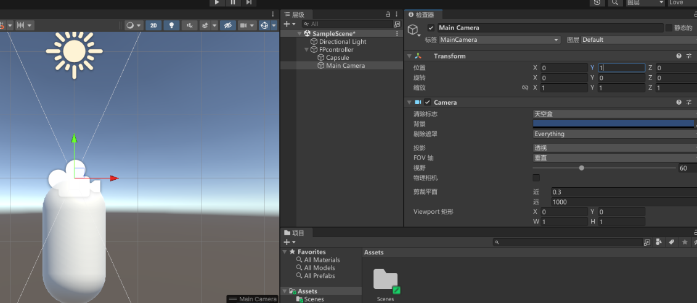

#### 2.FPcontroller添加CapsuleCollider 、RigiBody

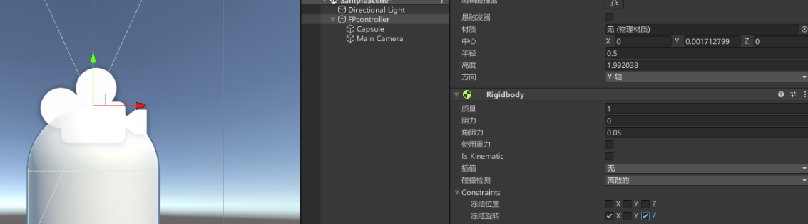

#### 3.需要让鼠标移动改变摄像机的值，创建脚本FPMouseLoook

FPMouseLoook.cs

```c#
using System.Collections;

using System.Collections.Generic;

using UnityEngine;

//视角控制

public class FPMouseLoook : MonoBehaviour

{

  //获得自身的组件，一般写在开头,获得的组件一般在Awake里初始化

  private Transform cameraTransform;

  [SerializeField] private Transform characterTransform;

  private Vector3 cameraRotation;

  public float mouseSensitivity = 5f;

  public Vector2 maxInAngle = new Vector2(-65,65);

  private void Awake() 

  {

​    cameraTransform = GetComponent<Transform>();

​    //cameraTransform = transform;

  }

  private void Update() {

​    var tmp_MouseX = Input.GetAxis("Mouse X");

​    var tmp_MouseY = Input.GetAxis("Mouse Y");

​    //摄像机Rotation

​    //y值增加向右旋转

​    cameraRotation.y += tmp_MouseX * mouseSensitivity;

​    //x轴增加向下旋转

​    cameraRotation.x -= tmp_MouseY * mouseSensitivity;

​    //限制向上向下看的角度

​    cameraRotation.x =  Mathf.Clamp(cameraRotation.x,maxInAngle.x,maxInAngle.y);

​    //Quaternion.Euler返回一个旋转，它围绕 z 轴旋转 z 度、围绕 x 轴旋转 x 度、围绕 y 轴旋转 y 度（按该顺序应用）

​    cameraTransform.rotation = Quaternion.Euler(x:cameraRotation.x,y:cameraRotation.y,z:0);
​      
//使用键盘控制移动，同时前进方向应为注视的方向
​      
​    characterTransform.rotation = Quaternion.Euler(x:0,y:cameraRotation.y,z:0);

  }

}
```


#### 4.使用键盘控制移动，同时前进方向应为注视的方向

FPMove.cs

```c#
using System.Collections;

using System.Collections.Generic;

using UnityEngine;

//根据视角方向进行移动

public class FPMove : MonoBehaviour

{

  private Transform characterTransform;

  private Rigidbody characterRigibody;

  public float speed;

  private void Awake() {

​    characterTransform = GetComponent<Transform>();

​    characterRigibody = GetComponent<Rigidbody>();

  }

  private void FixedUpdate() {

​    //Horizontal 这个水平轴其实就是X轴，也就是键盘上的AD键或方向箭头，当静止时为0

​    //当按下A键时这个数值减小，返回一个小于0的数值，同理，D键为大于0的数值；物体就在X轴方向水平移动

​    var tmp_Horizontal = Input.GetAxis("Horizontal");

​    //Vertical 这个垂直轴是Y轴，当我们按下键盘上的WS键也就是前进后退键，当静止时为0

​    //当按下S键时这个数值减小，返回一个小于0的数值，同理，W键为大于0的数值；物体就在Y轴方向垂直移动

​    var tmp_Vertical = Input.GetAxis("Vertical");

​    //当前方向

​    var tmp_CurrentDirection = new Vector3(tmp_Horizontal,0,tmp_Vertical);

​    tmp_CurrentDirection = characterTransform.TransformDirection(tmp_CurrentDirection);

​    tmp_CurrentDirection *= speed;

​    //当前速度

​    var tmp_CurrentVelocity = characterRigibody.velocity;

​    var tmp_VelocityChange = tmp_CurrentDirection - tmp_CurrentVelocity;

​    //速度的改变量

​    tmp_VelocityChange.y = 0;

​    //public void AddForce (Vector3 force（力矢量世界坐标）, ForceMode mode= ForceMode.Force（要施加力的类型）)

​    //沿 force 矢量的方向连续施加力。可以指定 ForceMode /mode/，以将力的类型更改为 Acceleration、Impulse 或 Velocity Change。

​    characterRigibody.AddForce(tmp_VelocityChange,ForceMode.VelocityChange);

​    

  }

}
```

#### 5.添加一个平面,同时使角色只有在地面上才移动，添加跳跃，修改FPMove.cs

```c#
using System;

using System.Collections;

using System.Collections.Generic;

using UnityEngine;

//根据视角方向进行移动

public class FPMove : MonoBehaviour

{

  private Transform characterTransform;

  private Rigidbody characterRigibody;

  private bool isGrounded;

  public float speed;

  public float gravity;

  public float jumpHeight;

  private void Awake() {

​    characterTransform = GetComponent<Transform>();

​    characterRigibody = GetComponent<Rigidbody>();

  }

  private void FixedUpdate() {

​    if(isGrounded)

​    {

​      //Horizontal 这个水平轴其实就是X轴，也就是键盘上的AD键或方向箭头，当静止时为0

​      //当按下A键时这个数值减小，返回一个小于0的数值，同理，D键为大于0的数值；物体就在X轴方向水平移动

​      var tmp_Horizontal = Input.GetAxis("Horizontal");

​      //Vertical 这个垂直轴是Y轴，当我们按下键盘上的WS键也就是前进后退键，当静止时为0

​      //当按下S键时这个数值减小，返回一个小于0的数值，同理，W键为大于0的数值；物体就在Y轴方向垂直移动

​      var tmp_Vertical = Input.GetAxis("Vertical");

​      //当前方向

​      var tmp_CurrentDirection = new Vector3(tmp_Horizontal,0,tmp_Vertical);

​      tmp_CurrentDirection = characterTransform.TransformDirection(tmp_CurrentDirection);

​      tmp_CurrentDirection *= speed;

​      //当前速度

​      var tmp_CurrentVelocity = characterRigibody.velocity;

​      var tmp_VelocityChange = tmp_CurrentDirection - tmp_CurrentVelocity;

​      //速度的改变量

​      tmp_VelocityChange.y = 0;

​      //public void AddForce (Vector3 force（力矢量世界坐标）, ForceMode mode= ForceMode.Force（要施加力的类型）)

​      //沿 force 矢量的方向连续施加力。可以指定 ForceMode /mode/，以将力的类型更改为 Acceleration、Impulse 或 Velocity Change。

​      characterRigibody.AddForce(tmp_VelocityChange,ForceMode.VelocityChange);

​      if(Input.GetButtonDown("Jump"))

​      {

​        characterRigibody.velocity = new Vector3(tmp_CurrentVelocity.x,CalculateJumpHeightSpeed(),tmp_CurrentVelocity.z);

​      }

​    }

​    

​    characterRigibody.AddForce(new Vector3(0,-gravity * characterRigibody.mass,0));

  }


  private float CalculateJumpHeightSpeed()

  {

​    return Mathf.Sqrt(2*gravity*jumpHeight);

  }


  //碰撞时一直检测


  private void OnCollisionStay(Collision other) {

​    isGrounded = true;   

  }

  //离开时检测

  private void OnCollisionExit(Collision other) {

​    isGrounded = false;

  }

}
```

缺点：会吞掉一些指令

## 二、[FPController] - 使用CharacterController制作FPS角色控制器

####  1.添加CharacterController组件

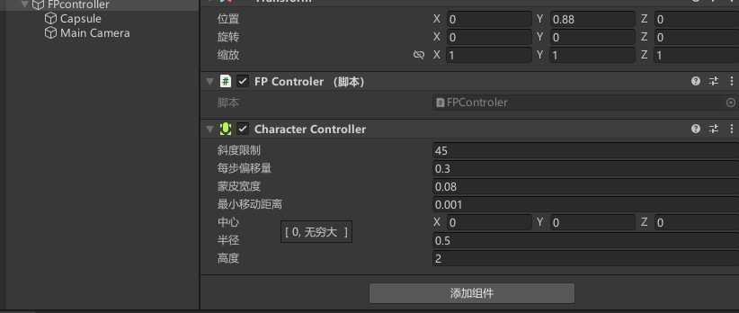

#### 2.编辑FPControler.cs脚本

FPControler.cs

```c#
using System.Collections;
using System.Collections.Generic;
using UnityEngine;

public class FPControler : MonoBehaviour
{
    private Transform characterTransform;
    private Vector3 movementDirection;
    public float speed = 3.0f;
    public float gravity  = 9.8f;
    public float jumpHeight = 3.0f;
    private CharacterController characterController;
    //获取组件
    private void Awake() {
        characterTransform = GetComponent<Transform>();
        characterController = GetComponent<CharacterController>();
        
    }
    private void Update() {
    if(characterController.isGrounded)
    {
        var tmp_Horizontal = Input.GetAxis("Horizontal");
        var tmp_Vertical = Input.GetAxis("Vertical");
        //当前要移动的方向
        movementDirection = characterTransform.TransformDirection(new Vector3(tmp_Horizontal,0,tmp_Vertical));
        if(Input.GetButtonDown("Jump"))
        {
            movementDirection.y = jumpHeight;
        }
    }
    movementDirection.y -= gravity*Time.deltaTime;
    //Move不实现重力
    characterController.Move(speed*Time.deltaTime*movementDirection);  
    //SimpleMove实现重力
    //characterController.SimpleMove(speed*Time.deltaTime*tmp_MovementDirection);
    }
}

```

## 三、完善FP控制器实现下蹲&静步&行走

#### 1.编辑FPControler.cs脚本

FPControler.cs

```c#
using System.Collections;

using System.Collections.Generic;

using UnityEngine;


public class FPControler : MonoBehaviour

{

  private Transform characterTransform;

  private Vector3 movementDirection;

  public float speed = 3.0f;

  public float walkSpeed = 1.7f;

  public float gravity  = 9.8f;

  public float jumpHeight = 3.0f;

  public float crouchHeight = 1.0f;

  public float smoothTime = 5;

  private float originHeight;

  private bool isCrouched = false;

  private CharacterController characterController;


  //获取组件

  private void Awake() {

​    characterTransform = GetComponent<Transform>();

​    characterController = GetComponent<CharacterController>();

​    originHeight = characterController.height;

  }

  private float tmp_CurrentSpeed = 1.7f;

  private void Update() {

  

  if(characterController.isGrounded)

  {

​    

​    //在地上时可以跳跃与静步

​    var tmp_Horizontal = Input.GetAxis("Horizontal");

​    var tmp_Vertical = Input.GetAxis("Vertical");

​    //当前要移动的方向

​    movementDirection = characterTransform.TransformDirection(new Vector3(tmp_Horizontal,0,tmp_Vertical));

​    //跳跃

​    if(Input.GetButtonDown("Jump"))

​    {

​      movementDirection.y = jumpHeight;

​    }

​    //静步 蹲下时速度都会变化

​    // if(Input.GetKey(KeyCode.LeftShift))

​    // {

​    //   tmp_CurrentSpeed = walkSpeed;

​    // }

​    // else

​    // {

​    //   tmp_CurrentSpeed = speed;

​    // }

​    tmp_CurrentSpeed =  Input.GetKey(KeyCode.LeftShift)||isCrouched?walkSpeed:speed;

  }

  //蹲下与站起

  Crouch_tip();

  movementDirection.y -= gravity*Time.deltaTime;

  //Move不实现重力

  characterController.Move(tmp_CurrentSpeed * Time.deltaTime*movementDirection);  

  //SimpleMove实现重力

  //characterController.SimpleMove(speed*Time.deltaTime*tmp_MovementDirection);

  }

  private void Crouch_tip(){

​    if(Input.GetKeyDown(KeyCode.LeftControl))

​    {

​    //协程函数，用于从2过渡到到1

​    float tmp_TargetHeight = isCrouched?originHeight:crouchHeight;

​    StartCoroutine(DoCrouch(tmp_TargetHeight));

​    isCrouched = !isCrouched;

​    }

  }

  private IEnumerator DoCrouch(float targetHeight){

  float tmp_CurrentHeight= 0;

​    while(Mathf.Abs(characterController.height - targetHeight)>0.1f)

​    {

​      yield return null;

​      characterController.height = 

​        Mathf.SmoothDamp(characterController.height,targetHeight,

​          ref tmp_CurrentHeight,Time.deltaTime*smoothTime);

​    }

  }

}
```


## 四、[FPController] - 手臂资源导入实现行走奔跑

#### 1.导入素材包，应用之前的脚本

POLYGON - FPS SAMPLE

LowPolyFPS Pack - Free(Sample)

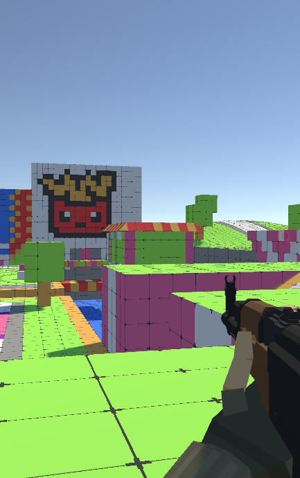

#### 2.构建动画，使用混合树来创建不同速度下创建的动画

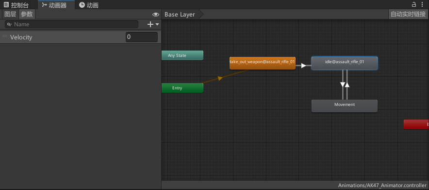

#### 3.用脚本传入动画控制器中变量Velocity的值来实现控制动画

FPControler.cs

```c#
using System.Collections;

using System.Collections.Generic;

using UnityEngine;


public class FPControler : MonoBehaviour

{
  private Animator animator;
  private Transform characterTransform;
  private Vector3 movementDirection;
  private CharacterController characterController;

  public float speed = 3.0f;

  public float walkSpeed = 1.7f;

  public float gravity  = 9.8f;

  public float jumpHeight = 3.0f;

  public float crouchHeight = 1.0f;

  public float smoothTime = 5;

  private float originHeight;

  private bool isCrouched = false;
  private float velocity;


  //获取组件

  private void Awake() {

	characterTransform = GetComponent<Transform>();

	characterController = GetComponent<CharacterController>();

	animator = GetComponentInChildren<Animator>();

  }
  private void Start() {
    

	originHeight = characterController.height;

  }

  private float tmp_CurrentSpeed = 1.7f;

  private void Update() {

  Vector3 tmp_SubXVelocity ;

  if(characterController.isGrounded)

  {

​    

	//在地上时可以跳跃与静步

	var tmp_Horizontal = Input.GetAxis("Horizontal");

	var tmp_Vertical = Input.GetAxis("Vertical");

	//当前要移动的方向

	movementDirection = characterTransform.TransformDirection(new Vector3(tmp_Horizontal,0,tmp_Vertical));

	//跳跃

	if(Input.GetButtonDown("Jump"))

	{

 	 movementDirection.y = jumpHeight;

	}

	//静步 蹲下时速度都会变化

	// if(Input.GetKey(KeyCode.LeftShift))

	// {

	//   tmp_CurrentSpeed = walkSpeed;

	// }

	// else

	// {

	//   tmp_CurrentSpeed = speed;

	// }

	tmp_CurrentSpeed =  Input.GetKey(KeyCode.LeftShift)||isCrouched?walkSpeed:speed;

  }

  //蹲下与站起

  	Crouch_tip();

 	 movementDirection.y -= gravity*Time.deltaTime;

  	//Move不实现重力

 	 characterController.Move(tmp_CurrentSpeed * Time.deltaTime*movementDirection);  
 	 tmp_SubXVelocity = characterController.velocity;
 	 tmp_SubXVelocity.y = 0;
  	velocity = tmp_SubXVelocity.magnitude;
  	animator.SetFloat("Velocity",velocity);

  	//SimpleMove实现重力

 	 //characterController.SimpleMove(speed*Time.deltaTime*tmp_MovementDirection);

  }

  private void Crouch_tip(){

	if(Input.GetKeyDown(KeyCode.LeftControl))

{

//协程函数，用于从2过渡到到1

	float tmp_TargetHeight = isCrouched?originHeight:crouchHeight;

	StartCoroutine(DoCrouch(tmp_TargetHeight));

	isCrouched = !isCrouched;

}

  }

  private IEnumerator DoCrouch(float targetHeight){

  	float tmp_CurrentHeight= 0;

	while(Mathf.Abs(characterController.height - targetHeight)>0.1f)

	{

 	 yield return null;

 	 characterController.height = 

​   	 Mathf.SmoothDamp(characterController.height,targetHeight,

​      	ref tmp_CurrentHeight,Time.deltaTime*smoothTime);

	}

  }

}
```

使用变量Velocity控制三种动画

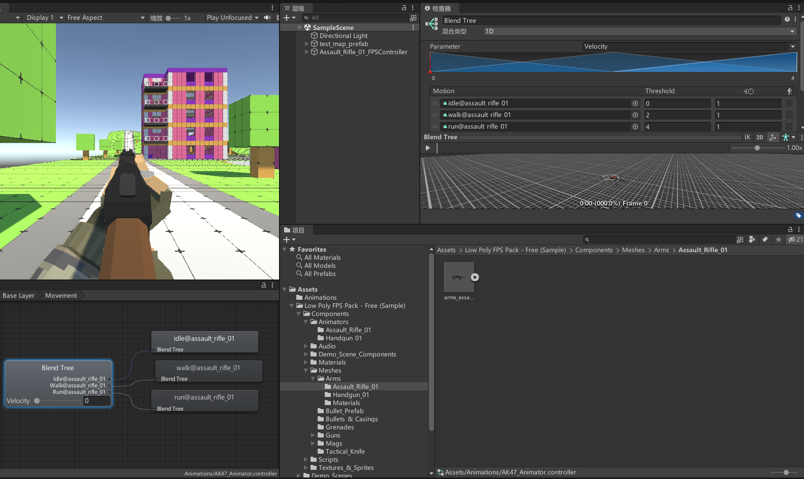

## 五、[FPController] - 移动脚步声

#### 1.创建FootStepAudioData.cs

```c#
using System.Collections;

using System.Collections.Generic;

using UnityEngine;

[CreateAssetMenu(menuName ="FPS/FootStepAudioData")]

public class FootStepAudioData : ScriptableObject

{

  public List<FootStepAudio> FootStepAudios = new List<FootStepAudio>();

}


[System.Serializable]//序列化存储

public class FootStepAudio

{

  public string tag;

  public List<AudioClip> AudioClips = new List<AudioClip>();

  public float Delay;

}
```


#### 2.创建FP Foot Step Audio Data

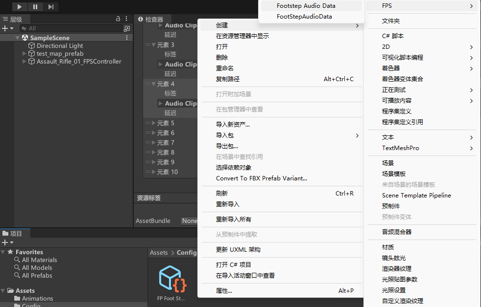

#### 3.插入素材Footstep

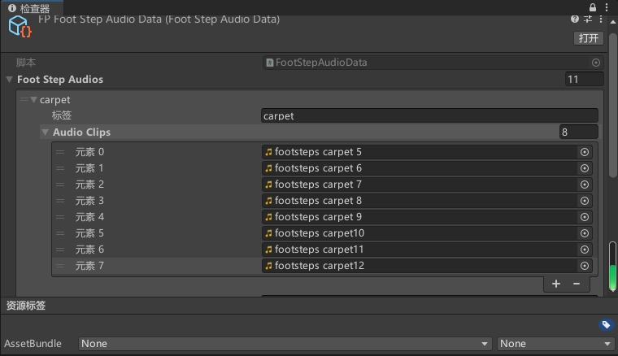

#### 4.创建FootStepListener.cs

FootStepListener.cs

```c#
using System.Collections;

using System.Collections.Generic;

using UnityEngine;


public class FootStepListener : MonoBehaviour

{

  public FootStepAudioData footStepAudioData;

  private AudioSource footStepAudioSource;

  private CharacterController characterController;

  private Transform characterTransform;

  private float nextPlayTime;

  public LayerMask playerLayerMask;//用来过滤一些物体(玩家)

  private float audioDelay;

  public enum State

  {

​    idle,

​    walk,

​    run,

​    other


  }

  public State characterState;

private void Awake() {

  characterController = GetComponent<CharacterController>();

  characterTransform = GetComponent<Transform>();

  footStepAudioSource = GetComponent<AudioSource>();

}

private void Update() {

 var tmp_SubXVelocity = characterController.velocity;

 tmp_SubXVelocity.y = 0;

 var velocity = tmp_SubXVelocity.magnitude;

 if(velocity>2)

 {

  characterState = State.run;

 }else if(velocity>1.5&&velocity<2)

 {

  characterState = State.walk;

 }else

 {

  characterState = State.idle;

 }


}

private void FixedUpdate() {

  if(characterController.isGrounded)

  {

​    //normalized单位向量magnityde向量长度

​    if(characterController.velocity.normalized.magnitude>0.1f)

​    {

​      //播放移动声音

​      nextPlayTime+=Time.fixedDeltaTime;

​      //Linecast是以投射的起始位置和终止位置为参数 Raycast则是以投射的起始位置和投射方向为参数来判断这个投射有没有和某个Collider发生了碰撞

​      //~表示求补

​      bool tmp_IsHit = Physics.Raycast(characterTransform.position,Vector3.down,out RaycastHit tmp_HitInfo,2,~playerLayerMask);

​      

​      //bool tmp_IsHit = Physics.Raycast(characterTransform.position,Vector3.down ,out RaycastHit tmp_HitInfo);

//射线检测

// #if UNITY_EDITOR

//   Debug.DrawRay(characterTransform.position,Vector3.down * (characterController.height /2 + characterController.skinWidth*2 - characterController.center.y ),Color.red,0.25f);

// #endif

​      // Debug.Log("hit="+tmp_HitInfo.collider.tag);

​      if(tmp_IsHit)

​      {

​        foreach (var tmp_AudioElement in footStepAudioData.FootStepAudios)

​        {

​          //如果tmp_HitInfo的标签为循环中音源的标签

​          if(tmp_HitInfo.collider.CompareTag(tmp_AudioElement.tag))

​          {

​            switch (characterState)

​            {

​              case(State.run):

​              audioDelay = tmp_AudioElement.Delay;

​              break;

​              case(State.walk):

​              audioDelay = tmp_AudioElement.walkDelay;

​              break;

​              case(State.other):

​              break;

​              default:

​              break;

​            }

​            //如果已经播放的时间大于设置中延迟的时间（延迟的作用是使一个音效可以完整播放完）

​            if(nextPlayTime >=audioDelay)

​            {

​              int tmp_AudioCount = tmp_AudioElement.AudioClips.Count;

​              int tmp_AudioIndex = UnityEngine.Random.Range(0,tmp_AudioCount);

​              //随机播放相应标签中的音效

​              AudioClip tmp_FootStepAudioClip = tmp_AudioElement.AudioClips[tmp_AudioIndex];

​              footStepAudioSource.clip = tmp_FootStepAudioClip;

​              footStepAudioSource.Play();

​              nextPlayTime = 0;

​              break;

​            }

​          }

​        }

​      }

​    }

  }

}

}
```

## 六、实现枪械的射击 - 动画与基础


#### 1.导入素材包

StylizedProjectilePack1

Series-5

将

Series-5\Artwork\Prefabs\Particle System.prefab

StylizedProjectilePack1\prefabs\Bullet\Bullet_GoldFire\Bullet_Small_Goldfire\Bullet_GoldFire_Small_MuzzleFlare.prefab

放到Components下，调整Transform属性，图层为GUN

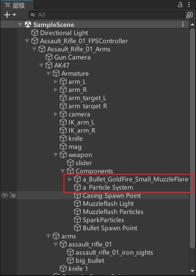

#### 2.编写脚本

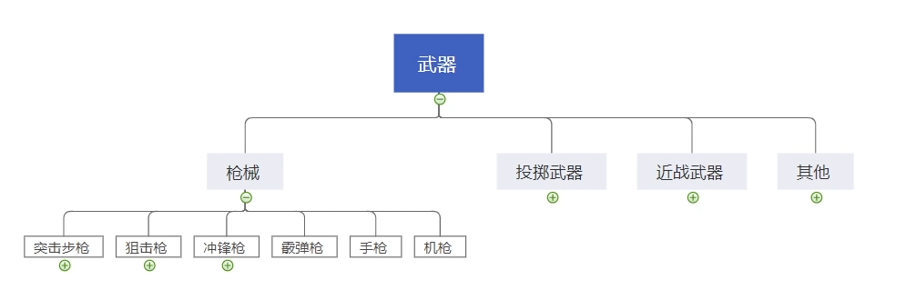

IWeapon.cs **<u>(武器)</u>**

```
using System.Collections;

using System.Collections.Generic;

using UnityEngine;

/*接口是功能的集合，同样可看做是一种数据类型，是比抽象类更为抽象的”类”。

接口只描述所应该具备的方法，并没有具体实现，具体的实现由接口的实现类(相当于接口的子类)来完成。这样将功能的定义与实现分离，优化了程序设计。

请记住：一切事物均有功能，即一切事物均有接口。*/

namespace Script.Weapon

{

  public interface IWeapon

  {

​    void DoAttack();

  }

}
```

Firearms.cs **<u>(枪)</u>**

```
using System.Collections;

using System.Collections.Generic;

using UnityEngine;

namespace Script.Weapon

{

  //枪类

  public abstract class Firearms : MonoBehaviour,IWeapon

  {

​    

​    public Transform muzzlePonit;//枪口位置

​    public Transform casingPoint;//蛋壳抛出位置

​    public ParticleSystem muzzleParticle;//枪口火焰粒子

​    public ParticleSystem casingParticle;//蛋壳抛出粒子

​    public int ammoInMag = 30;//弹夹

​    public float fireRate;//射速 一秒射出的子弹

​    public int maxAmmoCarried = 120;//总弹夹


​    protected int currentAmmo;

​    protected int currentMaxCarried;

​    protected float lastFireTime;

​    protected Animator gunAnimator;//射击动画

​    protected virtual void Start()

​    {

​      currentAmmo = ammoInMag;

​      currentMaxCarried = maxAmmoCarried;

​      gunAnimator = GetComponent<Animator>();

​    }

​    public void DoAttack()

​    {

​      if(currentAmmo <= 0)return;

​      if(!IsAllowShooting())return;

​      currentAmmo -= 1;//弹夹减一

​      gunAnimator.Play("Fire",0,0);

​      Shooting();//射击

​      lastFireTime = Time.time;//记录最后一次开枪的时间

​    }

​    protected abstract void Shooting();

​    protected abstract void Reload();

​    private bool IsAllowShooting()

​    {

​      return Time.time  - lastFireTime > 1/fireRate;

​    }

  }

}
```

AssualtRifle.cs **<u>(AK47)</u>**

```
using UnityEngine;

namespace Script.Weapon

{

  public class AssualtRifle : Firearms

  {

​    protected override void Reload()

​    {

​      currentAmmo =ammoInMag;

​      currentMaxCarried -= ammoInMag;

​    }


​    protected override void Shooting()

​    {

​      Debug.Log("shooting");

​    }

​    private void Update() {

​      if(Input.GetMouseButton(0))

​      {

​        DoAttack();

​      }

​      if(Input.GetKeyDown(KeyCode.R))

​      {

​        Reload();

​      }

​    }

  }

}
```

#### 3.对应的动画

在Firearms.cs 中调用gunAnimator.Play("Fire",0,0);

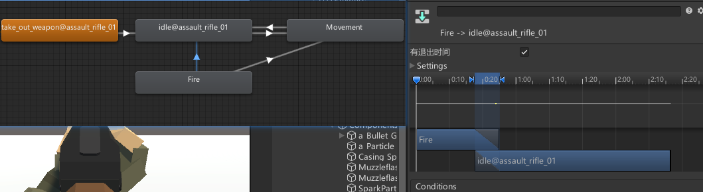

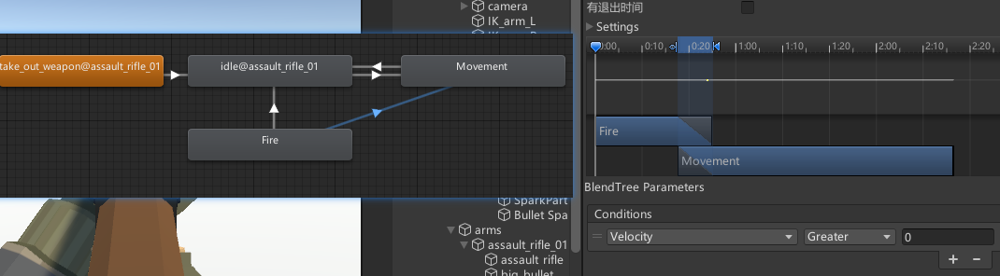
