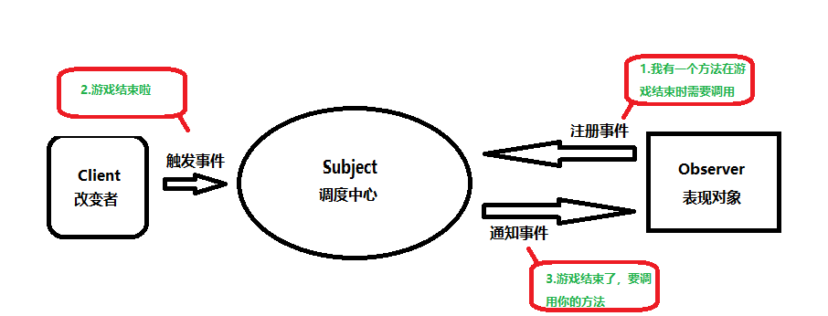

# Unity事件管理器

## 一、前置知识：委托和事件

在C#中，委托是用来存储方法的容器，事件是更安全的委托。

委托：命名空间System中，包含了Action<>和Func<>两种泛型委托，Action<>委托存储无返回值的方法，Func<>委托存储有返回值的方法，存储后通过()或者.Invoke()调用里面的方法。

```c#
//使用系统自带的委托,使用时必须引用using System命名空间
Console.WriteLine("--系统委托Action--");//Action无返回值的委托
Action action = null;//Action委托无参数委托
action += Fun1;
action.Invoke();
Action<string,int> action2 = null;//Action泛型n个参数委托（n<=16）
action2 += Fun4;
action2.Invoke("nihao",123);
Console.WriteLine("--系统委托Func--");//Func泛型有返回值委托
Func<string> func = null;//Func泛型无参数sting返回值委托
func += Fun3;
Console.WriteLine(func.Invoke());
Func<int,int> func2 = null;//Func泛型前面参数，最后一个返回值
func2 += Fun2;
func2.Invoke(16);
//测试方法Fun
static public void Fun1()
{
	Console.WriteLine("void Fun1");
}
static public int Fun2(int value)
{
	Console.Write("int Fun2：{0}",value);
	return value;
}
static public string Fun3()
{
	return "string Fun3";
}
static public void Fun4(string s,int i)
{
	Console.WriteLine("void Fun4 string:{0},int:{1}",s,i);
}
```

以上是部分代码，更详细的语法可以参考[C#委托和事件，匿名函数和lamabda表达式](https://blog.csdn.net/qq_18931093/article/details/130723723)

事件：只能作为成员变量存在类，接口和结构体中，相比于委托，事件不能在类的外部赋值与调用

访问修饰符 event 委托类型 事件名，`public event Action myEvent;` ，和委托用法相同。

> - 为什么有事件
>
> 防止外部随意置空委托
>
> 防止外部随意调用委托

## 二、理解概念：观察者模式

当游戏的工程量大时，需要执行的代码散落在各个文件中，不方便管理，而且如果如果直接调用，那么代码的耦合性会大大增加，陷入"牵一发而动全身"的情况。

因此，为了更好地集中管理游戏中的事件，以及减少“获取各个类的事件前要先要持有该类的引用”操作，利用观察者模式这种思想编写一个事件管理脚本，来统一处理事件的注册，移除，发送等操作，将事件拥有者和事件响应者完全解耦。

观察者模式：

当对象间存在一对多关系时，则使用观察者模式（Observer Pattern）。当一个对象被修改时，则会自动通知依赖它的对象。观察者模式属于行为型模式。

举个例子，当游戏结束时（一个对象被修改），我们希望弹出结束UI，暂停播放音乐，结算总体分数等（通知依赖它的对象）。

一个对象（目标对象）的状态发生改变，所有的依赖对象（观察者对象）都将得到通知，进行广播通知。

这种编程模式不仅考虑到了易用性和低耦合性，保证高度的协作性。

实现：观察者模式使用三个类 Subject、Observer 和 Client。




## 三、Unity中的事件管理

比如创建一个事件管理类，EventHandler.cs，相当于调度中心

```c#
using System.Collections;
using System.Collections.Generic;
using UnityEngine;
using System;
//不用挂载到任何物体上，就不会有任何父类函数
public class EventHandler
{
    //比如希望游戏结束后执行相关方法，在其他脚本中添加方法到该事件中，然后调用CallGameOverEvent()静态函数
    //就可以执行游戏结束后的相关方法
    public static event Action GameOverEvent;
    public static void CallGameOverEvent()
    {
        GameOverEvent?.Invoke();//判断GameOverEvent事件不为空时执行里面的方法
    }
}
```

在需要使用其他脚本的方法时，通过注册事件和注销事件来进行

比如想要游戏结束时显示一个UI，UImanager.cs，相当于表现对象

```c#
private void OnEnable()//注册事件
{
    Time.timeScale = 1;//恢复游戏时间
    EventHandler.GameOverEvent += OnGameOverEvent;
}
private void OnDisable()//注销事件
{
    EventHandler.GameOverEvent -= OnGameOverEvent;
}
private void OnGameOverEvent()
{
   //启用一个物体
   gameOverPanel.SetActive(true);//显示游戏结束UI
   if(gameOverPanel.activeInHierarchy)
   {
      //一直触发时会判断该窗口是否为激活状态，如果是则游戏时间暂停
      Time.timeScale = 0;
   }
}
```

> OnEnable()和OnDisable()与Updata(),Start()一样是周期函数，启用物体，生成物体都会运行OnEnable()，禁用物体，物体销毁会运行OnDisable()

在控制游戏结束的脚本中，调用CallGameOverEvent（）方法，相当于改变者

```c#
EventHandler.CallGameOverEvent();//调用CallGameOverEvent()静态函数
```

可以发现，有了事件管理中心后，只需要在调度中心编写触发事件的代码。改变者和表现对象的代码改动不会影响另一方，事件的处理在底层上全交给了调度中心，这样对跨模块的交互起到很好的解耦作用。

---

学习过程中参考了以下内容，诚挚感谢知识的分享者！

[菜鸟教程 | C# 教程](https://www.runoob.com/csharp/csharp-tutorial.html) 

[YY-nb|Unity 事件管理中心](https://blog.csdn.net/qq_46044366/article/details/122722948)