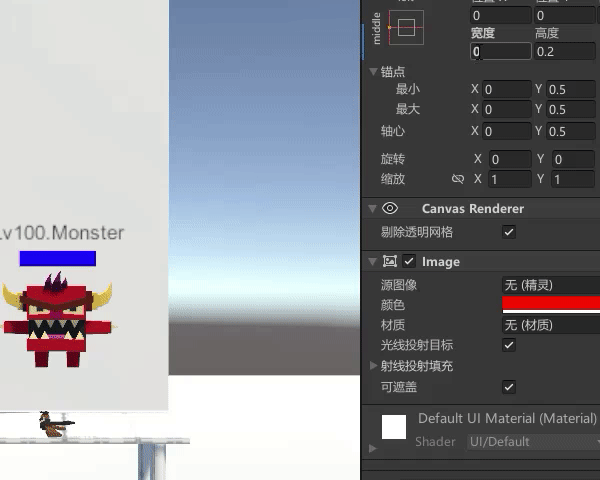
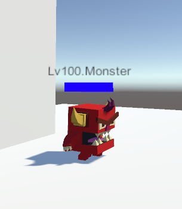

# 怪物血条的实现

## 一、怪物血条的原理


首先是将怪物身上的UI组件画布（Canvas）设置为世界空间，这样就可以将UI像物品一样摆在世界中，

然后使用两种颜色的图片，一种作为满血的UI，一种作为空血的UI。

比如我使用了蓝色图片为背景，红色图片是蓝色图片的子物体。再将红色图片的锚点和轴心设置为左侧，宽度设置为0。

当怪物受伤时，通过脚本改变红色图片RectTransform中的宽度，实现血条的变化。



```c
using UnityEngine;

public class HurtUI : MonoBehaviour
{
    public GameObject bloodRed;//红色血条
    public GameObject diedObject;//挂载的物体用于执行死亡动画和销毁
    private int currentBlood;//当前血量（未使用）
    private int maxBlood = 100;//最大值100滴血
    private int sumHurtBlood;//总受伤血量
    private Vector2 bloodRedRectTransform;//红色血条的RectTransform中的Width和Height用二维向量表示


    private void Start() 
    {
        bloodRedRectTransform = bloodRed.GetComponent<RectTransform>().sizeDelta;
        //得到红色血条的RectTransform中的Width和Height用二维向量
        currentBlood = maxBlood;//当前血量为最大血量
    }
    public void Hurted(int _HurtNum)//伤害范围1-100
    {
        //在UI中，0.1对应10滴血
            sumHurtBlood += _HurtNum;//其他脚本调用函数传入伤害值，计算当前的总伤害
            if(maxBlood - sumHurtBlood <= 0)//控制血条最低为0
            {
                Debug.Log("GG");
                currentBlood = 0;
                bloodRed.GetComponent<RectTransform>().sizeDelta = new Vector2(1f,bloodRedRectTransform.y);
                //0.1对应10滴血，所以宽度为1时，血条为空
                diedObject.GetComponent<Animator>().Play("Die",0);
                //播放死亡动画
                Destroy(diedObject,0.9f);
                //销毁挂载的物体
            }
            else
            {
                currentBlood -= _HurtNum;//当前血量为减去传入的伤害值
                float tmp_HurtBlood = sumHurtBlood/100f;//0.1对应10滴血，当前总受伤害值/100即为宽度
                bloodRed.GetComponent<RectTransform>().sizeDelta = new Vector2(tmp_HurtBlood,bloodRedRectTransform.y);
                //设置宽度
                diedObject.GetComponent<Animator>().Play("Take Damage",0);
                //播放受击动画
            }
    }
}

```

当前血量可以用来控制怪物的状态，比如第二阶段，释放技能之类。

## 二、怪物血条的旋转




实现该功能可以在上述代码中获得画布Canvas对象，然后在Update中使用LookAt方法对准主摄像机。

```c
public GameObject blood;//画布Canvas
private void Update()
{
    //面向摄像机
    blood.GetComponent<Transform>().LookAt(Camera.main.transform.position);   
}
```
