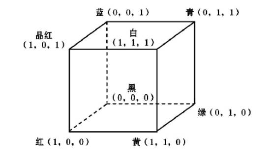
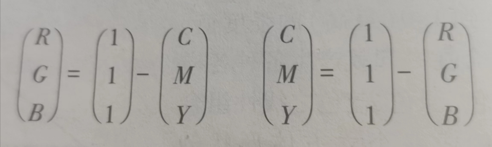

# 初识计算机图形学

## 一、计算机科学与视觉信息处理

计算机图形学：建模（建立模型）和成图（生成图像）

图像处理：对视觉信息进行处理加工

计算机视觉：对视觉信息进行识别辨认

> 计算机图形学与图像处理和计算机视觉的区别，可以用一本书来举例说明。

如果要在并非真正拥有该书的情况下，制作一幅它的图像，我们需要借助计算机图形学。

然而如果已有一幅该书的图像，只是想对图像进行改动，以突出书的外轮廓，我们则需要使用图像处理技术。

如果要以一幅书的图像作为输入信息，而由计算机识别出图中的物体，并作出图中有一本书的报告，我们就进入了人工智能的领域之一，计算机视觉。

## 二、计算机图形学的应用

图形学有着近乎无数的实际应用，首先点击式图形化用户界面(graphical user interface GUI)使得计算机在使用上既简单又直观，从而变成了普通家电。在演示图（又称商务图）方面，人们将数据或者信息以图表的形式表达，例如用直方图表示股票的开盘高低，收盘价格，用饼图表示各类产品的营业额，利润成本分布用块状图表示企业机构各部门的隶属与业务关系，以及用流程图表示工程程序，各步骤在时间上的相互制约，这比一满页数字和文字更能直观传达出一种在结构走向和比例上的感觉。在计算机辅助设计方面，计算机图形学使工程师无需创造实物，而能以设计数据为基础，在计算机上产生一个玩具，一座房子，一辆汽车或一架飞机的途径，低成本高效率的帮助验证设计方案，在科学数据形象化方面，科学家用色调和亮度作为视觉提示手段，来帮助揭示数据的内在模式和突出表现至关重要的信息，例如给一个用数学方法定义的曲面或立体着色，可为了解其形状和形态提供一个独特的观察思想思考角度，一段采用有特定含义的颜色产生的计算机模拟的燃烧室内井动画，可生动的显示器。热分布情况在数字化艺术和娱乐方面，计算机图形学为艺术家的创作想象提供了新天地，使他们能创造出表现像恐龙这样无人却知其真实相貌的物体的电子游戏和电影。

## 三、总结

- 计算机图形学，图像处理和计算机视觉分别涉及视觉信息的 <u>产生</u>， <u>处理加工</u> 和 <u>识别</u> 。

- 产生视觉信息又称 <u>成图（图像合成）</u>。

- 计算机图形学的两个主要部分是 <u>建模</u>与 <u>成图</u>。

-  GUI代表 <u>Graphical user interface</u>.

- 列出除GUI以外的计算机图形学的四项应用 <u>演示图</u>，<u>计算机辅助设计科学</u>，<u>数据形象化</u>，<u>数字化艺术和娱乐</u>。

  

# 数字图像基础

## 一、像素

一副数字图像简称图像，是由离散的图像元素及构成该图的原始构造单元所组成的，这些图像元素叫做像素。它们一般以行与列的方式分布组成一个格子型的长方形，图像区域常称为图山，在计算机合成图像这一任务，从本质上讲是计算每一个像素的颜色特征，呈现不同颜色特征的像素的综合效应，生成一幅我们看到的图像。图像的大小通常以横向像素总数乘以纵向像素总数的方式来表示，如512*512。

计算机系统中专门用来存放正在合成或显示图像的存储器，通常称为帧缓冲器，一副图像中的像素与帧缓冲器中的像素，都可以将其坐标设置为地址或者索引，一个典型做法是把位于左下角的像素放在像素坐标系的原点（0，0）于是一副800×600的图像或一个800×600的帧缓冲器右下角的像素，坐标是（799，0），而位于右上角像素的坐标则为（799，599）。

## 二、RGB和CMY颜色模型

对图像处理而言，RGB是最为重要和常见的颜色模型，它建立在笛卡尔坐标系中，以红、绿、蓝三种基本色为基础，进行不同程度的叠加，产生丰富而广泛的颜色，俗称三基色模式。
RGB颜色空间是用一个单位长度的立方体来表示颜色的，黑蓝绿青红紫黄白8种常见颜色分别位居立方体的8个顶点，通常将黑色置于三维直角坐标系的原点，红绿蓝分别置于3根坐标轴上，整个立方体放在第1卦限内。如下图1所示。而其中的青色与红色、紫色与绿色、黄色与蓝色是互补色。各参数的取值范围是：R：0-255；G：0-255；B：0-255。参数值也称为三色系数或基色系数或颜色值，除以255后归一到0-1之间，但不是无穷多个而是有限多个值。由于每个灰度级都定为256，所以，红绿蓝分量全部组合起来共可表示2563=16777216种不同的颜色。它比人眼能分辨的颜色种数多得多。因此，虽然自然界中的颜色非常多，但用RGB颜色空间来近似表达自然界中的颜色是完全够用了。

用RGB颜色模型指定颜色是个添加的过程，我们以黑色为起点，加上适量的颜色成分来产生某种想要的颜色，这与许多显示设备的工作原理十分匹配，在没有其他颜色可显示时，我们看到的是黑色。另一方面还有一个与RGB颜色模型互补的CMY颜色模型，后者采用减去法指定颜色与各种打印设备的工作原理相配，在无物可验时，我们看到的是白色打印纸的正常颜色，这是由于打印纸将来自光源，通常是白色的三原色全部反射到我们眼中。

CMY颜色模型中，CMY是青（Cyan）、洋红（或品红）（Magenta）和黄（Yellow）三种颜色的简写，加上黑色（Black），即为CMYK相减混色模式，用这种方法产生的颜色之所以称为相减色，乃是因为它减少了为视觉系统识别颜色所需要的反射光。

RGB和CMY之间的转换：

## 三、颜色编码

直接编码法：

|  R   |  G   |  B   |      |
| :--: | :--: | :--: | :--: |
|  0   |  0   |  0   | 黑色 |
|  0   |  0   |  1   | 蓝色 |
|  0   |  1   |  0   | 绿色 |
|  0   |  1   |  1   | 青色 |
|  1   |  0   |  0   | 红色 |
|  1   |  0   |  1   | 紫色 |
|  1   |  1   |  0   | 黄色 |
|  1   |  1   |  1   | 白色 |

我们可以分给每个像素三个二进制数位，其中每一位对应一种原色。这个三位表示法，允许RGB三原色相互独立的在0（关）或1（开）两种强度等级之间变换，因此每个像素能呈现对应于RGB颜色，立方体8个角的8种颜色中的任何一种。

工业编码：

工业界广泛采纳的标准是每个像素三个字节，也就是24个二进制数位，其中每一字节对应一种颜色，照此法我们允许每一原色拥有256种不同强度等级对应于从00000000~11111111的二进制数值。于是每个像素能呈现256×256×256或16 777 216种可能选择中的任何一种颜色。这个24位表示形式，有时称为真实颜色表示法。原因是在一般观看条件下，两种仅在一个或多个原色成分上。有一个强度等级之差的颜色是几乎无法区分的，于是从看到的颜色准确度方面讲，使用更多二技术位的更精确的表示法，基本上是不必要的。

黑白编码：

直接编码有一个值得注意的特别情形，那就是二值（黑与白）与灰度图像的表示。这类图像的三个颜色成分总是等值，因而不需要分别编码。对黑白图像来讲，每个像素只要一个二级数位，其中0代表黑色，1代表白色。编码格式是每个像素8个二进数位，用来实现256种强度或灰度等级。

虽然直接编码法既简单又支持多种应用，但是它的24位标准对存储空间有较高的需求，例如一副1000×1000真实颜色图像要占用300万个字节。此外即使该图像的每个像素都有独特的颜色，图像里也只有100万种颜色，对许多应用来讲，出现在每幅特定的图像的颜色，数目要明显少于100万。因此标准的24位表示法可以表示一幅图像里同时出现1,670万种不同颜色的能力，看起来有些大材小用。

## 四、查色表

使用查色表进行图像表示可以说是我们的双重愿望，愿望之一是降低存储需求，愿望之二是支持尽可能多的能同时出现在一幅图像里的颜色。在这里像素时并不直接表示颜色，而是代表一个色纸表的地址或索引，每一个像素的颜色由该像素值所指向的表里的颜色值所决定。

> 每一个像素点不再存储颜色，而是存储类似于指针指向查色表的地址。

表值24位，表长256的查色表表示法是一个广泛使用的工业标准，通常称为8位表示法。使用这种方法，可以将一副1000×1000的图像存储需求减少到100万字节，外加查色表中颜色值所需的768字节。这256种可以同时出现在一幅图像里的颜色，则来自1,670万种可能的选择。

查色表表示法的要点是：一幅图像不仅有它的像素值，还有与其相应的查色表中的颜色值，所对应这些颜色值，组成该图像的**颜色映射图**。

- 查色表动画

查色表表示法的一项有趣的应用称为查色表动画，这项技术**改变了一个表项的内容，同时影响了许多的像素**，于是我们用查色表为捷径来改变一幅显示中的图像，而不是用比较费时的将一个新的颜色值送到帧缓冲器中多个像素的方式。举例来说，我们可以将一个物体几个预先确定的位置上画入帧缓冲器，每个位置占用一个或多个连续的表项，对应位置零的表象是该物体颜色的初始值，所有其他表象则设置为背景色，这就意味着该物体开始时只要出现在位置零，此刻假如我们将该物体颜色复制到位于位置一的表项，并把对应于位置，零的表象重设为背景色，我们就在没有重画，该物体图像的情况下，把它从位置零移到了位置一将该物体的颜色轮转移位。则使该物体看起来像是一边自转，一边绕显示中心旋转。

## 五、图像文件

数字图像常以二进制文件的方式保存，以便于存储和运输，在多种多样的文件格式中有视窗位图BMP（.bmp），联合图像专家组文件互换格式JPEG（.jpg）及标记图像文件格式TIFF（.tif），彩色图像文件格式（.gif）虽然这些格式在技术细节上有差异，他们的结构上却有相似之处。

| 格式/版本标识              | 头   |
| -------------------------- | ---- |
| 图像宽高（以像素数目计算） | -    |
| 图像类型                   | 文   |
| 图像数据格式               | -    |
| 压缩类型                   | 件   |
| 其他                       | -    |
| 颜色映射图                 | 图像 |
| 像素值                     | 数据 |

文件主要由两大部分组成：文件头和图像数据。位于文件投资手的是指明该文件格式的二进制代码或 ASCII字符串。可能还附有版本序号。图像的宽与高以像素数目的方式给定，常见图像类型包括黑白，8位灰度，8位彩色及24位彩色。图像数据格式则指定像素值在图像数据部分的存放次序。通常使用的存放次序是从左到右自上而下，另一种可能的次序是从左到右自下而上，图像数据格式还指明颜色映射图或图像中的RGB值是否交错出现，也就是查色表的存储结构。

> 颜色值以交错方式出现，就意味着对应于每一个查色表项或像素的三个原色成分被连续存放。接着是对应于下一个查色表表项或像素的三个原色成分。
>
> 颜色值以非交错方式出现，就意味着对应于所有查色表表项或像素的一个原色成分首先出现，接着是下一个原色成分。

图像数据部分的颜色值可以用压缩算法进行压缩，例如行程编码RLE。形成编码的基本概念，可以通过一个占用12字节存储空间的字符串“xxxxxxyyzzzz”来阐明。如果我们从左到右查看该字符串，寻找由重复字符组成的段落，并把每一段换成一个占用一字节的重复技术，再加上被重复的字符，我们就把给定的字符串转换或压缩成只占用6个字节的"6x2y4z"。这个压缩版可以通过重现跟在每个重复计算后的字符的方式进行拓展或还原，恢复原始的字符串。这种100%的原物再造使RLE成为一种无损的压缩方法。它压缩技术，如JPEG标准所用的离散余弦变换法则，因真实原件不能从压缩版恢复而被称为有损压缩方法。

文件头的长度通常是固定的，否则就有必要将长度信息放入文件头，以指明图像数据部分的起点。另一方面图像数据部分的各个组成部分的长度，则取决于图像类型，压缩方法等因素，这些信息以及其他与具体格式有关的信息都可在文件头中找到。

## 六、总结

- 数字图像的原始构造单元是图像元素。
- 横向与纵向单位长度上像素的数量是图像的分辨率。
- 计算一幅有1024×768个像素，且大小为4×3英寸的图像的分辨率：1024/4=768/3=256个像素。

- 宽度与高度的比率是图像的纵横比。
- 一幅纵横比为1.5的，图像的高度为两英寸，其宽度为三英寸。
- 如果我们要将一幅大小为1024×768个像素的图像调整为宽度为640个像素的图像，并保持纵横比不变，调整后的图像的高度为：640*768/1024=480。
- 能否将一副5×3又1/2英寸的图像，以6×4英寸的大小呈现，而不引起几何失真？不能，会引起纵横比失协。
- 如果我们要在一幅800×600的图像的中央切出一副512×512的局部图像，什么是位于局部图像左下角的像素在原始图像下的坐标？（（800-512）/2,（600-512）/2）=（144,44）。
- 找出在RGB颜色空间位于（0.2，1， 0.5）的颜色的CMY坐标：（1-0.2，1=1，1-0.5）=（0.8，0，0.5）。
- 找出在CM外颜色空间位于（0.15，0.75，0）的颜色的RGB坐标：（1-0.15，1-0.75，1-0）=（0.85，0.25，1）。
- 如果用每原色两个二进数位的方式表示RGB颜色值，一共有多少种可能的颜色？如果每原色10个二进制数位呢？：2²×2²×2²=64；2^10^×2^10^×2^10^=1024^3^=1073741824>10亿。

@[toc]
# 一、初识计算机图形学
# 二、数字图像基础

# 三、应用程序设计界面OpenGL
# 四、扫描转换
# 五、三维基础
# 六、几何及坐标变换
# 七、颜色与着色模型
# 八、观察和裁剪
# 九、人机交互
# 十、参数式几何模型
# 十一、OpenGL拾遗
# 十二、其他图形实现技术